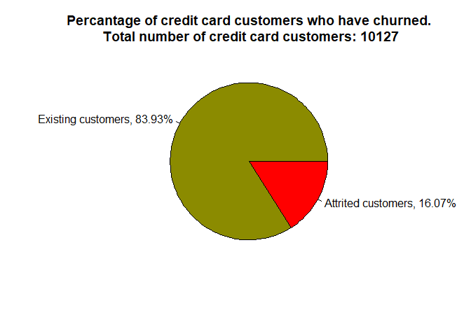

# Background 

Customer churn is the loss/turnover of a client. For this analysis, the goal is to predict/classify customers who will churn.


```r
# Clear working directory
rm(list = ls())

# Import and load packages
required_packages <- c("RColorBrewer", "cowplot", 
                       "lubridate", 
                       "Hmisc", "psych",
                       "tidyverse", "data.table", "knitr",
                       "mlr3", "mlr3learners", "mlr3viz")

packageCheck <- lapply(required_packages, FUN = function(x) {
  if(!require(x, character.only = TRUE)) {
    install.packages(x, dependencies = TRUE)
    library(x, character.only = TRUE)
  }
})
```


```r
# Import data 
bank_churn <- fread("C:/Users/diji_/Desktop/Data Science/Projects/Bank Churn/BankChurners.csv")
```


```r
# Print names of columns in the data table 
variable_names <- names(bank_churn)

# Meaning of names
variable_meaning <- c("Client number", "Whether or not the customer churned", "Age of customer", "Sex of customer", "Number of dependents", 
  "Educational qualification of the account holder", "Married, Single, Divorced or Unknown", "Annual income category of the account holder", "Type of card", "Period of relationship with the bank", "Total number of products held by the customer", "Number of months inactive in the last 12 months", "No of contacts in the last 12 months", "Credit limit on the credit card", "Total revolving balance on the credit card", "Open to buy credit line (Average of the last 12 months)", "Change in transaction amount (Q4/Q1)", "Total transaction amount in the last 12 months", "Total transaction count in the last 12 months", "Change in transaction count (Q4/Q1)", "Average card utilization ratio")

# Print the variable names and their meanings
data.table(variable_names, variable_meaning) %>% setnames(c("Variable Name", "Variable Meaning")) %>% kable()
```


|Variable Name            |Variable Meaning                                        |
|:------------------------|:-------------------------------------------------------|
|CLIENTNUM                |Client number                                           |
|Attrition_Flag           |Whether or not the customer churned                     |
|Customer_Age             |Age of customer                                         |
|Gender                   |Sex of customer                                         |
|Dependent_count          |Number of dependents                                    |
|Education_Level          |Educational qualification of the account holder         |
|Marital_Status           |Married, Single, Divorced or Unknown                    |
|Income_Category          |Annual income category of the account holder            |
|Card_Category            |Type of card                                            |
|Months_on_book           |Period of relationship with the bank                    |
|Total_Relationship_Count |Total number of products held by the customer           |
|Months_Inactive_12_mon   |Number of months inactive in the last 12 months         |
|Contacts_Count_12_mon    |No of contacts in the last 12 months                    |
|Credit_Limit             |Credit limit on the credit card                         |
|Total_Revolving_Bal      |Total revolving balance on the credit card              |
|Avg_Open_To_Buy          |Open to buy credit line (Average of the last 12 months) |
|Total_Amt_Chng_Q4_Q1     |Change in transaction amount (Q4/Q1)                    |
|Total_Trans_Amt          |Total transaction amount in the last 12 months          |
|Total_Trans_Ct           |Total transaction count in the last 12 months           |
|Total_Ct_Chng_Q4_Q1      |Change in transaction count (Q4/Q1)                     |
|Avg_Utilization_Ratio    |Average card utilization ratio                          |

Let us take a peek at the data 

```r
# Show the first 3 rows of the data 
head(bank_churn, 3)
```

```
##    CLIENTNUM    Attrition_Flag Customer_Age Gender Dependent_count
## 1: 768805383 Existing Customer           45      M               3
## 2: 818770008 Existing Customer           49      F               5
## 3: 713982108 Existing Customer           51      M               3
##    Education_Level Marital_Status Income_Category Card_Category Months_on_book
## 1:     High School        Married     $60K - $80K          Blue             39
## 2:        Graduate         Single  Less than $40K          Blue             44
## 3:        Graduate        Married    $80K - $120K          Blue             36
##    Total_Relationship_Count Months_Inactive_12_mon Contacts_Count_12_mon
## 1:                        5                      1                     3
## 2:                        6                      1                     2
## 3:                        4                      1                     0
##    Credit_Limit Total_Revolving_Bal Avg_Open_To_Buy Total_Amt_Chng_Q4_Q1
## 1:        12691                 777           11914                1.335
## 2:         8256                 864            7392                1.541
## 3:         3418                   0            3418                2.594
##    Total_Trans_Amt Total_Trans_Ct Total_Ct_Chng_Q4_Q1 Avg_Utilization_Ratio
## 1:            1144             42               1.625                 0.061
## 2:            1291             33               3.714                 0.105
## 3:            1887             20               2.333                 0.000
```

We have some bit of features here and our goal is to predict whether or not a customer will churn, as such our target feature is the Attrition_Flag. As shown below, the customers are either Existing or "Attrited", meaning they are no longer customers/clients. 


```r
unique(bank_churn$Attrition_Flag)
```

```
## [1] "Existing Customer" "Attrited Customer"
```

Next step is to perform some Exploratory Data Analysis (EDA) and pre-processing. Thus far, the only input feature I see that is not necessary to be included in our model is the "CLIENTNUM", The CLIENTNUM is just an identifier. I won't remove it just yet though, in accordance with the theme of EDA I'll make a plot to see the relationship between the client ID and Attrition Flag. We have no time variable to evaluate the churning through time. So, my maybe flawed logic is that the recent customers have higher client numbers than earlier customers...you know, customer 1, customer 2, ...., customer *n*, etc. 

Let us encode the response variable with 1 representing that the customer churned and 0 representing otherwise. 


```r
# Encode the response 
bank_churn$Attrition_Flag <- factor(bank_churn$Attrition_Flag, levels = c("Existing Customer", "Attrited Customer"), 
                                    labels = c(0, 1))
```


```r
ggplot() +
  geom_point(aes(x = bank_churn$CLIENTNUM, y = bank_churn$Attrition_Flag)) +
  xlab("Client Number") +
  ylab("Churn (1) or No churn (0)") +
  theme_classic()
```

<!-- -->
Damn, no cigar! 

We proceed to data pre-processing, checking that each feature is of appropriate class, check for missing data, ... will feature scaling be necessary? 


```r
# Get the class of each variable
data.table(`Variable Name` = variable_names, `Variable Class` = lapply(bank_churn, class)) %>% kable()
```


|Variable Name            |Variable Class |
|:------------------------|:--------------|
|CLIENTNUM                |integer        |
|Attrition_Flag           |factor         |
|Customer_Age             |integer        |
|Gender                   |character      |
|Dependent_count          |integer        |
|Education_Level          |character      |
|Marital_Status           |character      |
|Income_Category          |character      |
|Card_Category            |character      |
|Months_on_book           |integer        |
|Total_Relationship_Count |integer        |
|Months_Inactive_12_mon   |integer        |
|Contacts_Count_12_mon    |integer        |
|Credit_Limit             |numeric        |
|Total_Revolving_Bal      |integer        |
|Avg_Open_To_Buy          |numeric        |
|Total_Amt_Chng_Q4_Q1     |numeric        |
|Total_Trans_Amt          |integer        |
|Total_Trans_Ct           |integer        |
|Total_Ct_Chng_Q4_Q1      |numeric        |
|Avg_Utilization_Ratio    |numeric        |

From the table and as illustrated in the pie plot below, we see that approx 16% of the credit card customers churned. As such, we can expect a challenge in training our model to predict customers who will churn. This is because we have a relatively small subset of data that contains characteristics of customers who churned, as such, the effectiveness of the model can only be facilitated by having very dissimilar characteristics between customers who churned and those who didn't. 


|Activity | Count| Percentage|
|:--------|-----:|----------:|
|0        |  8500|      83.93|
|1        |  1627|      16.07|

<!-- -->

The fact that we have a small proportion of attrited customers in our data set gets us thinking about our model evaluation. I say this because if we have a model that predicts that every customer will remain, then on our complete data it will be right 83.93% of the time, as such, could be misleading when utilizing the model on unseen/test data. 

still working .....

