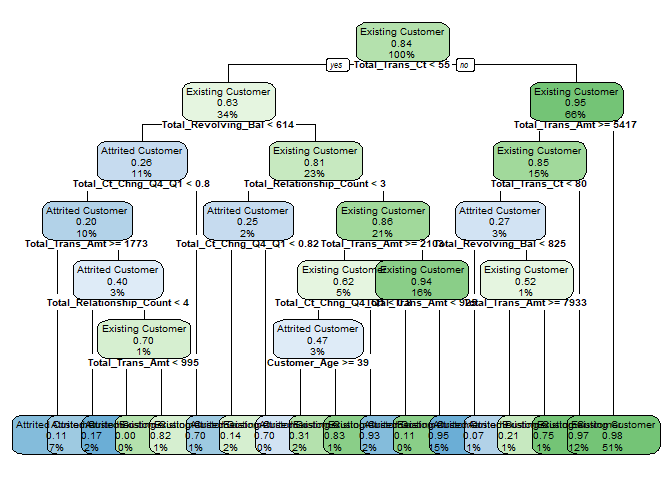

# Background 

Customer churn is the loss/turnover of a client. For this analysis, the goal is to predict/classify customers who will churn.


```r
# Clear working directory
rm(list = ls())

# Import and load packages
required_packages <- c("RColorBrewer", "cowplot", 
                       "lubridate", 
                       "Hmisc", "psych",
                       "tidyverse", "data.table", 
                       "mlr3")

packageCheck <- lapply(required_packages, FUN = function(x) {
  if(!require(x, character.only = TRUE)) {
    install.packages(x, dependencies = TRUE)
    library(x, character.only = TRUE)
  }
})
```


```r
# Import data 
bank_churn <- fread("C:/Users/diji_/Desktop/Data Science/Projects/Bank Churn/BankChurners.csv")
```


```r
# Show the first 3 rows of the data 
head(bank_churn, 3)
```

```
##    CLIENTNUM    Attrition_Flag Customer_Age Gender Dependent_count
## 1: 768805383 Existing Customer           45      M               3
## 2: 818770008 Existing Customer           49      F               5
## 3: 713982108 Existing Customer           51      M               3
##    Education_Level Marital_Status Income_Category Card_Category Months_on_book
## 1:     High School        Married     $60K - $80K          Blue             39
## 2:        Graduate         Single  Less than $40K          Blue             44
## 3:        Graduate        Married    $80K - $120K          Blue             36
##    Total_Relationship_Count Months_Inactive_12_mon Contacts_Count_12_mon
## 1:                        5                      1                     3
## 2:                        6                      1                     2
## 3:                        4                      1                     0
##    Credit_Limit Total_Revolving_Bal Avg_Open_To_Buy Total_Amt_Chng_Q4_Q1
## 1:        12691                 777           11914                1.335
## 2:         8256                 864            7392                1.541
## 3:         3418                   0            3418                2.594
##    Total_Trans_Amt Total_Trans_Ct Total_Ct_Chng_Q4_Q1 Avg_Utilization_Ratio
## 1:            1144             42               1.625                 0.061
## 2:            1291             33               3.714                 0.105
## 3:            1887             20               2.333                 0.000
```
We have some bit of features here, the first task will be to identify what the output feature is. In this case it is the Attrition_Flag. As shown below, the customers are either Existing or "Attrited" i.e., probably meaning they are no longer customers/clients. 


```r
unique(bank_churn$Attrition_Flag)
```

```
## [1] "Existing Customer" "Attrited Customer"
```

Next step is some Exploratory Data Analysis (EDA) and pre-processing. Thus far, the only input feature I see that is not necessary to be included in our model is the "CLIENTNUM", The CLIENTNUM is just an identifier. I won't remove it just yet though, in accordance with the theme of EDA I'll make a plot to see the relationship between the client ID and Attrition Flag. We have no time variable to evaluate the churning through time. So, my maybe flawed logic (*No bank manager to talk to lol*) is that the recent customers have higher client numbers than earlier customers...you know, customer 1, customer 2, ...., customer *n*, etc. 

Let us encode the response variable with 1 representing that the customer churned and 0 representing otherwise. 


```r
# Encode the response 
bank_churn$Attrition_Flag <- factor(bank_churn$Attrition_Flag, levels = c("Existing Customer", "Attrited Customer"), 
                                    labels = c(0, 1))
```


```r
ggplot() +
  geom_point(aes(x = bank_churn$CLIENTNUM, y = bank_churn$Attrition_Flag)) +
  xlab("Client Number") +
  ylab("Churn (1) or No churn (0)") +
  theme_classic()
```

<!-- -->
Damn, no cigar! 

Let us find out what the other features mean so we can make sense of our data as we work through the challenge. 

Card_Category: 

Months_on_book: Period of relationship with the bank

Total_Relationship_Count: Total number of products held by the customer 

Months_Inactive_12_mon: No. of months inactive in the last 12 months 

Contacts_Count_12_mon: No of contacts in the last 12 months

Avg_Open_To_Buy: Open to buy credit line (Average of last 12 months)

Total_Amt_Chng_Q4_Q1: Change in transaction amount (Q4/Q1)

Total_Trans_Amt:  Total transaction amount in the last 12 months 

Total_Trans_Ct: Total transaction count in the last 12 months

Total_Ct_Chng_Q4_Q1: Change in transaction count (Q4/Q1)


```r
# Get the class of each variable
lapply(bank_churn, class) %>% t()
```

```
##      CLIENTNUM Attrition_Flag Customer_Age Gender      Dependent_count
## [1,] "integer" "factor"       "integer"    "character" "integer"      
##      Education_Level Marital_Status Income_Category Card_Category
## [1,] "character"     "character"    "character"     "character"  
##      Months_on_book Total_Relationship_Count Months_Inactive_12_mon
## [1,] "integer"      "integer"                "integer"             
##      Contacts_Count_12_mon Credit_Limit Total_Revolving_Bal Avg_Open_To_Buy
## [1,] "integer"             "numeric"    "integer"           "numeric"      
##      Total_Amt_Chng_Q4_Q1 Total_Trans_Amt Total_Trans_Ct Total_Ct_Chng_Q4_Q1
## [1,] "numeric"            "integer"       "integer"      "numeric"          
##      Avg_Utilization_Ratio
## [1,] "numeric"
```


```r
Hmisc::describe(bank_churn$Attrition_Flag)
```

```
## bank_churn$Attrition_Flag 
##        n  missing distinct 
##    10127        0        2 
##                       
## Value          0     1
## Frequency   8500  1627
## Proportion 0.839 0.161
```

From above, and as represented in the pie plot below, we see that approx 16% of the credit card customers churned. As such, we can expect a challenge in training our model to predict customers who will churn...well, depending on the degree of similarity among customers who churned, and the degree of dissimilarity among customers who didn't churn.  


```r
# Create a table indicating churn proportions
churn_proportion <- table(bank_churn$Attrition_Flag) %>% data.table() %>% setnames(new = c("Activity", "Count"))
churn_proportion$`Percentage` <- round((churn_proportion$Count/sum(churn_proportion$Count))*100, 2)

# Create a pie chart to illustrate churn proportion
pie(churn_proportion$Count, labels = paste(factor(churn_proportion$Activity, levels = c(0, 1), labels = c("Existing customers", "Attrited customers")), sep = ", ", paste(churn_proportion$Percentage, sep = "", "%")), col = c("yellow4", "red"), 
    main = "Percantage of credit card customers who have churned.\n Total number of credit card customers: 10127")
```

<!-- -->

still working .....
