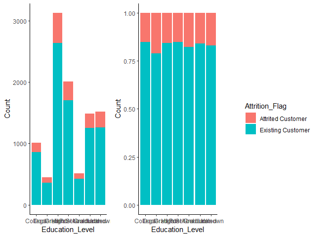
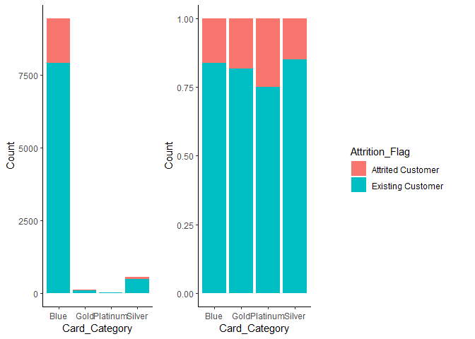

# Background

Customer churn is the loss/turnover of a client. For this analysis, the goal is to predict/classify customers who will churn. We will begin with exploratory data analysis to get a comprehensive understanding of the data, and then perform pre-processing if necessary, and delve into model development and evaluation. 

I will be performing the analysis in R, and additionally leverage some of its external packages for analysis and visualizations. 


```r
# Import and load packages
required_packages <- c("RColorBrewer", "cowplot", 
                       "lubridate", 
                       "Hmisc", "psych", "DataExplorer",
                       "tidyverse", "data.table", "knitr",
                       "precrec", "rpart.plot", "smotefamily",
                       "mlr3", "mlr3learners", "mlr3viz", 
                       "mlr3filters", "mlr3pipelines", "mlr3tuning")

packageCheck <- lapply(required_packages, FUN = function(x) {
  if(!require(x, character.only = TRUE)) {
    install.packages(x, dependencies = TRUE)
    library(x, character.only = TRUE)
  }
})
```


Let us take a peek at the data 


```r
# Plot the profile of the data
DataExplorer::plot_str(bank_churn)
```


```r
# Print the first 3 rows of the data 
bank_churn[1:3, ] 
```

```
##    CLIENTNUM    Attrition_Flag Customer_Age Gender Dependent_count
## 1: 768805383 Existing Customer           45      M               3
## 2: 818770008 Existing Customer           49      F               5
## 3: 713982108 Existing Customer           51      M               3
##    Education_Level Marital_Status Income_Category Card_Category Months_on_book
## 1:     High School        Married     $60K - $80K          Blue             39
## 2:        Graduate         Single  Less than $40K          Blue             44
## 3:        Graduate        Married    $80K - $120K          Blue             36
##    Total_Relationship_Count Months_Inactive_12_mon Contacts_Count_12_mon
## 1:                        5                      1                     3
## 2:                        6                      1                     2
## 3:                        4                      1                     0
##    Credit_Limit Total_Revolving_Bal Avg_Open_To_Buy Total_Amt_Chng_Q4_Q1
## 1:        12691                 777           11914                1.335
## 2:         8256                 864            7392                1.541
## 3:         3418                   0            3418                2.594
##    Total_Trans_Amt Total_Trans_Ct Total_Ct_Chng_Q4_Q1 Avg_Utilization_Ratio
## 1:            1144             42               1.625                 0.061
## 2:            1291             33               3.714                 0.105
## 3:            1887             20               2.333                 0.000
```

Below is a table informing what the different features mean. 


|Variable Name            |Variable Meaning                                        |
|:------------------------|:-------------------------------------------------------|
|CLIENTNUM                |Client number                                           |
|Attrition_Flag           |Whether or not the customer churned                     |
|Customer_Age             |Age of customer                                         |
|Gender                   |Sex of customer                                         |
|Dependent_count          |Number of dependents                                    |
|Education_Level          |Educational qualification of the account holder         |
|Marital_Status           |Married, Single, Divorced or Unknown                    |
|Income_Category          |Annual income category of the account holder            |
|Card_Category            |Type of card                                            |
|Months_on_book           |Period of relationship with the bank                    |
|Total_Relationship_Count |Total number of products held by the customer           |
|Months_Inactive_12_mon   |Number of months inactive in the last 12 months         |
|Contacts_Count_12_mon    |No of contacts in the last 12 months                    |
|Credit_Limit             |Credit limit on the credit card                         |
|Total_Revolving_Bal      |Total revolving balance on the credit card              |
|Avg_Open_To_Buy          |Open to buy credit line (Average of the last 12 months) |
|Total_Amt_Chng_Q4_Q1     |Change in transaction amount (Q4/Q1)                    |
|Total_Trans_Amt          |Total transaction amount in the last 12 months          |
|Total_Trans_Ct           |Total transaction count in the last 12 months           |
|Total_Ct_Chng_Q4_Q1      |Change in transaction count (Q4/Q1)                     |
|Avg_Utilization_Ratio    |Average card utilization ratio                          |

We have some bit of features here and our goal is to predict whether or not a customer will churn, as such our target feature is the Attrition_Flag. The Attrition Flag is a categorical feature that informs whether or not the customer churned, so let us get information on this feature, and make a visual representation on the proportions.


```r
# Create a table indicating churn proportions
churn_proportion <- table(bank_churn$Attrition_Flag) %>% data.table() %>% setnames(new = c("Customer Group", "Count"))
churn_proportion$`Percentage` <- round((churn_proportion$Count/sum(churn_proportion$Count))*100, 2)
churn_proportion %>% kable()
```


|Customer Group    | Count| Percentage|
|:-----------------|-----:|----------:|
|Attrited Customer |  1627|      16.07|
|Existing Customer |  8500|      83.93|

```r
# Make pie chart of churn proportions 
pie(churn_proportion$Count, labels = paste(churn_proportion$`Customer Group`, paste(churn_proportion$Percentage, sep = "", "%"), sep = ", "), col = c("red", "burlywood"), main = "Percantage of credit card customers who have churned.\n Total number of credit card customers: 10127")
```

<!-- -->

As illustrated in the pie chart, we have quite the imbalanced target feature with Attrited customers being 16.07% of the data, and the other 83.93% representing Existing customers. This gives something to think about through analysis and model development. 

Our goal, as mentioned earlier, is to develop a model that can effectively predict whether or not a customer will churn. That said, a model that better predicts the churning of a customer will serve better than a model the predicts the customer will stay. This piece of information will be key when evaluating model performance. 

As a case scenario, say we have a model that predicts every customer will remain; if we test this model on our complete data set, and evaluate simply using accuracy, then our model will be right 83.93% of the time...simply misleading benchmark for evaluations give our model may very well be useless in detecting/predicting customer who will churn. In essence, we must keep our analytics goal (i.e., predicting customers who churn) in mind. 

Let us continue with our data exploration and pre-processing. 


```r
# Get the class of each variable
data.table(`Variable Name` = variable_names, `Variable Class` = lapply(bank_churn, class)) %>% t()
```

```
##                [,1]        [,2]             [,3]           [,4]       
## Variable Name  "CLIENTNUM" "Attrition_Flag" "Customer_Age" "Gender"   
## Variable Class "integer"   "character"      "integer"      "character"
##                [,5]              [,6]              [,7]            
## Variable Name  "Dependent_count" "Education_Level" "Marital_Status"
## Variable Class "integer"         "character"       "character"     
##                [,8]              [,9]            [,10]           
## Variable Name  "Income_Category" "Card_Category" "Months_on_book"
## Variable Class "character"       "character"     "integer"       
##                [,11]                      [,12]                   
## Variable Name  "Total_Relationship_Count" "Months_Inactive_12_mon"
## Variable Class "integer"                  "integer"               
##                [,13]                   [,14]          [,15]                
## Variable Name  "Contacts_Count_12_mon" "Credit_Limit" "Total_Revolving_Bal"
## Variable Class "integer"               "numeric"      "integer"            
##                [,16]             [,17]                  [,18]            
## Variable Name  "Avg_Open_To_Buy" "Total_Amt_Chng_Q4_Q1" "Total_Trans_Amt"
## Variable Class "numeric"         "numeric"              "integer"        
##                [,19]            [,20]                 [,21]                  
## Variable Name  "Total_Trans_Ct" "Total_Ct_Chng_Q4_Q1" "Avg_Utilization_Ratio"
## Variable Class "integer"        "numeric"             "numeric"
```

We have to convert character variables to factors. We also have to convert some variables that are declared as integers to numeric variables i.e., Customer_Age (I think of age as a continuum), Total_Revolving_Bal, and Total_Trans_Amt


```r
# Select the character variables to be converted factors
character_variables <- c("Attrition_Flag", "Gender", "Education_Level", "Marital_Status", "Income_Category", "Card_Category")

# Convert the character variables to factors
bank_churn[, (character_variables) := lapply(.SD, factor), .SDcols = character_variables]

# Select the integersvariables to be converted to numeric
numeric_variables <- c("Customer_Age", "Total_Revolving_Bal", "Total_Trans_Amt")

# Convert some integers to numeric
bank_churn[, (numeric_variables) := lapply(.SD, as.numeric), .SDcols = numeric_variables]
```


```r
# Verify that classes have been appropriately set 
lapply(bank_churn, class) %>% t()
```

```
##      CLIENTNUM Attrition_Flag Customer_Age Gender   Dependent_count
## [1,] "integer" "factor"       "numeric"    "factor" "integer"      
##      Education_Level Marital_Status Income_Category Card_Category
## [1,] "factor"        "factor"       "factor"        "factor"     
##      Months_on_book Total_Relationship_Count Months_Inactive_12_mon
## [1,] "integer"      "integer"                "integer"             
##      Contacts_Count_12_mon Credit_Limit Total_Revolving_Bal Avg_Open_To_Buy
## [1,] "integer"             "numeric"    "numeric"           "numeric"      
##      Total_Amt_Chng_Q4_Q1 Total_Trans_Amt Total_Trans_Ct Total_Ct_Chng_Q4_Q1
## [1,] "numeric"            "numeric"       "integer"      "numeric"          
##      Avg_Utilization_Ratio
## [1,] "numeric"
```

Thus far, the only input feature I see that is not necessary to be included in our model is the "CLIENTNUM", The CLIENTNUM is just an identifier. I won't remove it just yet though, in accordance with the theme of EDA I'll make a plot to see the relationship between the client ID and Attrition Flag. We have no time variable to evaluate the churning through time. So, my maybe flawed logic is that the recent customers have higher client numbers than earlier customers...you know, customer 1, customer 2, ...., customer *n*, etc. 


```r
ggplot(data = bank_churn) +
  geom_point(aes(x = CLIENTNUM, y = Attrition_Flag, color = Attrition_Flag)) +
  xlab("Client Number") +
  ylab("Customer Group") +
  theme_classic()
```

<!-- -->

Damn, no cigar! But yes, visually, we confirm that the Client Number has no value in informing whether or not a client will churn. 

Let us explore our numeric input features 


```r
# Check correlation among variables 
correlation_data <- bank_churn[, !c("CLIENTNUM")] %>% 
  keep(is.numeric) %>% 
  as.matrix() %>%
  rcorr() 
```


```r
# Make correlation plot 
corrplot::corrplot(correlation_data$r, type = "lower", p.mat = correlation_data$P, sig.level = 0.05, order = "alphabet", tl.cex = 0.7)
```

<!-- -->

From above, we see that not too many quantitative variables are highly and significantly correlated. The correlated variables are however understandably related and include: 

- Customer Age and Months on book (R^2^ = 0.789, p-value < 0.05)
- Open to buy credit line and Credit limit (R^2^ = 0.996, p-value < 0.05)
- Average utilization ratio and Total revolving balance (R^2^ = 0.624, p-value < 0.05)
- Total transaction count and Total transaction amount (R^2^ = 0.0.807, p-value < 0.05)

The above information should be noted when making a model as it violates some assumptions that underlie some methods. 

How about the distribution of the numerical features as they relate to Attrition Flag? 


```r
# Density plot illustration distribution of total transaction amount
trans_amnt_density <- ggplot(data = bank_churn, aes(x = Total_Trans_Amt, color = Attrition_Flag, fill = Attrition_Flag)) + 
  geom_density(alpha = 0.5) + 
  theme_classic() +
  theme(legend.position = "none")

# Box plot illustration distribution of total transaction count 
trans_amnt_boxplot <- ggplot(data = bank_churn, aes(x = Total_Trans_Amt, y = Attrition_Flag, fill = Attrition_Flag)) +
  geom_boxplot() +
  theme_classic() +
  theme(legend.position = "none")

plot_grid(trans_amnt_density, trans_amnt_boxplot, ncol = 1)
```

<!-- -->

Based on the above plot, we see that clients who churn mostly have lower transaction amounts that those who do not churn. There are outliers in both categories, and these outliers have increased transaction amounts. Both groups have a right skew, and as shown below, taking the log10 of these groups somewhat normalizes their distribution. Another piece of information may be useful depending on the model we build. 


```r
# Density plot illustration distribution of log total transaction amount
log_trans_amnt_density <- ggplot(data = bank_churn, aes(x = log10(Total_Trans_Amt), color = Attrition_Flag, fill = Attrition_Flag)) + 
  geom_density(alpha = 0.5) + 
  theme_classic() +
  theme(legend.position = "none")

# Box plot illustration distribution of log total transaction amount
log_trans_amnt_boxplot <- ggplot(data = bank_churn, aes(x = log10(Total_Trans_Amt), y = Attrition_Flag, fill = Attrition_Flag)) +
  geom_boxplot() +
  theme_classic() +
  theme(legend.position = "none")

plot_grid(log_trans_amnt_density, log_trans_amnt_boxplot, ncol = 1)
```

<!-- -->

Below are the plots/distribution of the other numerical features. As expected, the total transaction count follows a similar distribution to the total transaction amount given the relationship between these variables.


```r
# Density plot illustration distribution of total transaction count 
ggplot(bank_churn, aes(x = Total_Trans_Ct, color = Attrition_Flag, fill = Attrition_Flag)) + 
  geom_density(alpha = 0.5) + 
  theme_classic()
```

<!-- -->

```r
# Density plot illustration distribution of Change in transaction count (Q4/Q1)
ggplot(bank_churn, aes(x = Total_Ct_Chng_Q4_Q1, color = Attrition_Flag, fill = Attrition_Flag)) + 
  geom_density(alpha = 0.5) + 
  theme_classic()
```

<!-- -->

```r
# Density plot illustration distribution of Change in transaction amount (Q4/Q1) 
ggplot(bank_churn, aes(x = Total_Amt_Chng_Q4_Q1, color = Attrition_Flag, fill = Attrition_Flag)) + 
  geom_density(alpha = 0.5) + 
  theme_classic()
```

<!-- -->

```r
# Density plot illustration distribution of Total revolving balance on the credit card
ggplot(bank_churn, aes(x = Total_Revolving_Bal, color = Attrition_Flag, fill = Attrition_Flag)) + 
  geom_density(alpha = 0.5) + 
  theme_classic()
```

<!-- -->

Let us explore the categorical features. 

```r
DataExplorer::plot_bar(bank_churn)
```

<!-- -->

The bar plot also informs that with the exception of Male:Female and Married:Single, the proportions of categories within the data are not evenly distributed. Let us get the actual metrics on the categorical features. 


```r
# Metrics on the categorical features
Hmisc::describe(bank_churn[, c("Gender", "Education_Level", "Marital_Status", "Income_Category", "Card_Category")])
```

```
## bank_churn[, c("Gender", "Education_Level", "Marital_Status", "Income_Category", "Card_Category")] 
## 
##  5  Variables      10127  Observations
## --------------------------------------------------------------------------------
## Gender 
##        n  missing distinct 
##    10127        0        2 
##                       
## Value          F     M
## Frequency   5358  4769
## Proportion 0.529 0.471
## --------------------------------------------------------------------------------
## Education_Level 
##        n  missing distinct 
##    10127        0        7 
## 
## lowest : College       Doctorate     Graduate      High School   Post-Graduate
## highest: Graduate      High School   Post-Graduate Uneducated    Unknown      
##                                                                   
## Value            College     Doctorate      Graduate   High School
## Frequency           1013           451          3128          2013
## Proportion         0.100         0.045         0.309         0.199
##                                                     
## Value      Post-Graduate    Uneducated       Unknown
## Frequency            516          1487          1519
## Proportion         0.051         0.147         0.150
## --------------------------------------------------------------------------------
## Marital_Status 
##        n  missing distinct 
##    10127        0        4 
##                                               
## Value      Divorced  Married   Single  Unknown
## Frequency       748     4687     3943      749
## Proportion    0.074    0.463    0.389    0.074
## --------------------------------------------------------------------------------
## Income_Category 
##        n  missing distinct 
##    10127        0        6 
## 
## lowest : $120K +        $40K - $60K    $60K - $80K    $80K - $120K   Less than $40K
## highest: $40K - $60K    $60K - $80K    $80K - $120K   Less than $40K Unknown       
##                                                                       
## Value             $120K +    $40K - $60K    $60K - $80K   $80K - $120K
## Frequency             727           1790           1402           1535
## Proportion          0.072          0.177          0.138          0.152
##                                         
## Value      Less than $40K        Unknown
## Frequency            3561           1112
## Proportion          0.352          0.110
## --------------------------------------------------------------------------------
## Card_Category 
##        n  missing distinct 
##    10127        0        4 
##                                               
## Value          Blue     Gold Platinum   Silver
## Frequency      9436      116       20      555
## Proportion    0.932    0.011    0.002    0.055
## --------------------------------------------------------------------------------
```

The most striking bit of information in here is that 93.2% of the individuals on which the information was collected have Blue cards. It will be surprising, nay, highly improbable that the card category will be an important feature in the data given the proportion of people who churned. 

Now we explore the relationship between categorical input features and target feature 

As shown below, our data contains more females than males, although of relatively similar proportions; also, of our total clients, 9.18% were females who churned while 6.88% were males who churned. We will observe the other categorical features in similar manner, searching for categories with high attrition observations. It should however be noted that this method of exploration does not account for interaction among features. 


```r
table(bank_churn$Gender, bank_churn$Attrition_Flag)
```

```
##    
##     Attrited Customer Existing Customer
##   F               930              4428
##   M               697              4072
```


```r
gender_attrition <- bank_churn[, by = .(Gender, Attrition_Flag), .N] %>% 
  .[order(Gender)] %>% setnames(old = "N", new = "Count")

gender_attrition_stack <- ggplot(gender_attrition, aes(fill = Attrition_Flag, y = Count, x = Gender)) +
  geom_bar(position = "stack", stat = "identity") +
  theme_classic() +
  theme(legend.position = "none")

gender_attrition_fill <- ggplot(gender_attrition, aes(fill = Attrition_Flag, y = Count, x = Gender)) +
  geom_bar(position = "fill", stat = "identity") +
  theme_classic() +
  theme(legend.position = "none")

gender_attrition_legend <- get_legend(gender_attrition_stack + theme(legend.position = "right"))
```


```r
plot_grid(gender_attrition_stack, gender_attrition_fill, gender_attrition_legend, ncol = 3)
```

<!-- -->


```r
table(bank_churn$Education_Level, bank_churn$Attrition_Flag)
```

```
##                
##                 Attrited Customer Existing Customer
##   College                     154               859
##   Doctorate                    95               356
##   Graduate                    487              2641
##   High School                 306              1707
##   Post-Graduate                92               424
##   Uneducated                  237              1250
##   Unknown                     256              1263
```


```r
Education_Level_attrition <- bank_churn[, by = .(Education_Level, Attrition_Flag), .N] %>% 
  .[order(Education_Level)] %>% setnames(old = "N", new = "Count")

Education_Level_attrition_stack <- ggplot(Education_Level_attrition, aes(fill = Attrition_Flag, y = Count, x = Education_Level)) +
  geom_bar(position = "stack", stat = "identity") +
  theme_classic() +
  theme(legend.position = "none")

Education_Level_attrition_fill <- ggplot(Education_Level_attrition, aes(fill = Attrition_Flag, y = Count, x = Education_Level)) +
  geom_bar(position = "fill", stat = "identity") +
  theme_classic() +
  theme(legend.position = "none")

Education_Level_attrition_legend <- get_legend(Education_Level_attrition_stack + theme(legend.position = "right"))
```


```r
plot_grid(Education_Level_attrition_stack, Education_Level_attrition_fill, Education_Level_attrition_legend, ncol = 3)
```

<!-- -->


```r
table(bank_churn$Marital_Status, bank_churn$Attrition_Flag)
```

```
##           
##            Attrited Customer Existing Customer
##   Divorced               121               627
##   Married                709              3978
##   Single                 668              3275
##   Unknown                129               620
```


```r
Marital_Status_attrition <- bank_churn[, by = .(Marital_Status, Attrition_Flag), .N] %>% 
  .[order(Marital_Status)] %>% setnames(old = "N", new = "Count")

Marital_Status_attrition_stack <- ggplot(Marital_Status_attrition, aes(fill = Attrition_Flag, y = Count, x = Marital_Status)) +
  geom_bar(position = "stack", stat = "identity") +
  theme_classic() +
  theme(legend.position = "none")

Marital_Status_attrition_fill <- ggplot(Marital_Status_attrition, aes(fill = Attrition_Flag, y = Count, x = Marital_Status)) +
  geom_bar(position = "fill", stat = "identity") +
  theme_classic() +
  theme(legend.position = "none")

Marital_Status_attrition_legend <- get_legend(Marital_Status_attrition_stack + theme(legend.position = "right"))
```


```r
plot_grid(Marital_Status_attrition_stack, Marital_Status_attrition_fill, Marital_Status_attrition_legend, ncol = 3)
```

<!-- -->


```r
table(bank_churn$Income_Category, bank_churn$Attrition_Flag)
```

```
##                 
##                  Attrited Customer Existing Customer
##   $120K +                      126               601
##   $40K - $60K                  271              1519
##   $60K - $80K                  189              1213
##   $80K - $120K                 242              1293
##   Less than $40K               612              2949
##   Unknown                      187               925
```


```r
Income_Category_attrition <- bank_churn[, by = .(Income_Category, Attrition_Flag), .N] %>% 
  .[order(Income_Category)] %>% setnames(old = "N", new = "Count")

Income_Category_attrition_stack <- ggplot(Income_Category_attrition, aes(fill = Attrition_Flag, y = Count, x = Income_Category)) +
  geom_bar(position = "stack", stat = "identity") +
  theme_classic() +
  theme(legend.position = "none")

Income_Category_attrition_fill <- ggplot(Income_Category_attrition, aes(fill = Attrition_Flag, y = Count, x = Income_Category)) +
  geom_bar(position = "fill", stat = "identity") +
  theme_classic() +
  theme(legend.position = "none")

Income_Category_attrition_legend <- get_legend(Income_Category_attrition_stack + theme(legend.position = "right"))
```


```r
plot_grid(Income_Category_attrition_stack, Income_Category_attrition_fill, Income_Category_attrition_legend, ncol = 3)
```

<!-- -->


```r
table(bank_churn$Card_Category, bank_churn$Attrition_Flag)
```

```
##           
##            Attrited Customer Existing Customer
##   Blue                  1519              7917
##   Gold                    21                95
##   Platinum                 5                15
##   Silver                  82               473
```


```r
Card_Category_attrition <- bank_churn[, by = .(Card_Category, Attrition_Flag), .N] %>% 
  .[order(Card_Category)] %>% setnames(old = "N", new = "Count")

Card_Category_attrition_stack <- ggplot(Card_Category_attrition, aes(fill = Attrition_Flag, y = Count, x = Card_Category)) +
  geom_bar(position = "stack", stat = "identity") +
  theme_classic() +
  theme(legend.position = "none")

Card_Category_attrition_fill <- ggplot(Card_Category_attrition, aes(fill = Attrition_Flag, y = Count, x = Card_Category)) +
  geom_bar(position = "fill", stat = "identity") +
  theme_classic() +
  theme(legend.position = "none")

Card_Category_attrition_legend <- get_legend(Card_Category_attrition_stack + theme(legend.position = "right"))
```


```r
plot_grid(Card_Category_attrition_stack, Card_Category_attrition_fill, Card_Category_attrition_legend, ncol = 3)
```

<!-- -->


```r
categorical_attrition <- bank_churn[, by = .(Gender, Education_Level, Marital_Status, Income_Category, Card_Category, Attrition_Flag), .N] %>% setnames(old = "N", new = "Count") %>% .[order(Attrition_Flag, -Count)]
```


```r
attrited_customer <- categorical_attrition[Attrition_Flag == "Attrited Customer"] %>% 
  .[, proportion_of_total := (Count/sum(Count))*100]
```


```r
# Print out the top 10 observations that account for attrited customers 
attrited_customer[1:10, !c("Attrition_Flag")] %>% kable()
```


|Gender |Education_Level |Marital_Status |Income_Category |Card_Category | Count| proportion_of_total|
|:------|:---------------|:--------------|:---------------|:-------------|-----:|-------------------:|
|F      |Graduate        |Single         |Less than $40K  |Blue          |    80|            4.917025|
|F      |Graduate        |Married        |Less than $40K  |Blue          |    79|            4.855562|
|F      |Unknown         |Married        |Less than $40K  |Blue          |    44|            2.704364|
|F      |High School     |Married        |Less than $40K  |Blue          |    39|            2.397050|
|F      |Unknown         |Single         |Less than $40K  |Blue          |    37|            2.274124|
|F      |High School     |Single         |Less than $40K  |Blue          |    35|            2.151199|
|F      |Uneducated      |Single         |Less than $40K  |Blue          |    34|            2.089736|
|M      |Graduate        |Married        |$80K - $120K    |Blue          |    27|            1.659496|
|F      |Uneducated      |Married        |Less than $40K  |Blue          |    25|            1.536570|
|F      |Graduate        |Married        |Unknown         |Blue          |    25|            1.536570|

The observations shown above illustrate the characteristics of 26% of our churned customers. We can further evaluate the table containing 100% of our churned customers to evaluate which categorical features (after encoding) account for most of the variation among the churned customers. One thing is for certain though, the Card Category doesn't contain most of the variation within the data. 

# Modelling 

Armed with some information from exploratory analysis, let us proceed to model development. For this analysis, I'll like to use a decision tree because of its simplicity to comprehend when understanding the relationship between input features and the target variable. I'll also focus on improving the performance of this decision tree albeit by utilizing ensemble methods (i.e., following random forests and k-nearest neighbours). 


```r
# Create the task 
task <- TaskClassif$new(id = "BankChurn", backend = bank_churn, target = "Attrition_Flag", positive = "Attrited Customer")
print(task)
```

```
## <TaskClassif:BankChurn> (10127 x 21)
## * Target: Attrition_Flag
## * Properties: twoclass
## * Features (20):
##   - dbl (8): Avg_Open_To_Buy, Avg_Utilization_Ratio, Credit_Limit,
##     Customer_Age, Total_Amt_Chng_Q4_Q1, Total_Ct_Chng_Q4_Q1,
##     Total_Revolving_Bal, Total_Trans_Amt
##   - int (7): CLIENTNUM, Contacts_Count_12_mon, Dependent_count,
##     Months_Inactive_12_mon, Months_on_book, Total_Relationship_Count,
##     Total_Trans_Ct
##   - fct (5): Card_Category, Education_Level, Gender, Income_Category,
##     Marital_Status
```


```r
# Set CLIENTNUM as an identifier 
task$set_col_roles("CLIENTNUM", roles = "name")
```


```r
# Explore the task 
as.data.table(task$col_info)
```

```
##                           id    type
##  1:                 ..row_id integer
##  2:           Attrition_Flag  factor
##  3:          Avg_Open_To_Buy numeric
##  4:    Avg_Utilization_Ratio numeric
##  5:                CLIENTNUM integer
##  6:            Card_Category  factor
##  7:    Contacts_Count_12_mon integer
##  8:             Credit_Limit numeric
##  9:             Customer_Age numeric
## 10:          Dependent_count integer
## 11:          Education_Level  factor
## 12:                   Gender  factor
## 13:          Income_Category  factor
## 14:           Marital_Status  factor
## 15:   Months_Inactive_12_mon integer
## 16:           Months_on_book integer
## 17:     Total_Amt_Chng_Q4_Q1 numeric
## 18:      Total_Ct_Chng_Q4_Q1 numeric
## 19: Total_Relationship_Count integer
## 20:      Total_Revolving_Bal numeric
## 21:          Total_Trans_Amt numeric
## 22:           Total_Trans_Ct integer
##                           id    type
##                                                                  levels
##  1:                                                                    
##  2:                                 Attrited Customer,Existing Customer
##  3:                                                                    
##  4:                                                                    
##  5:                                                                    
##  6:                                           Blue,Gold,Platinum,Silver
##  7:                                                                    
##  8:                                                                    
##  9:                                                                    
## 10:                                                                    
## 11: College,Doctorate,Graduate,High School,Post-Graduate,Uneducated,...
## 12:                                                                 F,M
## 13: $120K +,$40K - $60K,$60K - $80K,$80K - $120K,Less than $40K,Unknown
## 14:                                     Divorced,Married,Single,Unknown
## 15:                                                                    
## 16:                                                                    
## 17:                                                                    
## 18:                                                                    
## 19:                                                                    
## 20:                                                                    
## 21:                                                                    
## 22:                                                                    
##                                                                  levels
```

```r
task$col_roles
```

```
## $feature
##  [1] "Avg_Open_To_Buy"          "Avg_Utilization_Ratio"   
##  [3] "Card_Category"            "Contacts_Count_12_mon"   
##  [5] "Credit_Limit"             "Customer_Age"            
##  [7] "Dependent_count"          "Education_Level"         
##  [9] "Gender"                   "Income_Category"         
## [11] "Marital_Status"           "Months_Inactive_12_mon"  
## [13] "Months_on_book"           "Total_Amt_Chng_Q4_Q1"    
## [15] "Total_Ct_Chng_Q4_Q1"      "Total_Relationship_Count"
## [17] "Total_Revolving_Bal"      "Total_Trans_Amt"         
## [19] "Total_Trans_Ct"          
## 
## $target
## [1] "Attrition_Flag"
## 
## $name
## [1] "CLIENTNUM"
## 
## $order
## character(0)
## 
## $stratum
## character(0)
## 
## $group
## character(0)
## 
## $weight
## character(0)
## 
## $uri
## character(0)
```

```r
table(task$truth()) # Class imbalance with Attrited customers being 1/5 less than Existing customers 
```

```
## 
## Attrited Customer Existing Customer 
##              1627              8500
```

```r
task$positive
```

```
## [1] "Attrited Customer"
```

```r
Hmisc::describe(as.data.table(task))
```

```
## as.data.table(task) 
## 
##  20  Variables      10127  Observations
## --------------------------------------------------------------------------------
## Attrition_Flag 
##        n  missing distinct 
##    10127        0        2 
##                                               
## Value      Attrited Customer Existing Customer
## Frequency               1627              8500
## Proportion             0.161             0.839
## --------------------------------------------------------------------------------
## Avg_Open_To_Buy 
##        n  missing distinct     Info     Mean      Gmd      .05      .10 
##    10127        0     6813        1     7469     8848    480.3    683.0 
##      .25      .50      .75      .90      .95 
##   1324.5   3474.0   9859.0  21964.6  32183.4 
## 
## lowest :     3    10    14    15    24, highest: 34297 34300 34302 34362 34516
## --------------------------------------------------------------------------------
## Avg_Utilization_Ratio 
##        n  missing distinct     Info     Mean      Gmd      .05      .10 
##    10127        0      964    0.985   0.2749   0.3039    0.000    0.000 
##      .25      .50      .75      .90      .95 
##    0.023    0.176    0.503    0.707    0.793 
## 
## lowest : 0.000 0.004 0.005 0.006 0.007, highest: 0.990 0.992 0.994 0.995 0.999
## --------------------------------------------------------------------------------
## Card_Category 
##        n  missing distinct 
##    10127        0        4 
##                                               
## Value          Blue     Gold Platinum   Silver
## Frequency      9436      116       20      555
## Proportion    0.932    0.011    0.002    0.055
## --------------------------------------------------------------------------------
## Contacts_Count_12_mon 
##        n  missing distinct     Info     Mean      Gmd 
##    10127        0        7    0.925    2.455    1.204 
## 
## lowest : 0 1 2 3 4, highest: 2 3 4 5 6
##                                                     
## Value          0     1     2     3     4     5     6
## Frequency    399  1499  3227  3380  1392   176    54
## Proportion 0.039 0.148 0.319 0.334 0.137 0.017 0.005
## --------------------------------------------------------------------------------
## Credit_Limit 
##        n  missing distinct     Info     Mean      Gmd      .05      .10 
##    10127        0     6205        1     8632     8837     1439     1762 
##      .25      .50      .75      .90      .95 
##     2555     4549    11068    23400    34516 
## 
## lowest :  1438.3  1439.0  1440.0  1441.0  1442.0
## highest: 34198.0 34427.0 34458.0 34496.0 34516.0
## --------------------------------------------------------------------------------
## Customer_Age 
##        n  missing distinct     Info     Mean      Gmd      .05      .10 
##    10127        0       45    0.999    46.33     9.09       33       36 
##      .25      .50      .75      .90      .95 
##       41       46       52       57       60 
## 
## lowest : 26 27 28 29 30, highest: 66 67 68 70 73
## --------------------------------------------------------------------------------
## Dependent_count 
##        n  missing distinct     Info     Mean      Gmd 
##    10127        0        6    0.952    2.346    1.452 
## 
## lowest : 0 1 2 3 4, highest: 1 2 3 4 5
##                                               
## Value          0     1     2     3     4     5
## Frequency    904  1838  2655  2732  1574   424
## Proportion 0.089 0.181 0.262 0.270 0.155 0.042
## --------------------------------------------------------------------------------
## Education_Level 
##        n  missing distinct 
##    10127        0        7 
## 
## lowest : College       Doctorate     Graduate      High School   Post-Graduate
## highest: Graduate      High School   Post-Graduate Uneducated    Unknown      
##                                                                   
## Value            College     Doctorate      Graduate   High School
## Frequency           1013           451          3128          2013
## Proportion         0.100         0.045         0.309         0.199
##                                                     
## Value      Post-Graduate    Uneducated       Unknown
## Frequency            516          1487          1519
## Proportion         0.051         0.147         0.150
## --------------------------------------------------------------------------------
## Gender 
##        n  missing distinct 
##    10127        0        2 
##                       
## Value          F     M
## Frequency   5358  4769
## Proportion 0.529 0.471
## --------------------------------------------------------------------------------
## Income_Category 
##        n  missing distinct 
##    10127        0        6 
## 
## lowest : $120K +        $40K - $60K    $60K - $80K    $80K - $120K   Less than $40K
## highest: $40K - $60K    $60K - $80K    $80K - $120K   Less than $40K Unknown       
##                                                                       
## Value             $120K +    $40K - $60K    $60K - $80K   $80K - $120K
## Frequency             727           1790           1402           1535
## Proportion          0.072          0.177          0.138          0.152
##                                         
## Value      Less than $40K        Unknown
## Frequency            3561           1112
## Proportion          0.352          0.110
## --------------------------------------------------------------------------------
## Marital_Status 
##        n  missing distinct 
##    10127        0        4 
##                                               
## Value      Divorced  Married   Single  Unknown
## Frequency       748     4687     3943      749
## Proportion    0.074    0.463    0.389    0.074
## --------------------------------------------------------------------------------
## Months_Inactive_12_mon 
##        n  missing distinct     Info     Mean      Gmd 
##    10127        0        7      0.9    2.341    1.065 
## 
## lowest : 0 1 2 3 4, highest: 2 3 4 5 6
##                                                     
## Value          0     1     2     3     4     5     6
## Frequency     29  2233  3282  3846   435   178   124
## Proportion 0.003 0.220 0.324 0.380 0.043 0.018 0.012
## --------------------------------------------------------------------------------
## Months_on_book 
##        n  missing distinct     Info     Mean      Gmd      .05      .10 
##    10127        0       44    0.985    35.93    8.767       22       26 
##      .25      .50      .75      .90      .95 
##       31       36       40       46       50 
## 
## lowest : 13 14 15 16 17, highest: 52 53 54 55 56
## --------------------------------------------------------------------------------
## Total_Amt_Chng_Q4_Q1 
##        n  missing distinct     Info     Mean      Gmd      .05      .10 
##    10127        0     1158        1   0.7599   0.2251   0.4630   0.5310 
##      .25      .50      .75      .90      .95 
##   0.6310   0.7360   0.8590   0.9974   1.1030 
## 
## lowest : 0.000 0.010 0.018 0.046 0.061, highest: 2.368 2.594 2.675 3.355 3.397
## --------------------------------------------------------------------------------
## Total_Ct_Chng_Q4_Q1 
##        n  missing distinct     Info     Mean      Gmd      .05      .10 
##    10127        0      830        1   0.7122   0.2409    0.368    0.452 
##      .25      .50      .75      .90      .95 
##    0.582    0.702    0.818    0.950    1.069 
## 
## lowest : 0.000 0.028 0.029 0.038 0.053, highest: 3.000 3.250 3.500 3.571 3.714
## --------------------------------------------------------------------------------
## Total_Relationship_Count 
##        n  missing distinct     Info     Mean      Gmd 
##    10127        0        6    0.966    3.813    1.759 
## 
## lowest : 1 2 3 4 5, highest: 2 3 4 5 6
##                                               
## Value          1     2     3     4     5     6
## Frequency    910  1243  2305  1912  1891  1866
## Proportion 0.090 0.123 0.228 0.189 0.187 0.184
## --------------------------------------------------------------------------------
## Total_Revolving_Bal 
##        n  missing distinct     Info     Mean      Gmd      .05      .10 
##    10127        0     1974    0.985     1163      927        0        0 
##      .25      .50      .75      .90      .95 
##      359     1276     1784     2228     2517 
## 
## lowest :    0  132  134  145  154, highest: 2511 2512 2513 2514 2517
## --------------------------------------------------------------------------------
## Total_Trans_Amt 
##        n  missing distinct     Info     Mean      Gmd      .05      .10 
##    10127        0     5033        1     4404     3207     1283     1501 
##      .25      .50      .75      .90      .95 
##     2156     3899     4741     8212    14212 
## 
## lowest :   510   530   563   569   594, highest: 17628 17634 17744 17995 18484
## --------------------------------------------------------------------------------
## Total_Trans_Ct 
##        n  missing distinct     Info     Mean      Gmd      .05      .10 
##    10127        0      126        1    64.86     26.6       28       33 
##      .25      .50      .75      .90      .95 
##       45       67       81       92      105 
## 
## lowest :  10  11  12  13  14, highest: 131 132 134 138 139
## --------------------------------------------------------------------------------
```


```r
# Split the task into training and test sets 
train_set <- sample(task$nrow, 0.8*task$nrow)
test_set <- setdiff(seq_len(task$nrow), train_set)
```


```r
# Create learner 
learner_dt <- lrn("classif.rpart")
```


```r
# DECISION TREE MODEL; ORIGINAL DATA 
# Do nothing sampler
doing_nothing <- po("nop", id = "nop")

# Create ML graph for undersampler
doing_nothing_sampler <- doing_nothing %>>% 
  learner_dt
 
# Create a graph learner for undersampler
graph_learner_doing_nothing_sampler <- GraphLearner$new(doing_nothing_sampler)
```


```r
# Train the undersampler decision tree model
graph_learner_doing_nothing_sampler$train(task, train_set)
```


```r
# Show the state of the learner
graph_learner_doing_nothing_sampler$state
```

```
## $model
## $model$nop
## list()
## 
## $model$classif.rpart
## $model$classif.rpart$model
## n= 8101 
## 
## node), split, n, loss, yval, (yprob)
##       * denotes terminal node
## 
##  1) root 8101 1305 Existing Customer (0.16109122 0.83890878)  
##    2) Total_Trans_Ct< 54.5 2757 1045 Existing Customer (0.37903518 0.62096482)  
##      4) Total_Revolving_Bal< 642.5 920  242 Attrited Customer (0.73695652 0.26304348)  
##        8) Total_Ct_Chng_Q4_Q1< 0.6615 687  111 Attrited Customer (0.83842795 0.16157205) *
##        9) Total_Ct_Chng_Q4_Q1>=0.6615 233  102 Existing Customer (0.43776824 0.56223176)  
##         18) Total_Relationship_Count< 2.5 41    2 Attrited Customer (0.95121951 0.04878049) *
##         19) Total_Relationship_Count>=2.5 192   63 Existing Customer (0.32812500 0.67187500)  
##           38) Total_Trans_Amt>=1967 86   37 Attrited Customer (0.56976744 0.43023256)  
##             76) Total_Trans_Amt< 2978 67   20 Attrited Customer (0.70149254 0.29850746) *
##             77) Total_Trans_Amt>=2978 19    2 Existing Customer (0.10526316 0.89473684) *
##           39) Total_Trans_Amt< 1967 106   14 Existing Customer (0.13207547 0.86792453) *
##      5) Total_Revolving_Bal>=642.5 1837  367 Existing Customer (0.19978225 0.80021775)  
##       10) Total_Relationship_Count< 2.5 168   39 Attrited Customer (0.76785714 0.23214286) *
##       11) Total_Relationship_Count>=2.5 1669  238 Existing Customer (0.14260036 0.85739964)  
##         22) Total_Trans_Amt>=2102 415  160 Existing Customer (0.38554217 0.61445783)  
##           44) Total_Ct_Chng_Q4_Q1< 0.6315 199   76 Attrited Customer (0.61809045 0.38190955)  
##             88) Customer_Age>=37.5 145   32 Attrited Customer (0.77931034 0.22068966) *
##             89) Customer_Age< 37.5 54   10 Existing Customer (0.18518519 0.81481481) *
##           45) Total_Ct_Chng_Q4_Q1>=0.6315 216   37 Existing Customer (0.17129630 0.82870370) *
##         23) Total_Trans_Amt< 2102 1254   78 Existing Customer (0.06220096 0.93779904) *
##    3) Total_Trans_Ct>=54.5 5344  260 Existing Customer (0.04865269 0.95134731)  
##      6) Total_Trans_Amt>=5423 1215  189 Existing Customer (0.15555556 0.84444444)  
##       12) Total_Trans_Ct< 78.5 204   49 Attrited Customer (0.75980392 0.24019608) *
##       13) Total_Trans_Ct>=78.5 1011   34 Existing Customer (0.03363007 0.96636993) *
##      7) Total_Trans_Amt< 5423 4129   71 Existing Customer (0.01719545 0.98280455) *
## 
## $model$classif.rpart$log
## Empty data.table (0 rows and 3 cols): stage,class,msg
## 
## $model$classif.rpart$train_time
## [1] 0.05
## 
## $model$classif.rpart$train_task
## <TaskClassif:BankChurn> (8101 x 20)
## * Target: Attrition_Flag
## * Properties: twoclass
## * Features (19):
##   - dbl (8): Avg_Open_To_Buy, Avg_Utilization_Ratio, Credit_Limit,
##     Customer_Age, Total_Amt_Chng_Q4_Q1, Total_Ct_Chng_Q4_Q1,
##     Total_Revolving_Bal, Total_Trans_Amt
##   - int (6): Contacts_Count_12_mon, Dependent_count,
##     Months_Inactive_12_mon, Months_on_book, Total_Relationship_Count,
##     Total_Trans_Ct
##   - fct (5): Card_Category, Education_Level, Gender, Income_Category,
##     Marital_Status
## 
## 
## 
## $log
## Empty data.table (0 rows and 3 cols): stage,class,msg
## 
## $train_time
## [1] 0.07
## 
## $train_task
## <TaskClassif:BankChurn> (10127 x 20)
## * Target: Attrition_Flag
## * Properties: twoclass
## * Features (19):
##   - dbl (8): Avg_Open_To_Buy, Avg_Utilization_Ratio, Credit_Limit,
##     Customer_Age, Total_Amt_Chng_Q4_Q1, Total_Ct_Chng_Q4_Q1,
##     Total_Revolving_Bal, Total_Trans_Amt
##   - int (6): Contacts_Count_12_mon, Dependent_count,
##     Months_Inactive_12_mon, Months_on_book, Total_Relationship_Count,
##     Total_Trans_Ct
##   - fct (5): Card_Category, Education_Level, Gender, Income_Category,
##     Marital_Status
```


```r
# Visualize undersampler decision tree model
rpart.plot(graph_learner_doing_nothing_sampler$state$model$classif.rpart$model, cex = 0.6)
```

<!-- -->


```r
# Make predictions on the test set 
prediction_dt <- graph_learner_doing_nothing_sampler$predict(task, test_set)
```


```r
# Show confusion matrix
prediction_dt$confusion
```

```
##                    truth
## response            Attrited Customer Existing Customer
##   Attrited Customer               249                73
##   Existing Customer                73              1631
```


```r
# Print sensitivity
prediction_dt$score(msr("classif.sensitivity"))
```

```
## classif.sensitivity 
##           0.7732919
```

```r
prediction_dt$score(msr("classif.ce"))
```

```
## classif.ce 
## 0.07206318
```

```r
prediction_dt$score(msr("classif.fbeta"))
```

```
## classif.fbeta 
##     0.7732919
```


```r
# DECISION TREE MODEL; UNDERSAMPLER
# Create an undersampler 
undersampler <- po("classbalancing", ratio = 1/5, reference = "major", adjust = "major", shuffle = F, id = "undersampler")

# Create ML graph for undersampler
dt_undersampler <- undersampler %>>% 
  learner_dt

# Create a graph learner for undersampler
graph_learner_undersampler <- GraphLearner$new(dt_undersampler)
```


```r
# Train the undersampler decision tree model
graph_learner_undersampler$train(task, train_set)
```


```r
# Show the state of the learner
graph_learner_undersampler$state
```

```
## $model
## $model$undersampler
## $model$undersampler$affected_cols
##  [1] "Avg_Open_To_Buy"          "Avg_Utilization_Ratio"   
##  [3] "Card_Category"            "Contacts_Count_12_mon"   
##  [5] "Credit_Limit"             "Customer_Age"            
##  [7] "Dependent_count"          "Education_Level"         
##  [9] "Gender"                   "Income_Category"         
## [11] "Marital_Status"           "Months_Inactive_12_mon"  
## [13] "Months_on_book"           "Total_Amt_Chng_Q4_Q1"    
## [15] "Total_Ct_Chng_Q4_Q1"      "Total_Relationship_Count"
## [17] "Total_Revolving_Bal"      "Total_Trans_Amt"         
## [19] "Total_Trans_Ct"          
## 
## $model$undersampler$intasklayout
##                           id    type
##  1:          Avg_Open_To_Buy numeric
##  2:    Avg_Utilization_Ratio numeric
##  3:            Card_Category  factor
##  4:    Contacts_Count_12_mon integer
##  5:             Credit_Limit numeric
##  6:             Customer_Age numeric
##  7:          Dependent_count integer
##  8:          Education_Level  factor
##  9:                   Gender  factor
## 10:          Income_Category  factor
## 11:           Marital_Status  factor
## 12:   Months_Inactive_12_mon integer
## 13:           Months_on_book integer
## 14:     Total_Amt_Chng_Q4_Q1 numeric
## 15:      Total_Ct_Chng_Q4_Q1 numeric
## 16: Total_Relationship_Count integer
## 17:      Total_Revolving_Bal numeric
## 18:          Total_Trans_Amt numeric
## 19:           Total_Trans_Ct integer
## 
## $model$undersampler$outtasklayout
##                           id    type
##  1:          Avg_Open_To_Buy numeric
##  2:    Avg_Utilization_Ratio numeric
##  3:            Card_Category  factor
##  4:    Contacts_Count_12_mon integer
##  5:             Credit_Limit numeric
##  6:             Customer_Age numeric
##  7:          Dependent_count integer
##  8:          Education_Level  factor
##  9:                   Gender  factor
## 10:          Income_Category  factor
## 11:           Marital_Status  factor
## 12:   Months_Inactive_12_mon integer
## 13:           Months_on_book integer
## 14:     Total_Amt_Chng_Q4_Q1 numeric
## 15:      Total_Ct_Chng_Q4_Q1 numeric
## 16: Total_Relationship_Count integer
## 17:      Total_Revolving_Bal numeric
## 18:          Total_Trans_Amt numeric
## 19:           Total_Trans_Ct integer
## 
## $model$undersampler$outtaskshell
## Empty data.table (0 rows and 20 cols): Attrition_Flag,Avg_Open_To_Buy,Avg_Utilization_Ratio,Card_Category,Contacts_Count_12_mon,Credit_Limit...
## 
## 
## $model$classif.rpart
## $model$classif.rpart$model
## n= 2664 
## 
## node), split, n, loss, yval, (yprob)
##       * denotes terminal node
## 
##  1) root 2664 1305 Existing Customer (0.48986486 0.51013514)  
##    2) Total_Trans_Ct< 59.5 1482  375 Attrited Customer (0.74696356 0.25303644)  
##      4) Total_Revolving_Bal< 745 784   56 Attrited Customer (0.92857143 0.07142857) *
##      5) Total_Revolving_Bal>=745 698  319 Attrited Customer (0.54297994 0.45702006)  
##       10) Total_Relationship_Count< 2.5 142    6 Attrited Customer (0.95774648 0.04225352) *
##       11) Total_Relationship_Count>=2.5 556  243 Existing Customer (0.43705036 0.56294964)  
##         22) Total_Trans_Amt>=2028.5 272   99 Attrited Customer (0.63602941 0.36397059)  
##           44) Total_Amt_Chng_Q4_Q1< 1.079 238   68 Attrited Customer (0.71428571 0.28571429)  
##             88) Total_Trans_Ct< 53.5 184   31 Attrited Customer (0.83152174 0.16847826) *
##             89) Total_Trans_Ct>=53.5 54   17 Existing Customer (0.31481481 0.68518519) *
##           45) Total_Amt_Chng_Q4_Q1>=1.079 34    3 Existing Customer (0.08823529 0.91176471) *
##         23) Total_Trans_Amt< 2028.5 284   70 Existing Customer (0.24647887 0.75352113) *
##    3) Total_Trans_Ct>=59.5 1182  198 Existing Customer (0.16751269 0.83248731)  
##      6) Total_Trans_Amt>=5371.5 382  175 Existing Customer (0.45811518 0.54188482)  
##       12) Total_Trans_Ct< 82.5 177   21 Attrited Customer (0.88135593 0.11864407) *
##       13) Total_Trans_Ct>=82.5 205   19 Existing Customer (0.09268293 0.90731707) *
##      7) Total_Trans_Amt< 5371.5 800   23 Existing Customer (0.02875000 0.97125000) *
## 
## $model$classif.rpart$log
## Empty data.table (0 rows and 3 cols): stage,class,msg
## 
## $model$classif.rpart$train_time
## [1] 0.03
## 
## $model$classif.rpart$train_task
## <TaskClassif:BankChurn> (2664 x 20)
## * Target: Attrition_Flag
## * Properties: twoclass
## * Features (19):
##   - dbl (8): Avg_Open_To_Buy, Avg_Utilization_Ratio, Credit_Limit,
##     Customer_Age, Total_Amt_Chng_Q4_Q1, Total_Ct_Chng_Q4_Q1,
##     Total_Revolving_Bal, Total_Trans_Amt
##   - int (6): Contacts_Count_12_mon, Dependent_count,
##     Months_Inactive_12_mon, Months_on_book, Total_Relationship_Count,
##     Total_Trans_Ct
##   - fct (5): Card_Category, Education_Level, Gender, Income_Category,
##     Marital_Status
## 
## 
## 
## $log
## Empty data.table (0 rows and 3 cols): stage,class,msg
## 
## $train_time
## [1] 0.04
## 
## $train_task
## <TaskClassif:BankChurn> (10127 x 20)
## * Target: Attrition_Flag
## * Properties: twoclass
## * Features (19):
##   - dbl (8): Avg_Open_To_Buy, Avg_Utilization_Ratio, Credit_Limit,
##     Customer_Age, Total_Amt_Chng_Q4_Q1, Total_Ct_Chng_Q4_Q1,
##     Total_Revolving_Bal, Total_Trans_Amt
##   - int (6): Contacts_Count_12_mon, Dependent_count,
##     Months_Inactive_12_mon, Months_on_book, Total_Relationship_Count,
##     Total_Trans_Ct
##   - fct (5): Card_Category, Education_Level, Gender, Income_Category,
##     Marital_Status
```


```r
# Visualize undersampler decision tree model
rpart.plot(graph_learner_undersampler$state$model$classif.rpart$model, cex = 0.6)
```

<!-- -->


```r
# Make predictions on the test set 
undersampler_prediction_dt <- graph_learner_undersampler$predict(task, test_set)
```


```r
# Show confusion matrix
undersampler_prediction_dt$confusion
```

```
##                    truth
## response            Attrited Customer Existing Customer
##   Attrited Customer               283               169
##   Existing Customer                39              1535
```


```r
# Print sensitivity
undersampler_prediction_dt$score(msr("classif.sensitivity"))
```

```
## classif.sensitivity 
##            0.878882
```

```r
undersampler_prediction_dt$score(msr("classif.ce"))
```

```
## classif.ce 
##  0.1026654
```

```r
undersampler_prediction_dt$score(msr("classif.fbeta"))
```

```
## classif.fbeta 
##     0.7312661
```


```r
# DECISION TREE MODEL; OVERSAMPLER 
# Create an oversampler 
oversampler = po("classbalancing", ratio = 5, reference = "minor", adjust = "minor", shuffle = F, id = "oversampler")

# Oversampler 
dt_oversampler <- oversampler %>>% 
  learner_dt

# Create a graph learner for oversampler
graph_learner_oversampler <- GraphLearner$new(dt_oversampler)
```


```r
# Train the oversampler decision tree model
graph_learner_oversampler$train(task, train_set)
```


```r
# Show the state of the learner
graph_learner_oversampler$state
```

```
## $model
## $model$oversampler
## $model$oversampler$affected_cols
##  [1] "Avg_Open_To_Buy"          "Avg_Utilization_Ratio"   
##  [3] "Card_Category"            "Contacts_Count_12_mon"   
##  [5] "Credit_Limit"             "Customer_Age"            
##  [7] "Dependent_count"          "Education_Level"         
##  [9] "Gender"                   "Income_Category"         
## [11] "Marital_Status"           "Months_Inactive_12_mon"  
## [13] "Months_on_book"           "Total_Amt_Chng_Q4_Q1"    
## [15] "Total_Ct_Chng_Q4_Q1"      "Total_Relationship_Count"
## [17] "Total_Revolving_Bal"      "Total_Trans_Amt"         
## [19] "Total_Trans_Ct"          
## 
## $model$oversampler$intasklayout
##                           id    type
##  1:          Avg_Open_To_Buy numeric
##  2:    Avg_Utilization_Ratio numeric
##  3:            Card_Category  factor
##  4:    Contacts_Count_12_mon integer
##  5:             Credit_Limit numeric
##  6:             Customer_Age numeric
##  7:          Dependent_count integer
##  8:          Education_Level  factor
##  9:                   Gender  factor
## 10:          Income_Category  factor
## 11:           Marital_Status  factor
## 12:   Months_Inactive_12_mon integer
## 13:           Months_on_book integer
## 14:     Total_Amt_Chng_Q4_Q1 numeric
## 15:      Total_Ct_Chng_Q4_Q1 numeric
## 16: Total_Relationship_Count integer
## 17:      Total_Revolving_Bal numeric
## 18:          Total_Trans_Amt numeric
## 19:           Total_Trans_Ct integer
## 
## $model$oversampler$outtasklayout
##                           id    type
##  1:          Avg_Open_To_Buy numeric
##  2:    Avg_Utilization_Ratio numeric
##  3:            Card_Category  factor
##  4:    Contacts_Count_12_mon integer
##  5:             Credit_Limit numeric
##  6:             Customer_Age numeric
##  7:          Dependent_count integer
##  8:          Education_Level  factor
##  9:                   Gender  factor
## 10:          Income_Category  factor
## 11:           Marital_Status  factor
## 12:   Months_Inactive_12_mon integer
## 13:           Months_on_book integer
## 14:     Total_Amt_Chng_Q4_Q1 numeric
## 15:      Total_Ct_Chng_Q4_Q1 numeric
## 16: Total_Relationship_Count integer
## 17:      Total_Revolving_Bal numeric
## 18:          Total_Trans_Amt numeric
## 19:           Total_Trans_Ct integer
## 
## $model$oversampler$outtaskshell
## Empty data.table (0 rows and 20 cols): Attrition_Flag,Avg_Open_To_Buy,Avg_Utilization_Ratio,Card_Category,Contacts_Count_12_mon,Credit_Limit...
## 
## 
## $model$classif.rpart
## $model$classif.rpart$model
## n= 13321 
## 
## node), split, n, loss, yval, (yprob)
##       * denotes terminal node
## 
##  1) root 13321 6525 Existing Customer (0.48982809 0.51017191)  
##    2) Total_Trans_Ct< 60.5 7707 2107 Attrited Customer (0.72661217 0.27338783)  
##      4) Total_Revolving_Bal< 634.5 3921  326 Attrited Customer (0.91685794 0.08314206) *
##      5) Total_Revolving_Bal>=634.5 3786 1781 Attrited Customer (0.52958267 0.47041733)  
##       10) Total_Relationship_Count< 2.5 762   47 Attrited Customer (0.93832021 0.06167979) *
##       11) Total_Relationship_Count>=2.5 3024 1290 Existing Customer (0.42658730 0.57341270)  
##         22) Total_Trans_Amt>=2019 1500  565 Attrited Customer (0.62333333 0.37666667)  
##           44) Total_Ct_Chng_Q4_Q1< 0.6545 909  179 Attrited Customer (0.80308031 0.19691969) *
##           45) Total_Ct_Chng_Q4_Q1>=0.6545 591  205 Existing Customer (0.34686971 0.65313029) *
##         23) Total_Trans_Amt< 2019 1524  355 Existing Customer (0.23293963 0.76706037) *
##    3) Total_Trans_Ct>=60.5 5614  925 Existing Customer (0.16476665 0.83523335)  
##      6) Total_Trans_Amt>=5240 1934  850 Existing Customer (0.43950362 0.56049638)  
##       12) Total_Trans_Ct< 81.5 841  106 Attrited Customer (0.87395957 0.12604043) *
##       13) Total_Trans_Ct>=81.5 1093  115 Existing Customer (0.10521500 0.89478500) *
##      7) Total_Trans_Amt< 5240 3680   75 Existing Customer (0.02038043 0.97961957) *
## 
## $model$classif.rpart$log
## Empty data.table (0 rows and 3 cols): stage,class,msg
## 
## $model$classif.rpart$train_time
## [1] 0.04
## 
## $model$classif.rpart$train_task
## <TaskClassif:BankChurn> (13321 x 20)
## * Target: Attrition_Flag
## * Properties: twoclass
## * Features (19):
##   - dbl (8): Avg_Open_To_Buy, Avg_Utilization_Ratio, Credit_Limit,
##     Customer_Age, Total_Amt_Chng_Q4_Q1, Total_Ct_Chng_Q4_Q1,
##     Total_Revolving_Bal, Total_Trans_Amt
##   - int (6): Contacts_Count_12_mon, Dependent_count,
##     Months_Inactive_12_mon, Months_on_book, Total_Relationship_Count,
##     Total_Trans_Ct
##   - fct (5): Card_Category, Education_Level, Gender, Income_Category,
##     Marital_Status
## 
## 
## 
## $log
## Empty data.table (0 rows and 3 cols): stage,class,msg
## 
## $train_time
## [1] 0.13
## 
## $train_task
## <TaskClassif:BankChurn> (10127 x 20)
## * Target: Attrition_Flag
## * Properties: twoclass
## * Features (19):
##   - dbl (8): Avg_Open_To_Buy, Avg_Utilization_Ratio, Credit_Limit,
##     Customer_Age, Total_Amt_Chng_Q4_Q1, Total_Ct_Chng_Q4_Q1,
##     Total_Revolving_Bal, Total_Trans_Amt
##   - int (6): Contacts_Count_12_mon, Dependent_count,
##     Months_Inactive_12_mon, Months_on_book, Total_Relationship_Count,
##     Total_Trans_Ct
##   - fct (5): Card_Category, Education_Level, Gender, Income_Category,
##     Marital_Status
```


```r
# Visualize oversampler decision tree model
rpart.plot(graph_learner_oversampler$state$model$classif.rpart$model, cex = 0.6)
```

<!-- -->


```r
# Make predictions on the test set 
oversampler_prediction_dt <- graph_learner_oversampler$predict(task, test_set)
```


```r
oversampler_prediction_dt$confusion
```

```
##                    truth
## response            Attrited Customer Existing Customer
##   Attrited Customer               278               152
##   Existing Customer                44              1552
```


```r
oversampler_prediction_dt$score(msr("classif.sensitivity"))
```

```
## classif.sensitivity 
##            0.863354
```

```r
oversampler_prediction_dt$score(msr("classif.ce"))
```

```
## classif.ce 
## 0.09674235
```

```r
oversampler_prediction_dt$score(msr("classif.fbeta"))
```

```
## classif.fbeta 
##     0.7393617
```


```r
# DECISION TREE MODEL PRECEEDED BY RANDOM FORESTS AND K-NEAREST NEIGHBOURS ON UNDERSAMPLED DATA
# Create an undersampler 
undersampler_model2 <- po("classbalancing", ratio = 1/5, reference = "major", adjust = "major", shuffle = F, id = "undersampler_model2")

# Create ML graph for undersampler_model2
dt_undersampler_model2 <- undersampler_model2 %>>% 
  gunion(list(
    po("learner_cv", lrn("classif.ranger", num.trees = 1000)),
    po("learner_cv", lrn("classif.kknn", k = 5)))) %>>%
  po("featureunion") %>>%
  lrn("classif.rpart")
```


```r
# Visualize the pipeline
dt_undersampler_model2$plot()
```

<!-- -->


```r
# Create a graph learner for undersampler_model2
graph_learner_undersampler_model2 <- GraphLearner$new(dt_undersampler_model2)
```


```r
# Train the undersampler_model2 decision tree model
graph_learner_undersampler_model2$train(task, train_set)
```

```
## INFO  [19:53:12.809] [mlr3]  Applying learner 'classif.ranger' on task 'BankChurn' (iter 1/3) 
## INFO  [19:53:14.677] [mlr3]  Applying learner 'classif.ranger' on task 'BankChurn' (iter 2/3) 
## INFO  [19:53:16.520] [mlr3]  Applying learner 'classif.ranger' on task 'BankChurn' (iter 3/3) 
## INFO  [19:53:18.257] [mlr3]  Applying learner 'classif.kknn' on task 'BankChurn' (iter 1/3) 
## INFO  [19:53:18.385] [mlr3]  Applying learner 'classif.kknn' on task 'BankChurn' (iter 3/3) 
## INFO  [19:53:18.493] [mlr3]  Applying learner 'classif.kknn' on task 'BankChurn' (iter 2/3)
```

```
## Warning: package 'kknn' was built under R version 4.0.5

## Warning: package 'kknn' was built under R version 4.0.5

## Warning: package 'kknn' was built under R version 4.0.5
```


```r
# Show the state of the learner
graph_learner_undersampler_model2$state
```

```
## $model
## $model$undersampler_model2
## $model$undersampler_model2$affected_cols
##  [1] "Avg_Open_To_Buy"          "Avg_Utilization_Ratio"   
##  [3] "Card_Category"            "Contacts_Count_12_mon"   
##  [5] "Credit_Limit"             "Customer_Age"            
##  [7] "Dependent_count"          "Education_Level"         
##  [9] "Gender"                   "Income_Category"         
## [11] "Marital_Status"           "Months_Inactive_12_mon"  
## [13] "Months_on_book"           "Total_Amt_Chng_Q4_Q1"    
## [15] "Total_Ct_Chng_Q4_Q1"      "Total_Relationship_Count"
## [17] "Total_Revolving_Bal"      "Total_Trans_Amt"         
## [19] "Total_Trans_Ct"          
## 
## $model$undersampler_model2$intasklayout
##                           id    type
##  1:          Avg_Open_To_Buy numeric
##  2:    Avg_Utilization_Ratio numeric
##  3:            Card_Category  factor
##  4:    Contacts_Count_12_mon integer
##  5:             Credit_Limit numeric
##  6:             Customer_Age numeric
##  7:          Dependent_count integer
##  8:          Education_Level  factor
##  9:                   Gender  factor
## 10:          Income_Category  factor
## 11:           Marital_Status  factor
## 12:   Months_Inactive_12_mon integer
## 13:           Months_on_book integer
## 14:     Total_Amt_Chng_Q4_Q1 numeric
## 15:      Total_Ct_Chng_Q4_Q1 numeric
## 16: Total_Relationship_Count integer
## 17:      Total_Revolving_Bal numeric
## 18:          Total_Trans_Amt numeric
## 19:           Total_Trans_Ct integer
## 
## $model$undersampler_model2$outtasklayout
##                           id    type
##  1:          Avg_Open_To_Buy numeric
##  2:    Avg_Utilization_Ratio numeric
##  3:            Card_Category  factor
##  4:    Contacts_Count_12_mon integer
##  5:             Credit_Limit numeric
##  6:             Customer_Age numeric
##  7:          Dependent_count integer
##  8:          Education_Level  factor
##  9:                   Gender  factor
## 10:          Income_Category  factor
## 11:           Marital_Status  factor
## 12:   Months_Inactive_12_mon integer
## 13:           Months_on_book integer
## 14:     Total_Amt_Chng_Q4_Q1 numeric
## 15:      Total_Ct_Chng_Q4_Q1 numeric
## 16: Total_Relationship_Count integer
## 17:      Total_Revolving_Bal numeric
## 18:          Total_Trans_Amt numeric
## 19:           Total_Trans_Ct integer
## 
## $model$undersampler_model2$outtaskshell
## Empty data.table (0 rows and 20 cols): Attrition_Flag,Avg_Open_To_Buy,Avg_Utilization_Ratio,Card_Category,Contacts_Count_12_mon,Credit_Limit...
## 
## 
## $model$classif.ranger
## $model$classif.ranger$model
## Ranger result
## 
## Call:
##  ranger::ranger(dependent.variable.name = task$target_names, data = task$data(),      probability = self$predict_type == "prob", case.weights = task$weights$weight,      num.trees = 1000L, num.threads = 1L) 
## 
## Type:                             Classification 
## Number of trees:                  1000 
## Sample size:                      2664 
## Number of independent variables:  19 
## Mtry:                             4 
## Target node size:                 1 
## Variable importance mode:         none 
## Splitrule:                        gini 
## OOB prediction error:             5.03 % 
## 
## $model$classif.ranger$log
## Empty data.table (0 rows and 3 cols): stage,class,msg
## 
## $model$classif.ranger$train_time
## [1] 2.41
## 
## $model$classif.ranger$train_task
## <TaskClassif:BankChurn> (2664 x 20)
## * Target: Attrition_Flag
## * Properties: twoclass
## * Features (19):
##   - dbl (8): Avg_Open_To_Buy, Avg_Utilization_Ratio, Credit_Limit,
##     Customer_Age, Total_Amt_Chng_Q4_Q1, Total_Ct_Chng_Q4_Q1,
##     Total_Revolving_Bal, Total_Trans_Amt
##   - int (6): Contacts_Count_12_mon, Dependent_count,
##     Months_Inactive_12_mon, Months_on_book, Total_Relationship_Count,
##     Total_Trans_Ct
##   - fct (5): Card_Category, Education_Level, Gender, Income_Category,
##     Marital_Status
## 
## $model$classif.ranger$affected_cols
##  [1] "Avg_Open_To_Buy"          "Avg_Utilization_Ratio"   
##  [3] "Card_Category"            "Contacts_Count_12_mon"   
##  [5] "Credit_Limit"             "Customer_Age"            
##  [7] "Dependent_count"          "Education_Level"         
##  [9] "Gender"                   "Income_Category"         
## [11] "Marital_Status"           "Months_Inactive_12_mon"  
## [13] "Months_on_book"           "Total_Amt_Chng_Q4_Q1"    
## [15] "Total_Ct_Chng_Q4_Q1"      "Total_Relationship_Count"
## [17] "Total_Revolving_Bal"      "Total_Trans_Amt"         
## [19] "Total_Trans_Ct"          
## 
## $model$classif.ranger$intasklayout
##                           id    type
##  1:          Avg_Open_To_Buy numeric
##  2:    Avg_Utilization_Ratio numeric
##  3:            Card_Category  factor
##  4:    Contacts_Count_12_mon integer
##  5:             Credit_Limit numeric
##  6:             Customer_Age numeric
##  7:          Dependent_count integer
##  8:          Education_Level  factor
##  9:                   Gender  factor
## 10:          Income_Category  factor
## 11:           Marital_Status  factor
## 12:   Months_Inactive_12_mon integer
## 13:           Months_on_book integer
## 14:     Total_Amt_Chng_Q4_Q1 numeric
## 15:      Total_Ct_Chng_Q4_Q1 numeric
## 16: Total_Relationship_Count integer
## 17:      Total_Revolving_Bal numeric
## 18:          Total_Trans_Amt numeric
## 19:           Total_Trans_Ct integer
## 
## $model$classif.ranger$outtasklayout
##                         id   type
## 1: classif.ranger.response factor
## 
## $model$classif.ranger$outtaskshell
## Empty data.table (0 rows and 2 cols): Attrition_Flag,classif.ranger.response
## 
## 
## $model$classif.kknn
## $model$classif.kknn$model
## $model$classif.kknn$model$formula
## Attrition_Flag ~ .
## NULL
## 
## $model$classif.kknn$model$data
##          Attrition_Flag Avg_Open_To_Buy Avg_Utilization_Ratio Card_Category
##    1: Existing Customer            5589                 0.000          Blue
##    2: Existing Customer            3980                 0.276          Blue
##    3: Attrited Customer            1574                 0.000          Blue
##    4: Existing Customer            3599                 0.000          Blue
##    5: Attrited Customer           13450                 0.000          Blue
##   ---                                                                      
## 2660: Existing Customer            1056                 0.536          Blue
## 2661: Attrited Customer            2672                 0.000          Blue
## 2662: Attrited Customer            1568                 0.261          Blue
## 2663: Existing Customer            2263                 0.300          Blue
## 2664: Attrited Customer             804                 0.462          Blue
##       Contacts_Count_12_mon Credit_Limit Customer_Age Dependent_count
##    1:                     2         5589           38               2
##    2:                     4         5497           36               3
##    3:                     3         1574           30               0
##    4:                     2         3599           49               0
##    5:                     3        13450           42               3
##   ---                                                                
## 2660:                     3         2275           51               1
## 2661:                     3         2672           49               4
## 2662:                     3         2122           61               0
## 2663:                     3         3234           34               3
## 2664:                     3         1495           51               3
##       Education_Level Gender Income_Category Marital_Status
##    1:         Unknown      F  Less than $40K        Married
##    2:     High School      M     $60K - $80K        Married
##    3:        Graduate      F  Less than $40K         Single
##    4:      Uneducated      M     $60K - $80K        Married
##    5:         College      M     $60K - $80K        Married
##   ---                                                      
## 2660:   Post-Graduate      F     $40K - $60K         Single
## 2661:         Unknown      F         Unknown         Single
## 2662:        Graduate      F  Less than $40K        Married
## 2663:      Uneducated      F  Less than $40K         Single
## 2664:        Graduate      F  Less than $40K       Divorced
##       Months_Inactive_12_mon Months_on_book Total_Amt_Chng_Q4_Q1
##    1:                      2             36                0.787
##    2:                      2             36                0.624
##    3:                      3             36                0.582
##    4:                      3             38                0.738
##    5:                      3             34                0.742
##   ---                                                           
## 2660:                      1             46                0.639
## 2661:                      3             31                1.038
## 2662:                      3             56                0.857
## 2663:                      2             26                0.790
## 2664:                      3             41                0.705
##       Total_Ct_Chng_Q4_Q1 Total_Relationship_Count Total_Revolving_Bal
##    1:               0.711                        4                   0
##    2:               0.357                        5                1517
##    3:               0.788                        5                   0
##    4:               0.594                        1                   0
##    5:               0.059                        3                   0
##   ---                                                                 
## 2660:               0.600                        4                1219
## 2661:               0.500                        6                   0
## 2662:               0.133                        3                 554
## 2663:               0.868                        4                 971
## 2664:               0.556                        5                 691
##       Total_Trans_Amt Total_Trans_Ct
##    1:            4064             77
##    2:            1981             38
##    3:            2560             59
##    4:           13324            110
##    5:            1000             18
##   ---                               
## 2660:            4807             72
## 2661:            2576             39
## 2662:             949             17
## 2663:            3989             71
## 2664:            2552             42
## 
## $model$classif.kknn$model$pars
## $model$classif.kknn$model$pars$k
## [1] 5
## 
## 
## $model$classif.kknn$model$kknn
## NULL
## 
## 
## $model$classif.kknn$log
## Empty data.table (0 rows and 3 cols): stage,class,msg
## 
## $model$classif.kknn$train_time
## [1] 0
## 
## $model$classif.kknn$train_task
## <TaskClassif:BankChurn> (2664 x 20)
## * Target: Attrition_Flag
## * Properties: twoclass
## * Features (19):
##   - dbl (8): Avg_Open_To_Buy, Avg_Utilization_Ratio, Credit_Limit,
##     Customer_Age, Total_Amt_Chng_Q4_Q1, Total_Ct_Chng_Q4_Q1,
##     Total_Revolving_Bal, Total_Trans_Amt
##   - int (6): Contacts_Count_12_mon, Dependent_count,
##     Months_Inactive_12_mon, Months_on_book, Total_Relationship_Count,
##     Total_Trans_Ct
##   - fct (5): Card_Category, Education_Level, Gender, Income_Category,
##     Marital_Status
## 
## $model$classif.kknn$affected_cols
##  [1] "Avg_Open_To_Buy"          "Avg_Utilization_Ratio"   
##  [3] "Card_Category"            "Contacts_Count_12_mon"   
##  [5] "Credit_Limit"             "Customer_Age"            
##  [7] "Dependent_count"          "Education_Level"         
##  [9] "Gender"                   "Income_Category"         
## [11] "Marital_Status"           "Months_Inactive_12_mon"  
## [13] "Months_on_book"           "Total_Amt_Chng_Q4_Q1"    
## [15] "Total_Ct_Chng_Q4_Q1"      "Total_Relationship_Count"
## [17] "Total_Revolving_Bal"      "Total_Trans_Amt"         
## [19] "Total_Trans_Ct"          
## 
## $model$classif.kknn$intasklayout
##                           id    type
##  1:          Avg_Open_To_Buy numeric
##  2:    Avg_Utilization_Ratio numeric
##  3:            Card_Category  factor
##  4:    Contacts_Count_12_mon integer
##  5:             Credit_Limit numeric
##  6:             Customer_Age numeric
##  7:          Dependent_count integer
##  8:          Education_Level  factor
##  9:                   Gender  factor
## 10:          Income_Category  factor
## 11:           Marital_Status  factor
## 12:   Months_Inactive_12_mon integer
## 13:           Months_on_book integer
## 14:     Total_Amt_Chng_Q4_Q1 numeric
## 15:      Total_Ct_Chng_Q4_Q1 numeric
## 16: Total_Relationship_Count integer
## 17:      Total_Revolving_Bal numeric
## 18:          Total_Trans_Amt numeric
## 19:           Total_Trans_Ct integer
## 
## $model$classif.kknn$outtasklayout
##                       id   type
## 1: classif.kknn.response factor
## 
## $model$classif.kknn$outtaskshell
## Empty data.table (0 rows and 2 cols): Attrition_Flag,classif.kknn.response
## 
## 
## $model$featureunion
## list()
## 
## $model$classif.rpart
## $model$classif.rpart$model
## n= 2664 
## 
## node), split, n, loss, yval, (yprob)
##       * denotes terminal node
## 
## 1) root 2664 1305 Existing Customer (0.48986486 0.51013514)  
##   2) classif.ranger.response=Attrited Customer 1311   75 Attrited Customer (0.94279176 0.05720824) *
##   3) classif.ranger.response=Existing Customer 1353   69 Existing Customer (0.05099778 0.94900222) *
## 
## $model$classif.rpart$log
## Empty data.table (0 rows and 3 cols): stage,class,msg
## 
## $model$classif.rpart$train_time
## [1] 0.01
## 
## $model$classif.rpart$train_task
## <TaskClassif:BankChurn> (2664 x 3)
## * Target: Attrition_Flag
## * Properties: twoclass
## * Features (2):
##   - fct (2): classif.kknn.response, classif.ranger.response
## 
## 
## 
## $log
## Empty data.table (0 rows and 3 cols): stage,class,msg
## 
## $train_time
## [1] 8.67
## 
## $train_task
## <TaskClassif:BankChurn> (10127 x 20)
## * Target: Attrition_Flag
## * Properties: twoclass
## * Features (19):
##   - dbl (8): Avg_Open_To_Buy, Avg_Utilization_Ratio, Credit_Limit,
##     Customer_Age, Total_Amt_Chng_Q4_Q1, Total_Ct_Chng_Q4_Q1,
##     Total_Revolving_Bal, Total_Trans_Amt
##   - int (6): Contacts_Count_12_mon, Dependent_count,
##     Months_Inactive_12_mon, Months_on_book, Total_Relationship_Count,
##     Total_Trans_Ct
##   - fct (5): Card_Category, Education_Level, Gender, Income_Category,
##     Marital_Status
```


```r
# Visualize undersampler_model2 decision tree model
rpart.plot(graph_learner_undersampler_model2$state$model$classif.rpart$model)
```

```
## Warning: Cannot retrieve the data used to build the model (model.frame: object 'classif.ranger.response' not found).
## To silence this warning:
##     Call rpart.plot with roundint=FALSE,
##     or rebuild the rpart model with model=TRUE.
```

<!-- -->


```r
# Make predictions on the test set 
undersampler_model2_prediction_dt <- graph_learner_undersampler_model2$predict(task, test_set)
```

```
## Warning: package 'kknn' was built under R version 4.0.5
```


```r
# Show confusion matrix
undersampler_model2_prediction_dt$confusion
```

```
##                    truth
## response            Attrited Customer Existing Customer
##   Attrited Customer               311               112
##   Existing Customer                11              1592
```


```r
# Print sensitivity
undersampler_model2_prediction_dt$score(msr("classif.sensitivity"))
```

```
## classif.sensitivity 
##           0.9658385
```

```r
undersampler_model2_prediction_dt$score(msr("classif.acc"))
```

```
## classif.acc 
##   0.9392892
```

```r
undersampler_model2_prediction_dt$score(msr("classif.fbeta"))
```

```
## classif.fbeta 
##     0.8348993
```


```r
# Benchmarking 
dt_benchmark <- benchmark_grid(tasks = task,
                               learners = c(graph_learner_doing_nothing_sampler,
                                            graph_learner_undersampler, 
                                            graph_learner_oversampler, 
                                            dt_undersampler_model2 ), 
                               resamplings = rsmp("cv", folds = 3))

dt_bm_results <- benchmark(dt_benchmark)
```

```
## INFO  [19:53:20.292] [mlr3]  Running benchmark with 12 resampling iterations 
## INFO  [19:53:20.303] [mlr3]  Applying learner 'oversampler.classif.rpart' on task 'BankChurn' (iter 2/3) 
## INFO  [19:53:20.498] [mlr3]  Applying learner 'oversampler.classif.rpart' on task 'BankChurn' (iter 1/3) 
## INFO  [19:53:20.669] [mlr3]  Applying learner 'undersampler.classif.rpart' on task 'BankChurn' (iter 2/3) 
## INFO  [19:53:20.785] [mlr3]  Applying learner 'undersampler_model2.classif.ranger.classif.kknn.featureunion.classif.rpart' on task 'BankChurn' (iter 1/3) 
## INFO  [19:53:22.626] [mlr3]  Applying learner 'classif.ranger' on task 'BankChurn' (iter 2/3) 
## INFO  [19:53:23.963] [mlr3]  Applying learner 'classif.ranger' on task 'BankChurn' (iter 3/3) 
## INFO  [19:53:25.475] [mlr3]  Applying learner 'classif.ranger' on task 'BankChurn' (iter 1/3) 
## INFO  [19:53:26.842] [mlr3]  Applying learner 'classif.kknn' on task 'BankChurn' (iter 1/3) 
## INFO  [19:53:27.156] [mlr3]  Applying learner 'classif.kknn' on task 'BankChurn' (iter 2/3) 
## INFO  [19:53:27.259] [mlr3]  Applying learner 'classif.kknn' on task 'BankChurn' (iter 3/3) 
## INFO  [19:53:28.694] [mlr3]  Applying learner 'undersampler.classif.rpart' on task 'BankChurn' (iter 1/3) 
## INFO  [19:53:28.802] [mlr3]  Applying learner 'nop.classif.rpart' on task 'BankChurn' (iter 2/3) 
## INFO  [19:53:28.902] [mlr3]  Applying learner 'undersampler_model2.classif.ranger.classif.kknn.featureunion.classif.rpart' on task 'BankChurn' (iter 3/3) 
## INFO  [19:53:30.942] [mlr3]  Applying learner 'classif.ranger' on task 'BankChurn' (iter 2/3) 
## INFO  [19:53:32.261] [mlr3]  Applying learner 'classif.ranger' on task 'BankChurn' (iter 1/3) 
## INFO  [19:53:33.572] [mlr3]  Applying learner 'classif.ranger' on task 'BankChurn' (iter 3/3) 
## INFO  [19:53:35.091] [mlr3]  Applying learner 'classif.kknn' on task 'BankChurn' (iter 2/3) 
## INFO  [19:53:35.190] [mlr3]  Applying learner 'classif.kknn' on task 'BankChurn' (iter 1/3) 
## INFO  [19:53:35.291] [mlr3]  Applying learner 'classif.kknn' on task 'BankChurn' (iter 3/3) 
## INFO  [19:53:37.149] [mlr3]  Applying learner 'undersampler_model2.classif.ranger.classif.kknn.featureunion.classif.rpart' on task 'BankChurn' (iter 2/3) 
## INFO  [19:53:39.042] [mlr3]  Applying learner 'classif.ranger' on task 'BankChurn' (iter 2/3) 
## INFO  [19:53:40.391] [mlr3]  Applying learner 'classif.ranger' on task 'BankChurn' (iter 3/3) 
## INFO  [19:53:41.908] [mlr3]  Applying learner 'classif.ranger' on task 'BankChurn' (iter 1/3) 
## INFO  [19:53:43.314] [mlr3]  Applying learner 'classif.kknn' on task 'BankChurn' (iter 3/3) 
## INFO  [19:53:43.411] [mlr3]  Applying learner 'classif.kknn' on task 'BankChurn' (iter 1/3) 
## INFO  [19:53:43.522] [mlr3]  Applying learner 'classif.kknn' on task 'BankChurn' (iter 2/3) 
## INFO  [19:53:44.974] [mlr3]  Applying learner 'nop.classif.rpart' on task 'BankChurn' (iter 1/3) 
## INFO  [19:53:45.075] [mlr3]  Applying learner 'nop.classif.rpart' on task 'BankChurn' (iter 3/3) 
## INFO  [19:53:45.187] [mlr3]  Applying learner 'oversampler.classif.rpart' on task 'BankChurn' (iter 3/3) 
## INFO  [19:53:45.363] [mlr3]  Applying learner 'undersampler.classif.rpart' on task 'BankChurn' (iter 3/3) 
## INFO  [19:53:45.457] [mlr3]  Finished benchmark
```


```r
# Make a table of the model validation metrics
as.data.table(
  dt_bm_results$aggregate(
    c(msr("classif.ce"),
      msr("classif.sensitivity"),
      msr("classif.fbeta"))))[, c(
        "learner_id", "classif.ce", "classif.sensitivity", "classif.fbeta")] %>% 
  kable()
```


|learner_id                                                                 | classif.ce| classif.sensitivity| classif.fbeta|
|:--------------------------------------------------------------------------|----------:|-------------------:|-------------:|
|nop.classif.rpart                                                          |  0.0684307|           0.7608696|     0.7806408|
|undersampler.classif.rpart                                                 |  0.1084228|           0.9021195|     0.7276360|
|oversampler.classif.rpart                                                  |  0.1012136|           0.8941341|     0.7395866|
|undersampler_model2.classif.ranger.classif.kknn.featureunion.classif.rpart |  0.0616175|           0.9583127|     0.8331954|


```r
# Benchmark visualizations 
classification_error_plot <- autoplot(dt_bm_results, measure = msr("classif.ce")) +
  xlab("Class balancing method prior to decision tree implementation") +
  ylab("Classification Error Rate") +
  theme_classic()

sensitivity_plot <- autoplot(dt_bm_results, measure = msr("classif.sensitivity")) +
  xlab("Class balancing method prior to decision tree implementation") +
  ylab("Sensitivity") +
  theme_classic()

plot_grid(classification_error_plot, sensitivity_plot)
```

<!-- -->

