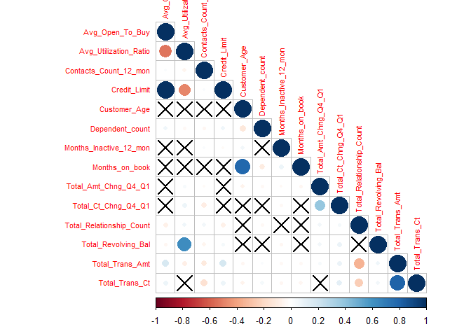

# Background 

Customer churn is the loss/turnover of a client. For this analysis, the goal is to predict/classify customers who will churn. We will begin by importing the necessary packages and performing some exploratory data analysis. 


```r
# Clear working directory
rm(list = ls())

# Import and load packages
required_packages <- c("RColorBrewer", "cowplot", 
                       "lubridate", 
                       "Hmisc", "psych", "DataExplorer",
                       "tidyverse", "data.table", "knitr",
                       "mlr3", "mlr3learners", "mlr3viz")

packageCheck <- lapply(required_packages, FUN = function(x) {
  if(!require(x, character.only = TRUE)) {
    install.packages(x, dependencies = TRUE)
    library(x, character.only = TRUE)
  }
})
```


What does our data look like? 


```r
# Print number of rows and columns
dim(bank_churn)
```

```
## [1] 10127    21
```

```r
# Print the first 3 rows of the data 
head(bank_churn, 3)
```

```
##    CLIENTNUM    Attrition_Flag Customer_Age Gender Dependent_count
## 1: 768805383 Existing Customer           45      M               3
## 2: 818770008 Existing Customer           49      F               5
## 3: 713982108 Existing Customer           51      M               3
##    Education_Level Marital_Status Income_Category Card_Category Months_on_book
## 1:     High School        Married     $60K - $80K          Blue             39
## 2:        Graduate         Single  Less than $40K          Blue             44
## 3:        Graduate        Married    $80K - $120K          Blue             36
##    Total_Relationship_Count Months_Inactive_12_mon Contacts_Count_12_mon
## 1:                        5                      1                     3
## 2:                        6                      1                     2
## 3:                        4                      1                     0
##    Credit_Limit Total_Revolving_Bal Avg_Open_To_Buy Total_Amt_Chng_Q4_Q1
## 1:        12691                 777           11914                1.335
## 2:         8256                 864            7392                1.541
## 3:         3418                   0            3418                2.594
##    Total_Trans_Amt Total_Trans_Ct Total_Ct_Chng_Q4_Q1 Avg_Utilization_Ratio
## 1:            1144             42               1.625                 0.061
## 2:            1291             33               3.714                 0.105
## 3:            1887             20               2.333                 0.000
```

Below is information on what the variable names mean


```r
# Print names of columns in the data table 
variable_names <- names(bank_churn)

# Meaning of names
variable_meaning <- c("Client number", "Whether or not the customer churned", "Age of customer", "Sex of customer", "Number of dependents", 
  "Educational qualification of the account holder", "Married, Single, Divorced or Unknown", "Annual income category of the account holder", "Type of card", "Period of relationship with the bank", "Total number of products held by the customer", "Number of months inactive in the last 12 months", "No of contacts in the last 12 months", "Credit limit on the credit card", "Total revolving balance on the credit card", "Open to buy credit line (Average of the last 12 months)", "Change in transaction amount (Q4/Q1)", "Total transaction amount in the last 12 months", "Total transaction count in the last 12 months", "Change in transaction count (Q4/Q1)", "Average card utilization ratio")

# Print the variable names and their meanings
data.table(variable_names, variable_meaning) %>% setnames(c("Variable Name", "Variable Meaning")) %>% kable()
```


|Variable Name            |Variable Meaning                                        |
|:------------------------|:-------------------------------------------------------|
|CLIENTNUM                |Client number                                           |
|Attrition_Flag           |Whether or not the customer churned                     |
|Customer_Age             |Age of customer                                         |
|Gender                   |Sex of customer                                         |
|Dependent_count          |Number of dependents                                    |
|Education_Level          |Educational qualification of the account holder         |
|Marital_Status           |Married, Single, Divorced or Unknown                    |
|Income_Category          |Annual income category of the account holder            |
|Card_Category            |Type of card                                            |
|Months_on_book           |Period of relationship with the bank                    |
|Total_Relationship_Count |Total number of products held by the customer           |
|Months_Inactive_12_mon   |Number of months inactive in the last 12 months         |
|Contacts_Count_12_mon    |No of contacts in the last 12 months                    |
|Credit_Limit             |Credit limit on the credit card                         |
|Total_Revolving_Bal      |Total revolving balance on the credit card              |
|Avg_Open_To_Buy          |Open to buy credit line (Average of the last 12 months) |
|Total_Amt_Chng_Q4_Q1     |Change in transaction amount (Q4/Q1)                    |
|Total_Trans_Amt          |Total transaction amount in the last 12 months          |
|Total_Trans_Ct           |Total transaction count in the last 12 months           |
|Total_Ct_Chng_Q4_Q1      |Change in transaction count (Q4/Q1)                     |
|Avg_Utilization_Ratio    |Average card utilization ratio                          |

We have some bit of features here and our goal is to predict whether or not a customer will churn, as such our target feature is the Attrition_Flag. As shown below, the customers are either Existing or "Attrited", meaning they are no longer customers/clients. 


```r
unique(bank_churn$Attrition_Flag)
```

```
## [1] "Existing Customer" "Attrited Customer"
```

With our goal in mind of developing a model that can effectively predict whether or not a customer will churn, we have to think about how we will be splitting our data and evaluating our model. To sort of speak, we are more interested in informing whether the customer will churn, that we are in informing whether the customer will remain. 

From the table and as illustrated in the pie plot below, we see that approx 16% of the credit card customers churned. As such, we can expect a challenge in training our model to predict customers who will churn. This is because we have a relatively small subset of data that contains characteristics of customers who churned, as such, the effectiveness of the model can only be facilitated by having very dissimilar characteristics between customers who churned and those who didn't. 


|Customer Group    | Count| Percentage|
|:-----------------|-----:|----------:|
|Attrited Customer |  1627|      16.07|
|Existing Customer |  8500|      83.93|


```r
pie(churn_proportion$Count, labels = paste(churn_proportion$`Customer Group`, paste(churn_proportion$Percentage, sep = "", "%"), sep = ", "), col = c("red", "burlywood"), main = "Percantage of credit card customers who have churned.\n Total number of credit card customers: 10127")
```

<!-- -->

The fact that we have a small proportion of "Attrited Customer" in our data set gets us thinking about our model evaluation. I say this because say we have a model that predicts every customer will remain; if we test this model on our complete data set, and evaluate simply using accuracy percentage, then our will be right 83.93% of the time...simply misleading! Our model may very well be useless in detecting/predicting customer who will churn. 

Let us continue with our data exploration and pre-processing. 


```r
# Get the class of each variable
data.table(`Variable Name` = variable_names, `Variable Class` = lapply(bank_churn, class)) %>% kable()
```


|Variable Name            |Variable Class |
|:------------------------|:--------------|
|CLIENTNUM                |integer        |
|Attrition_Flag           |character      |
|Customer_Age             |integer        |
|Gender                   |character      |
|Dependent_count          |integer        |
|Education_Level          |character      |
|Marital_Status           |character      |
|Income_Category          |character      |
|Card_Category            |character      |
|Months_on_book           |integer        |
|Total_Relationship_Count |integer        |
|Months_Inactive_12_mon   |integer        |
|Contacts_Count_12_mon    |integer        |
|Credit_Limit             |numeric        |
|Total_Revolving_Bal      |integer        |
|Avg_Open_To_Buy          |numeric        |
|Total_Amt_Chng_Q4_Q1     |numeric        |
|Total_Trans_Amt          |integer        |
|Total_Trans_Ct           |integer        |
|Total_Ct_Chng_Q4_Q1      |numeric        |
|Avg_Utilization_Ratio    |numeric        |

We have to convert character variables to factors.


```r
# Select the character variables to be converted factors
character_variables <- c("Attrition_Flag", "Gender", "Education_Level", "Marital_Status", "Income_Category", "Card_Category")

# Convert the character variables to factors
bank_churn[, (character_variables) := lapply(.SD, factor), .SDcols = character_variables]
```

Thus far, the only input feature I see that is not necessary to be included in our model is the "CLIENTNUM", The CLIENTNUM is just an identifier. I won't remove it just yet though, in accordance with the theme of EDA I'll make a plot to see the relationship between the client ID and Attrition Flag. We have no time variable to evaluate the churning through time. So, my maybe flawed logic is that the recent customers have higher client numbers than earlier customers...you know, customer 1, customer 2, ...., customer *n*, etc. 


```r
ggplot() +
  geom_point(aes(x = bank_churn$CLIENTNUM, y = bank_churn$Attrition_Flag)) +
  xlab("Client Number") +
  ylab("Customer Group") +
  theme_classic()
```

<!-- -->

Damn, no cigar! But yes, visually, we confirm that the Client Number has no value in informing whether or not a client will churn. 

Some important details to check for during EDA include

  - The distribution of each variable
    - some skewed distributions could be transformed to follow a normal distribution
  - Examination of variables to possibly identify variables that could inform more on possibility of attrition
  - Examine the proportion of the different factor variables...could be important when deciding how to split the data 


```r
# Bar plots informing the proportions within each factor variable
plot_bar(bank_churn)
```

<!-- -->

```r
# Metrics on the factor variables
Hmisc::describe(bank_churn[, c("Attrition_Flag", "Gender", "Education_Level", "Marital_Status", "Income_Category", "Card_Category")])
```

```
## bank_churn[, c("Attrition_Flag", "Gender", "Education_Level", "Marital_Status", "Income_Category", "Card_Category")] 
## 
##  6  Variables      10127  Observations
## --------------------------------------------------------------------------------
## Attrition_Flag 
##        n  missing distinct 
##    10127        0        2 
##                                               
## Value      Attrited Customer Existing Customer
## Frequency               1627              8500
## Proportion             0.161             0.839
## --------------------------------------------------------------------------------
## Gender 
##        n  missing distinct 
##    10127        0        2 
##                       
## Value          F     M
## Frequency   5358  4769
## Proportion 0.529 0.471
## --------------------------------------------------------------------------------
## Education_Level 
##        n  missing distinct 
##    10127        0        7 
## 
## lowest : College       Doctorate     Graduate      High School   Post-Graduate
## highest: Graduate      High School   Post-Graduate Uneducated    Unknown      
##                                                                   
## Value            College     Doctorate      Graduate   High School
## Frequency           1013           451          3128          2013
## Proportion         0.100         0.045         0.309         0.199
##                                                     
## Value      Post-Graduate    Uneducated       Unknown
## Frequency            516          1487          1519
## Proportion         0.051         0.147         0.150
## --------------------------------------------------------------------------------
## Marital_Status 
##        n  missing distinct 
##    10127        0        4 
##                                               
## Value      Divorced  Married   Single  Unknown
## Frequency       748     4687     3943      749
## Proportion    0.074    0.463    0.389    0.074
## --------------------------------------------------------------------------------
## Income_Category 
##        n  missing distinct 
##    10127        0        6 
## 
## lowest : $120K +        $40K - $60K    $60K - $80K    $80K - $120K   Less than $40K
## highest: $40K - $60K    $60K - $80K    $80K - $120K   Less than $40K Unknown       
##                                                                       
## Value             $120K +    $40K - $60K    $60K - $80K   $80K - $120K
## Frequency             727           1790           1402           1535
## Proportion          0.072          0.177          0.138          0.152
##                                         
## Value      Less than $40K        Unknown
## Frequency            3561           1112
## Proportion          0.352          0.110
## --------------------------------------------------------------------------------
## Card_Category 
##        n  missing distinct 
##    10127        0        4 
##                                               
## Value          Blue     Gold Platinum   Silver
## Frequency      9436      116       20      555
## Proportion    0.932    0.011    0.002    0.055
## --------------------------------------------------------------------------------
```

The bar plot of the Attrition_Flag confirms what we already know i.e., we have a highly uneven proportion of attrited customers to existing customers. Among the variables, Gender is the only feature with relatively close proportions; 52.9% are females and 47.1% are males. The other variables have skewed distributions and is something to consider when splitting the data into training and test sets. 


```r
# Histograms to inform on the distribution of each numerical variable
plot_histogram(bank_churn)
```

<!-- -->

```r
# Metrics on the numerical variables 
Hmisc::describe(bank_churn[, !c("Attrition_Flag", "Gender", "Education_Level", "Marital_Status", "Income_Category", "Card_Category")])
```

```
## bank_churn[, !c("Attrition_Flag", "Gender", "Education_Level", "Marital_Status", "Income_Category", "Card_Category")] 
## 
##  15  Variables      10127  Observations
## --------------------------------------------------------------------------------
## CLIENTNUM 
##         n   missing  distinct      Info      Mean       Gmd       .05       .10 
##     10127         0     10127         1 739177606  37249488 709120391 710160513 
##       .25       .50       .75       .90       .95 
## 713036771 717926358 773143533 798512118 814212033 
## 
## lowest : 708082083 708083283 708084558 708085458 708086958
## highest: 828288333 828291858 828294933 828298908 828343083
## --------------------------------------------------------------------------------
## Customer_Age 
##        n  missing distinct     Info     Mean      Gmd      .05      .10 
##    10127        0       45    0.999    46.33     9.09       33       36 
##      .25      .50      .75      .90      .95 
##       41       46       52       57       60 
## 
## lowest : 26 27 28 29 30, highest: 66 67 68 70 73
## --------------------------------------------------------------------------------
## Dependent_count 
##        n  missing distinct     Info     Mean      Gmd 
##    10127        0        6    0.952    2.346    1.452 
## 
## lowest : 0 1 2 3 4, highest: 1 2 3 4 5
##                                               
## Value          0     1     2     3     4     5
## Frequency    904  1838  2655  2732  1574   424
## Proportion 0.089 0.181 0.262 0.270 0.155 0.042
## --------------------------------------------------------------------------------
## Months_on_book 
##        n  missing distinct     Info     Mean      Gmd      .05      .10 
##    10127        0       44    0.985    35.93    8.767       22       26 
##      .25      .50      .75      .90      .95 
##       31       36       40       46       50 
## 
## lowest : 13 14 15 16 17, highest: 52 53 54 55 56
## --------------------------------------------------------------------------------
## Total_Relationship_Count 
##        n  missing distinct     Info     Mean      Gmd 
##    10127        0        6    0.966    3.813    1.759 
## 
## lowest : 1 2 3 4 5, highest: 2 3 4 5 6
##                                               
## Value          1     2     3     4     5     6
## Frequency    910  1243  2305  1912  1891  1866
## Proportion 0.090 0.123 0.228 0.189 0.187 0.184
## --------------------------------------------------------------------------------
## Months_Inactive_12_mon 
##        n  missing distinct     Info     Mean      Gmd 
##    10127        0        7      0.9    2.341    1.065 
## 
## lowest : 0 1 2 3 4, highest: 2 3 4 5 6
##                                                     
## Value          0     1     2     3     4     5     6
## Frequency     29  2233  3282  3846   435   178   124
## Proportion 0.003 0.220 0.324 0.380 0.043 0.018 0.012
## --------------------------------------------------------------------------------
## Contacts_Count_12_mon 
##        n  missing distinct     Info     Mean      Gmd 
##    10127        0        7    0.925    2.455    1.204 
## 
## lowest : 0 1 2 3 4, highest: 2 3 4 5 6
##                                                     
## Value          0     1     2     3     4     5     6
## Frequency    399  1499  3227  3380  1392   176    54
## Proportion 0.039 0.148 0.319 0.334 0.137 0.017 0.005
## --------------------------------------------------------------------------------
## Credit_Limit 
##        n  missing distinct     Info     Mean      Gmd      .05      .10 
##    10127        0     6205        1     8632     8837     1439     1762 
##      .25      .50      .75      .90      .95 
##     2555     4549    11068    23400    34516 
## 
## lowest :  1438.3  1439.0  1440.0  1441.0  1442.0
## highest: 34198.0 34427.0 34458.0 34496.0 34516.0
## --------------------------------------------------------------------------------
## Total_Revolving_Bal 
##        n  missing distinct     Info     Mean      Gmd      .05      .10 
##    10127        0     1974    0.985     1163      927        0        0 
##      .25      .50      .75      .90      .95 
##      359     1276     1784     2228     2517 
## 
## lowest :    0  132  134  145  154, highest: 2511 2512 2513 2514 2517
## --------------------------------------------------------------------------------
## Avg_Open_To_Buy 
##        n  missing distinct     Info     Mean      Gmd      .05      .10 
##    10127        0     6813        1     7469     8848    480.3    683.0 
##      .25      .50      .75      .90      .95 
##   1324.5   3474.0   9859.0  21964.6  32183.4 
## 
## lowest :     3    10    14    15    24, highest: 34297 34300 34302 34362 34516
## --------------------------------------------------------------------------------
## Total_Amt_Chng_Q4_Q1 
##        n  missing distinct     Info     Mean      Gmd      .05      .10 
##    10127        0     1158        1   0.7599   0.2251   0.4630   0.5310 
##      .25      .50      .75      .90      .95 
##   0.6310   0.7360   0.8590   0.9974   1.1030 
## 
## lowest : 0.000 0.010 0.018 0.046 0.061, highest: 2.368 2.594 2.675 3.355 3.397
## --------------------------------------------------------------------------------
## Total_Trans_Amt 
##        n  missing distinct     Info     Mean      Gmd      .05      .10 
##    10127        0     5033        1     4404     3207     1283     1501 
##      .25      .50      .75      .90      .95 
##     2156     3899     4741     8212    14212 
## 
## lowest :   510   530   563   569   594, highest: 17628 17634 17744 17995 18484
## --------------------------------------------------------------------------------
## Total_Trans_Ct 
##        n  missing distinct     Info     Mean      Gmd      .05      .10 
##    10127        0      126        1    64.86     26.6       28       33 
##      .25      .50      .75      .90      .95 
##       45       67       81       92      105 
## 
## lowest :  10  11  12  13  14, highest: 131 132 134 138 139
## --------------------------------------------------------------------------------
## Total_Ct_Chng_Q4_Q1 
##        n  missing distinct     Info     Mean      Gmd      .05      .10 
##    10127        0      830        1   0.7122   0.2409    0.368    0.452 
##      .25      .50      .75      .90      .95 
##    0.582    0.702    0.818    0.950    1.069 
## 
## lowest : 0.000 0.028 0.029 0.038 0.053, highest: 3.000 3.250 3.500 3.571 3.714
## --------------------------------------------------------------------------------
## Avg_Utilization_Ratio 
##        n  missing distinct     Info     Mean      Gmd      .05      .10 
##    10127        0      964    0.985   0.2749   0.3039    0.000    0.000 
##      .25      .50      .75      .90      .95 
##    0.023    0.176    0.503    0.707    0.793 
## 
## lowest : 0.000 0.004 0.005 0.006 0.007, highest: 0.990 0.992 0.994 0.995 0.999
## --------------------------------------------------------------------------------
```

Building an effective model involves understanding the data, the goal of the project, and importantly, determining a valid method/metric of model evaluation. To demonstrate, consider the Random Forest model below: 

----

```r
# Create the task 
task = TaskClassif$new(id = "CreditCardChurners", backend = bank_churn, target = "Attrition_Flag")
```


```r
# Split the data into training and test sets 
set.seed(123)
train_set = sample(task$row_ids, 0.8*task$nrow)
test_set = setdiff(task$row_ids, train_set)
```


```r
# Create a random forest learner 
learner_rf = lrn("classif.ranger", importance = "permutation")
learner_rf$train(task, row_ids = train_set)
```


```r
# Illustrate feature importance
importance = as.data.table(learner_rf$importance(), keep.rownames = TRUE)
colnames(importance) = c("Feature", "Importance")
ggplot(importance, aes(x = reorder(Feature, Importance), y = Importance)) +
  geom_col() + coord_flip() + xlab("")
```

<!-- -->


```r
# Make predictions on the test set
pred_rf = learner_rf$predict(task, row_ids = test_set)
```


```r
# Create confusion matrix
pred_rf$confusion
```

```
##                    truth
## response            Attrited Customer Existing Customer
##   Attrited Customer               256                25
##   Existing Customer                63              1682
```


```r
# Print misclassification error rate 
pred_rf$score(msr("classif.ce"))
```

```
## classif.ce 
## 0.04343534
```

The misclassification error rate here is approximately 0.04, as such we could naively conclude that our model would be right in its prediction 95.66% of the time. Definitely misleading! We are more interested in determining customers who will churn than we are in determining customers who will remain. Perhaps by understanding characteristics of customers who will churn, and in turn being able to make predictions of this possibility, we could device some strategies to reduce this churn rate. 

It will be more fitting of us to choose a metric that informs on the likelihood of detecting customers who will churn. For example if we divided the false negative by the sum of the true positives and false negatives, i.e. False Negative Rate (FNR), we would then have an expected value of how often our model will fail to inform us that a customer will churn when indeed they will. 


```r
# Calculate the false negative rate 
pred_rf$score(msr("classif.fnr"))
```

```
## classif.fnr 
##   0.1974922
```

So, the FNR informs that 19.75% of the time we will fail to predict that the customer will churn when indeed they will. Compared to the misclassification error rate which informs that our model will fail only 4.34% of the time. The misclassification error rate is less useful for this analysis. 
