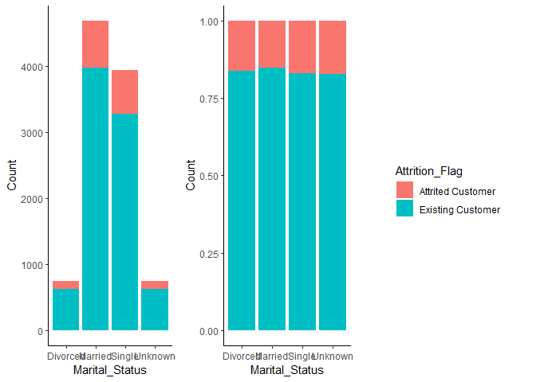

# Background 

Customer churn is the loss/turnover of a client. For this analysis, the goal is to predict/classify customers who will churn. We will begin by importing the necessary packages and performing some exploratory data analysis. 


```r
# Import and load packages
required_packages <- c("RColorBrewer", "cowplot", 
                       "lubridate", 
                       "Hmisc", "psych", "DataExplorer",
                       "tidyverse", "data.table", "knitr",
                       "precrec", "rpart.plot", "smotefamily",
                       "mlr3", "mlr3learners", "mlr3viz", 
                       "mlr3filters", "mlr3pipelines", "mlr3tuning")

packageCheck <- lapply(required_packages, FUN = function(x) {
  if(!require(x, character.only = TRUE)) {
    install.packages(x, dependencies = TRUE)
    library(x, character.only = TRUE)
  }
})
```


```r
# Select the character variables to be converted factors
character_variables <- c("Attrition_Flag", "Gender", "Education_Level", "Marital_Status", "Income_Category", "Card_Category")

# Convert the character variables to factors
bank_churn[, (character_variables) := lapply(.SD, factor), .SDcols = character_variables]

# Select the integersvariables to be converted to numeric
numeric_variables <- c("Customer_Age", "Total_Revolving_Bal", "Total_Trans_Amt")

# Convert some integers to numeric
bank_churn[, (numeric_variables) := lapply(.SD, as.numeric), .SDcols = numeric_variables]

# Verify that classes have been appropriately set 
lapply(bank_churn, class)
```

```
## $CLIENTNUM
## [1] "integer"
## 
## $Attrition_Flag
## [1] "factor"
## 
## $Customer_Age
## [1] "numeric"
## 
## $Gender
## [1] "factor"
## 
## $Dependent_count
## [1] "integer"
## 
## $Education_Level
## [1] "factor"
## 
## $Marital_Status
## [1] "factor"
## 
## $Income_Category
## [1] "factor"
## 
## $Card_Category
## [1] "factor"
## 
## $Months_on_book
## [1] "integer"
## 
## $Total_Relationship_Count
## [1] "integer"
## 
## $Months_Inactive_12_mon
## [1] "integer"
## 
## $Contacts_Count_12_mon
## [1] "integer"
## 
## $Credit_Limit
## [1] "numeric"
## 
## $Total_Revolving_Bal
## [1] "numeric"
## 
## $Avg_Open_To_Buy
## [1] "numeric"
## 
## $Total_Amt_Chng_Q4_Q1
## [1] "numeric"
## 
## $Total_Trans_Amt
## [1] "numeric"
## 
## $Total_Trans_Ct
## [1] "integer"
## 
## $Total_Ct_Chng_Q4_Q1
## [1] "numeric"
## 
## $Avg_Utilization_Ratio
## [1] "numeric"
```


```r
# Create the task 
task <- TaskClassif$new(id = "BankChurn", backend = bank_churn, target = "Attrition_Flag", positive = "Attrited Customer")
print(task)
```

```
## <TaskClassif:BankChurn> (10127 x 21)
## * Target: Attrition_Flag
## * Properties: twoclass
## * Features (20):
##   - dbl (8): Avg_Open_To_Buy, Avg_Utilization_Ratio, Credit_Limit,
##     Customer_Age, Total_Amt_Chng_Q4_Q1, Total_Ct_Chng_Q4_Q1,
##     Total_Revolving_Bal, Total_Trans_Amt
##   - int (7): CLIENTNUM, Contacts_Count_12_mon, Dependent_count,
##     Months_Inactive_12_mon, Months_on_book, Total_Relationship_Count,
##     Total_Trans_Ct
##   - fct (5): Card_Category, Education_Level, Gender, Income_Category,
##     Marital_Status
```


```r
# Set CLIENTNUM as an identifier 
task$set_col_roles("CLIENTNUM", roles = "name")
```


```r
# Explore the task 
as.data.table(task$col_info)
```

```
##                           id    type
##  1:                 ..row_id integer
##  2:           Attrition_Flag  factor
##  3:          Avg_Open_To_Buy numeric
##  4:    Avg_Utilization_Ratio numeric
##  5:                CLIENTNUM integer
##  6:            Card_Category  factor
##  7:    Contacts_Count_12_mon integer
##  8:             Credit_Limit numeric
##  9:             Customer_Age numeric
## 10:          Dependent_count integer
## 11:          Education_Level  factor
## 12:                   Gender  factor
## 13:          Income_Category  factor
## 14:           Marital_Status  factor
## 15:   Months_Inactive_12_mon integer
## 16:           Months_on_book integer
## 17:     Total_Amt_Chng_Q4_Q1 numeric
## 18:      Total_Ct_Chng_Q4_Q1 numeric
## 19: Total_Relationship_Count integer
## 20:      Total_Revolving_Bal numeric
## 21:          Total_Trans_Amt numeric
## 22:           Total_Trans_Ct integer
##                           id    type
##                                                                  levels
##  1:                                                                    
##  2:                                 Attrited Customer,Existing Customer
##  3:                                                                    
##  4:                                                                    
##  5:                                                                    
##  6:                                           Blue,Gold,Platinum,Silver
##  7:                                                                    
##  8:                                                                    
##  9:                                                                    
## 10:                                                                    
## 11: College,Doctorate,Graduate,High School,Post-Graduate,Uneducated,...
## 12:                                                                 F,M
## 13: $120K +,$40K - $60K,$60K - $80K,$80K - $120K,Less than $40K,Unknown
## 14:                                     Divorced,Married,Single,Unknown
## 15:                                                                    
## 16:                                                                    
## 17:                                                                    
## 18:                                                                    
## 19:                                                                    
## 20:                                                                    
## 21:                                                                    
## 22:                                                                    
##                                                                  levels
```

```r
task$col_roles
```

```
## $feature
##  [1] "Avg_Open_To_Buy"          "Avg_Utilization_Ratio"   
##  [3] "Card_Category"            "Contacts_Count_12_mon"   
##  [5] "Credit_Limit"             "Customer_Age"            
##  [7] "Dependent_count"          "Education_Level"         
##  [9] "Gender"                   "Income_Category"         
## [11] "Marital_Status"           "Months_Inactive_12_mon"  
## [13] "Months_on_book"           "Total_Amt_Chng_Q4_Q1"    
## [15] "Total_Ct_Chng_Q4_Q1"      "Total_Relationship_Count"
## [17] "Total_Revolving_Bal"      "Total_Trans_Amt"         
## [19] "Total_Trans_Ct"          
## 
## $target
## [1] "Attrition_Flag"
## 
## $name
## [1] "CLIENTNUM"
## 
## $order
## character(0)
## 
## $stratum
## character(0)
## 
## $group
## character(0)
## 
## $weight
## character(0)
## 
## $uri
## character(0)
```

```r
table(task$truth()) # Class imbalance with Attrited customers being 1/5 less than Existing customers 
```

```
## 
## Attrited Customer Existing Customer 
##              1627              8500
```

```r
task$positive
```

```
## [1] "Attrited Customer"
```

```r
Hmisc::describe(as.data.table(task))
```

```
## as.data.table(task) 
## 
##  20  Variables      10127  Observations
## --------------------------------------------------------------------------------
## Attrition_Flag 
##        n  missing distinct 
##    10127        0        2 
##                                               
## Value      Attrited Customer Existing Customer
## Frequency               1627              8500
## Proportion             0.161             0.839
## --------------------------------------------------------------------------------
## Avg_Open_To_Buy 
##        n  missing distinct     Info     Mean      Gmd      .05      .10 
##    10127        0     6813        1     7469     8848    480.3    683.0 
##      .25      .50      .75      .90      .95 
##   1324.5   3474.0   9859.0  21964.6  32183.4 
## 
## lowest :     3    10    14    15    24, highest: 34297 34300 34302 34362 34516
## --------------------------------------------------------------------------------
## Avg_Utilization_Ratio 
##        n  missing distinct     Info     Mean      Gmd      .05      .10 
##    10127        0      964    0.985   0.2749   0.3039    0.000    0.000 
##      .25      .50      .75      .90      .95 
##    0.023    0.176    0.503    0.707    0.793 
## 
## lowest : 0.000 0.004 0.005 0.006 0.007, highest: 0.990 0.992 0.994 0.995 0.999
## --------------------------------------------------------------------------------
## Card_Category 
##        n  missing distinct 
##    10127        0        4 
##                                               
## Value          Blue     Gold Platinum   Silver
## Frequency      9436      116       20      555
## Proportion    0.932    0.011    0.002    0.055
## --------------------------------------------------------------------------------
## Contacts_Count_12_mon 
##        n  missing distinct     Info     Mean      Gmd 
##    10127        0        7    0.925    2.455    1.204 
## 
## lowest : 0 1 2 3 4, highest: 2 3 4 5 6
##                                                     
## Value          0     1     2     3     4     5     6
## Frequency    399  1499  3227  3380  1392   176    54
## Proportion 0.039 0.148 0.319 0.334 0.137 0.017 0.005
## --------------------------------------------------------------------------------
## Credit_Limit 
##        n  missing distinct     Info     Mean      Gmd      .05      .10 
##    10127        0     6205        1     8632     8837     1439     1762 
##      .25      .50      .75      .90      .95 
##     2555     4549    11068    23400    34516 
## 
## lowest :  1438.3  1439.0  1440.0  1441.0  1442.0
## highest: 34198.0 34427.0 34458.0 34496.0 34516.0
## --------------------------------------------------------------------------------
## Customer_Age 
##        n  missing distinct     Info     Mean      Gmd      .05      .10 
##    10127        0       45    0.999    46.33     9.09       33       36 
##      .25      .50      .75      .90      .95 
##       41       46       52       57       60 
## 
## lowest : 26 27 28 29 30, highest: 66 67 68 70 73
## --------------------------------------------------------------------------------
## Dependent_count 
##        n  missing distinct     Info     Mean      Gmd 
##    10127        0        6    0.952    2.346    1.452 
## 
## lowest : 0 1 2 3 4, highest: 1 2 3 4 5
##                                               
## Value          0     1     2     3     4     5
## Frequency    904  1838  2655  2732  1574   424
## Proportion 0.089 0.181 0.262 0.270 0.155 0.042
## --------------------------------------------------------------------------------
## Education_Level 
##        n  missing distinct 
##    10127        0        7 
## 
## lowest : College       Doctorate     Graduate      High School   Post-Graduate
## highest: Graduate      High School   Post-Graduate Uneducated    Unknown      
##                                                                   
## Value            College     Doctorate      Graduate   High School
## Frequency           1013           451          3128          2013
## Proportion         0.100         0.045         0.309         0.199
##                                                     
## Value      Post-Graduate    Uneducated       Unknown
## Frequency            516          1487          1519
## Proportion         0.051         0.147         0.150
## --------------------------------------------------------------------------------
## Gender 
##        n  missing distinct 
##    10127        0        2 
##                       
## Value          F     M
## Frequency   5358  4769
## Proportion 0.529 0.471
## --------------------------------------------------------------------------------
## Income_Category 
##        n  missing distinct 
##    10127        0        6 
## 
## lowest : $120K +        $40K - $60K    $60K - $80K    $80K - $120K   Less than $40K
## highest: $40K - $60K    $60K - $80K    $80K - $120K   Less than $40K Unknown       
##                                                                       
## Value             $120K +    $40K - $60K    $60K - $80K   $80K - $120K
## Frequency             727           1790           1402           1535
## Proportion          0.072          0.177          0.138          0.152
##                                         
## Value      Less than $40K        Unknown
## Frequency            3561           1112
## Proportion          0.352          0.110
## --------------------------------------------------------------------------------
## Marital_Status 
##        n  missing distinct 
##    10127        0        4 
##                                               
## Value      Divorced  Married   Single  Unknown
## Frequency       748     4687     3943      749
## Proportion    0.074    0.463    0.389    0.074
## --------------------------------------------------------------------------------
## Months_Inactive_12_mon 
##        n  missing distinct     Info     Mean      Gmd 
##    10127        0        7      0.9    2.341    1.065 
## 
## lowest : 0 1 2 3 4, highest: 2 3 4 5 6
##                                                     
## Value          0     1     2     3     4     5     6
## Frequency     29  2233  3282  3846   435   178   124
## Proportion 0.003 0.220 0.324 0.380 0.043 0.018 0.012
## --------------------------------------------------------------------------------
## Months_on_book 
##        n  missing distinct     Info     Mean      Gmd      .05      .10 
##    10127        0       44    0.985    35.93    8.767       22       26 
##      .25      .50      .75      .90      .95 
##       31       36       40       46       50 
## 
## lowest : 13 14 15 16 17, highest: 52 53 54 55 56
## --------------------------------------------------------------------------------
## Total_Amt_Chng_Q4_Q1 
##        n  missing distinct     Info     Mean      Gmd      .05      .10 
##    10127        0     1158        1   0.7599   0.2251   0.4630   0.5310 
##      .25      .50      .75      .90      .95 
##   0.6310   0.7360   0.8590   0.9974   1.1030 
## 
## lowest : 0.000 0.010 0.018 0.046 0.061, highest: 2.368 2.594 2.675 3.355 3.397
## --------------------------------------------------------------------------------
## Total_Ct_Chng_Q4_Q1 
##        n  missing distinct     Info     Mean      Gmd      .05      .10 
##    10127        0      830        1   0.7122   0.2409    0.368    0.452 
##      .25      .50      .75      .90      .95 
##    0.582    0.702    0.818    0.950    1.069 
## 
## lowest : 0.000 0.028 0.029 0.038 0.053, highest: 3.000 3.250 3.500 3.571 3.714
## --------------------------------------------------------------------------------
## Total_Relationship_Count 
##        n  missing distinct     Info     Mean      Gmd 
##    10127        0        6    0.966    3.813    1.759 
## 
## lowest : 1 2 3 4 5, highest: 2 3 4 5 6
##                                               
## Value          1     2     3     4     5     6
## Frequency    910  1243  2305  1912  1891  1866
## Proportion 0.090 0.123 0.228 0.189 0.187 0.184
## --------------------------------------------------------------------------------
## Total_Revolving_Bal 
##        n  missing distinct     Info     Mean      Gmd      .05      .10 
##    10127        0     1974    0.985     1163      927        0        0 
##      .25      .50      .75      .90      .95 
##      359     1276     1784     2228     2517 
## 
## lowest :    0  132  134  145  154, highest: 2511 2512 2513 2514 2517
## --------------------------------------------------------------------------------
## Total_Trans_Amt 
##        n  missing distinct     Info     Mean      Gmd      .05      .10 
##    10127        0     5033        1     4404     3207     1283     1501 
##      .25      .50      .75      .90      .95 
##     2156     3899     4741     8212    14212 
## 
## lowest :   510   530   563   569   594, highest: 17628 17634 17744 17995 18484
## --------------------------------------------------------------------------------
## Total_Trans_Ct 
##        n  missing distinct     Info     Mean      Gmd      .05      .10 
##    10127        0      126        1    64.86     26.6       28       33 
##      .25      .50      .75      .90      .95 
##       45       67       81       92      105 
## 
## lowest :  10  11  12  13  14, highest: 131 132 134 138 139
## --------------------------------------------------------------------------------
```


```r
# Split the task into training and test sets 
train_set <- sample(task$nrow, 0.8*task$nrow)
test_set <- setdiff(seq_len(task$nrow), train_set)
```


```r
# Create learner 
learner_dt <- lrn("classif.rpart")
```


```r
# DECISION TREE MODEL; ORIGINAL DATA 
# Do nothing sampler
doing_nothing <- po("nop", id = "nop")

# Create ML graph for undersampler
doing_nothing_sampler <- doing_nothing %>>% 
  learner_dt
 
# Create a graph learner for undersampler
graph_learner_doing_nothing_sampler <- GraphLearner$new(doing_nothing_sampler)
```


```r
# Train the undersampler decision tree model
graph_learner_doing_nothing_sampler$train(task, train_set)
```


```r
# Show the state of the learner
graph_learner_doing_nothing_sampler$state
```

```
## $model
## $model$nop
## list()
## 
## $model$classif.rpart
## $model$classif.rpart$model
## n= 8101 
## 
## node), split, n, loss, yval, (yprob)
##       * denotes terminal node
## 
##  1) root 8101 1305 Existing Customer (0.16109122 0.83890878)  
##    2) Total_Trans_Ct< 54.5 2752 1053 Existing Customer (0.38263081 0.61736919)  
##      4) Total_Revolving_Bal< 613.5 910  235 Attrited Customer (0.74175824 0.25824176)  
##        8) Total_Ct_Chng_Q4_Q1< 0.729 736  132 Attrited Customer (0.82065217 0.17934783)  
##         16) Total_Trans_Amt>=1805 495   42 Attrited Customer (0.91515152 0.08484848) *
##         17) Total_Trans_Amt< 1805 241   90 Attrited Customer (0.62655602 0.37344398)  
##           34) Total_Relationship_Count< 3.5 136   24 Attrited Customer (0.82352941 0.17647059) *
##           35) Total_Relationship_Count>=3.5 105   39 Existing Customer (0.37142857 0.62857143)  
##             70) Total_Trans_Amt< 995 15    0 Attrited Customer (1.00000000 0.00000000) *
##             71) Total_Trans_Amt>=995 90   24 Existing Customer (0.26666667 0.73333333) *
##        9) Total_Ct_Chng_Q4_Q1>=0.729 174   71 Existing Customer (0.40804598 0.59195402)  
##         18) Total_Relationship_Count< 2.5 31    2 Attrited Customer (0.93548387 0.06451613) *
##         19) Total_Relationship_Count>=2.5 143   42 Existing Customer (0.29370629 0.70629371) *
##      5) Total_Revolving_Bal>=613.5 1842  378 Existing Customer (0.20521173 0.79478827)  
##       10) Total_Relationship_Count< 2.5 173   40 Attrited Customer (0.76878613 0.23121387) *
##       11) Total_Relationship_Count>=2.5 1669  245 Existing Customer (0.14679449 0.85320551)  
##         22) Total_Trans_Amt>=2102 403  157 Existing Customer (0.38957816 0.61042184)  
##           44) Total_Ct_Chng_Q4_Q1< 0.6315 190   72 Attrited Customer (0.62105263 0.37894737)  
##             88) Customer_Age>=37.5 136   29 Attrited Customer (0.78676471 0.21323529) *
##             89) Customer_Age< 37.5 54   11 Existing Customer (0.20370370 0.79629630) *
##           45) Total_Ct_Chng_Q4_Q1>=0.6315 213   39 Existing Customer (0.18309859 0.81690141) *
##         23) Total_Trans_Amt< 2102 1266   88 Existing Customer (0.06951027 0.93048973)  
##           46) Total_Trans_Amt< 924.5 18    1 Attrited Customer (0.94444444 0.05555556) *
##           47) Total_Trans_Amt>=924.5 1248   71 Existing Customer (0.05689103 0.94310897) *
##    3) Total_Trans_Ct>=54.5 5349  252 Existing Customer (0.04711161 0.95288839)  
##      6) Total_Trans_Amt>=5417 1230  188 Existing Customer (0.15284553 0.84715447)  
##       12) Total_Trans_Ct< 79.5 210   53 Attrited Customer (0.74761905 0.25238095) *
##       13) Total_Trans_Ct>=79.5 1020   31 Existing Customer (0.03039216 0.96960784) *
##      7) Total_Trans_Amt< 5417 4119   64 Existing Customer (0.01553775 0.98446225) *
## 
## $model$classif.rpart$log
## Empty data.table (0 rows and 3 cols): stage,class,msg
## 
## $model$classif.rpart$train_time
## [1] 0.11
## 
## $model$classif.rpart$train_task
## <TaskClassif:BankChurn> (8101 x 20)
## * Target: Attrition_Flag
## * Properties: twoclass
## * Features (19):
##   - dbl (8): Avg_Open_To_Buy, Avg_Utilization_Ratio, Credit_Limit,
##     Customer_Age, Total_Amt_Chng_Q4_Q1, Total_Ct_Chng_Q4_Q1,
##     Total_Revolving_Bal, Total_Trans_Amt
##   - int (6): Contacts_Count_12_mon, Dependent_count,
##     Months_Inactive_12_mon, Months_on_book, Total_Relationship_Count,
##     Total_Trans_Ct
##   - fct (5): Card_Category, Education_Level, Gender, Income_Category,
##     Marital_Status
## 
## 
## 
## $log
## Empty data.table (0 rows and 3 cols): stage,class,msg
## 
## $train_time
## [1] 0.14
## 
## $train_task
## <TaskClassif:BankChurn> (10127 x 20)
## * Target: Attrition_Flag
## * Properties: twoclass
## * Features (19):
##   - dbl (8): Avg_Open_To_Buy, Avg_Utilization_Ratio, Credit_Limit,
##     Customer_Age, Total_Amt_Chng_Q4_Q1, Total_Ct_Chng_Q4_Q1,
##     Total_Revolving_Bal, Total_Trans_Amt
##   - int (6): Contacts_Count_12_mon, Dependent_count,
##     Months_Inactive_12_mon, Months_on_book, Total_Relationship_Count,
##     Total_Trans_Ct
##   - fct (5): Card_Category, Education_Level, Gender, Income_Category,
##     Marital_Status
```


```r
# Visualize undersampler decision tree model
rpart.plot(graph_learner_doing_nothing_sampler$state$model$classif.rpart$model, cex = 0.6)
```

<!-- -->


```r
# Make predictions on the test set 
prediction_dt <- graph_learner_doing_nothing_sampler$predict(task, test_set)
```


```r
# Show confusion matrix
prediction_dt$confusion
```

```
##                    truth
## response            Attrited Customer Existing Customer
##   Attrited Customer               253                60
##   Existing Customer                69              1644
```


```r
# Print sensitivity
prediction_dt$score(msr("classif.sensitivity"))
```

```
## classif.sensitivity 
##           0.7857143
```

```r
prediction_dt$score(msr("classif.ce"))
```

```
## classif.ce 
## 0.06367226
```

```r
prediction_dt$score(msr("classif.fbeta"))
```

```
## classif.fbeta 
##     0.7968504
```


```r
# DECISION TREE MODEL; UNDERSAMPLER
# Create an undersampler 
undersampler <- po("classbalancing", ratio = 1/5, reference = "major", adjust = "major", shuffle = F, id = "undersampler")

# Create ML graph for undersampler
dt_undersampler <- undersampler %>>% 
  learner_dt

# Create a graph learner for undersampler
graph_learner_undersampler <- GraphLearner$new(dt_undersampler)
```


```r
# Train the undersampler decision tree model
graph_learner_undersampler$train(task, train_set)
```


```r
# Show the state of the learner
graph_learner_undersampler$state
```

```
## $model
## $model$undersampler
## $model$undersampler$affected_cols
##  [1] "Avg_Open_To_Buy"          "Avg_Utilization_Ratio"   
##  [3] "Card_Category"            "Contacts_Count_12_mon"   
##  [5] "Credit_Limit"             "Customer_Age"            
##  [7] "Dependent_count"          "Education_Level"         
##  [9] "Gender"                   "Income_Category"         
## [11] "Marital_Status"           "Months_Inactive_12_mon"  
## [13] "Months_on_book"           "Total_Amt_Chng_Q4_Q1"    
## [15] "Total_Ct_Chng_Q4_Q1"      "Total_Relationship_Count"
## [17] "Total_Revolving_Bal"      "Total_Trans_Amt"         
## [19] "Total_Trans_Ct"          
## 
## $model$undersampler$intasklayout
##                           id    type
##  1:          Avg_Open_To_Buy numeric
##  2:    Avg_Utilization_Ratio numeric
##  3:            Card_Category  factor
##  4:    Contacts_Count_12_mon integer
##  5:             Credit_Limit numeric
##  6:             Customer_Age numeric
##  7:          Dependent_count integer
##  8:          Education_Level  factor
##  9:                   Gender  factor
## 10:          Income_Category  factor
## 11:           Marital_Status  factor
## 12:   Months_Inactive_12_mon integer
## 13:           Months_on_book integer
## 14:     Total_Amt_Chng_Q4_Q1 numeric
## 15:      Total_Ct_Chng_Q4_Q1 numeric
## 16: Total_Relationship_Count integer
## 17:      Total_Revolving_Bal numeric
## 18:          Total_Trans_Amt numeric
## 19:           Total_Trans_Ct integer
## 
## $model$undersampler$outtasklayout
##                           id    type
##  1:          Avg_Open_To_Buy numeric
##  2:    Avg_Utilization_Ratio numeric
##  3:            Card_Category  factor
##  4:    Contacts_Count_12_mon integer
##  5:             Credit_Limit numeric
##  6:             Customer_Age numeric
##  7:          Dependent_count integer
##  8:          Education_Level  factor
##  9:                   Gender  factor
## 10:          Income_Category  factor
## 11:           Marital_Status  factor
## 12:   Months_Inactive_12_mon integer
## 13:           Months_on_book integer
## 14:     Total_Amt_Chng_Q4_Q1 numeric
## 15:      Total_Ct_Chng_Q4_Q1 numeric
## 16: Total_Relationship_Count integer
## 17:      Total_Revolving_Bal numeric
## 18:          Total_Trans_Amt numeric
## 19:           Total_Trans_Ct integer
## 
## $model$undersampler$outtaskshell
## Empty data.table (0 rows and 20 cols): Attrition_Flag,Avg_Open_To_Buy,Avg_Utilization_Ratio,Card_Category,Contacts_Count_12_mon,Credit_Limit...
## 
## 
## $model$classif.rpart
## $model$classif.rpart$model
## n= 2664 
## 
## node), split, n, loss, yval, (yprob)
##       * denotes terminal node
## 
##  1) root 2664 1305 Existing Customer (0.48986486 0.51013514)  
##    2) Total_Trans_Ct< 59.5 1541  432 Attrited Customer (0.71966256 0.28033744)  
##      4) Total_Revolving_Bal< 716.5 788   69 Attrited Customer (0.91243655 0.08756345) *
##      5) Total_Revolving_Bal>=716.5 753  363 Attrited Customer (0.51792829 0.48207171)  
##       10) Total_Relationship_Count< 2.5 147    8 Attrited Customer (0.94557823 0.05442177) *
##       11) Total_Relationship_Count>=2.5 606  251 Existing Customer (0.41419142 0.58580858)  
##         22) Total_Trans_Amt>=2035.5 269   97 Attrited Customer (0.63940520 0.36059480)  
##           44) Total_Ct_Chng_Q4_Q1< 0.678 170   31 Attrited Customer (0.81764706 0.18235294) *
##           45) Total_Ct_Chng_Q4_Q1>=0.678 99   33 Existing Customer (0.33333333 0.66666667) *
##         23) Total_Trans_Amt< 2035.5 337   79 Existing Customer (0.23442136 0.76557864)  
##           46) Total_Trans_Amt< 1103.5 31    4 Attrited Customer (0.87096774 0.12903226) *
##           47) Total_Trans_Amt>=1103.5 306   52 Existing Customer (0.16993464 0.83006536) *
##    3) Total_Trans_Ct>=59.5 1123  196 Existing Customer (0.17453250 0.82546750)  
##      6) Total_Trans_Amt>=5258 390  177 Existing Customer (0.45384615 0.54615385)  
##       12) Total_Trans_Ct< 80.5 161   11 Attrited Customer (0.93167702 0.06832298) *
##       13) Total_Trans_Ct>=80.5 229   27 Existing Customer (0.11790393 0.88209607) *
##      7) Total_Trans_Amt< 5258 733   19 Existing Customer (0.02592087 0.97407913) *
## 
## $model$classif.rpart$log
## Empty data.table (0 rows and 3 cols): stage,class,msg
## 
## $model$classif.rpart$train_time
## [1] 0.02
## 
## $model$classif.rpart$train_task
## <TaskClassif:BankChurn> (2664 x 20)
## * Target: Attrition_Flag
## * Properties: twoclass
## * Features (19):
##   - dbl (8): Avg_Open_To_Buy, Avg_Utilization_Ratio, Credit_Limit,
##     Customer_Age, Total_Amt_Chng_Q4_Q1, Total_Ct_Chng_Q4_Q1,
##     Total_Revolving_Bal, Total_Trans_Amt
##   - int (6): Contacts_Count_12_mon, Dependent_count,
##     Months_Inactive_12_mon, Months_on_book, Total_Relationship_Count,
##     Total_Trans_Ct
##   - fct (5): Card_Category, Education_Level, Gender, Income_Category,
##     Marital_Status
## 
## 
## 
## $log
## Empty data.table (0 rows and 3 cols): stage,class,msg
## 
## $train_time
## [1] 0.05
## 
## $train_task
## <TaskClassif:BankChurn> (10127 x 20)
## * Target: Attrition_Flag
## * Properties: twoclass
## * Features (19):
##   - dbl (8): Avg_Open_To_Buy, Avg_Utilization_Ratio, Credit_Limit,
##     Customer_Age, Total_Amt_Chng_Q4_Q1, Total_Ct_Chng_Q4_Q1,
##     Total_Revolving_Bal, Total_Trans_Amt
##   - int (6): Contacts_Count_12_mon, Dependent_count,
##     Months_Inactive_12_mon, Months_on_book, Total_Relationship_Count,
##     Total_Trans_Ct
##   - fct (5): Card_Category, Education_Level, Gender, Income_Category,
##     Marital_Status
```


```r
# Visualize undersampler decision tree model
rpart.plot(graph_learner_undersampler$state$model$classif.rpart$model, cex = 0.6)
```

<!-- -->


```r
# Make predictions on the test set 
undersampler_prediction_dt <- graph_learner_undersampler$predict(task, test_set)
```


```r
# Show confusion matrix
undersampler_prediction_dt$confusion
```

```
##                    truth
## response            Attrited Customer Existing Customer
##   Attrited Customer               288               186
##   Existing Customer                34              1518
```


```r
# Print sensitivity
undersampler_prediction_dt$score(msr("classif.sensitivity"))
```

```
## classif.sensitivity 
##           0.8944099
```

```r
undersampler_prediction_dt$score(msr("classif.ce"))
```

```
## classif.ce 
##  0.1085884
```

```r
undersampler_prediction_dt$score(msr("classif.fbeta"))
```

```
## classif.fbeta 
##     0.7236181
```


```r
# DECISION TREE MODEL; OVERSAMPLER 
# Create an oversampler 
oversampler = po("classbalancing", ratio = 5, reference = "minor", adjust = "minor", shuffle = F, id = "oversampler")

# Oversampler 
dt_oversampler <- oversampler %>>% 
  learner_dt

# Create a graph learner for oversampler
graph_learner_oversampler <- GraphLearner$new(dt_oversampler)
```


```r
# Train the oversampler decision tree model
graph_learner_oversampler$train(task, train_set)
```


```r
# Show the state of the learner
graph_learner_oversampler$state
```

```
## $model
## $model$oversampler
## $model$oversampler$affected_cols
##  [1] "Avg_Open_To_Buy"          "Avg_Utilization_Ratio"   
##  [3] "Card_Category"            "Contacts_Count_12_mon"   
##  [5] "Credit_Limit"             "Customer_Age"            
##  [7] "Dependent_count"          "Education_Level"         
##  [9] "Gender"                   "Income_Category"         
## [11] "Marital_Status"           "Months_Inactive_12_mon"  
## [13] "Months_on_book"           "Total_Amt_Chng_Q4_Q1"    
## [15] "Total_Ct_Chng_Q4_Q1"      "Total_Relationship_Count"
## [17] "Total_Revolving_Bal"      "Total_Trans_Amt"         
## [19] "Total_Trans_Ct"          
## 
## $model$oversampler$intasklayout
##                           id    type
##  1:          Avg_Open_To_Buy numeric
##  2:    Avg_Utilization_Ratio numeric
##  3:            Card_Category  factor
##  4:    Contacts_Count_12_mon integer
##  5:             Credit_Limit numeric
##  6:             Customer_Age numeric
##  7:          Dependent_count integer
##  8:          Education_Level  factor
##  9:                   Gender  factor
## 10:          Income_Category  factor
## 11:           Marital_Status  factor
## 12:   Months_Inactive_12_mon integer
## 13:           Months_on_book integer
## 14:     Total_Amt_Chng_Q4_Q1 numeric
## 15:      Total_Ct_Chng_Q4_Q1 numeric
## 16: Total_Relationship_Count integer
## 17:      Total_Revolving_Bal numeric
## 18:          Total_Trans_Amt numeric
## 19:           Total_Trans_Ct integer
## 
## $model$oversampler$outtasklayout
##                           id    type
##  1:          Avg_Open_To_Buy numeric
##  2:    Avg_Utilization_Ratio numeric
##  3:            Card_Category  factor
##  4:    Contacts_Count_12_mon integer
##  5:             Credit_Limit numeric
##  6:             Customer_Age numeric
##  7:          Dependent_count integer
##  8:          Education_Level  factor
##  9:                   Gender  factor
## 10:          Income_Category  factor
## 11:           Marital_Status  factor
## 12:   Months_Inactive_12_mon integer
## 13:           Months_on_book integer
## 14:     Total_Amt_Chng_Q4_Q1 numeric
## 15:      Total_Ct_Chng_Q4_Q1 numeric
## 16: Total_Relationship_Count integer
## 17:      Total_Revolving_Bal numeric
## 18:          Total_Trans_Amt numeric
## 19:           Total_Trans_Ct integer
## 
## $model$oversampler$outtaskshell
## Empty data.table (0 rows and 20 cols): Attrition_Flag,Avg_Open_To_Buy,Avg_Utilization_Ratio,Card_Category,Contacts_Count_12_mon,Credit_Limit...
## 
## 
## $model$classif.rpart
## $model$classif.rpart$model
## n= 13321 
## 
## node), split, n, loss, yval, (yprob)
##       * denotes terminal node
## 
##  1) root 13321 6525 Existing Customer (0.48982809 0.51017191)  
##    2) Total_Trans_Ct< 57.5 7323 1873 Attrited Customer (0.74423051 0.25576949)  
##      4) Total_Revolving_Bal< 613.5 3757  277 Attrited Customer (0.92627096 0.07372904) *
##      5) Total_Revolving_Bal>=613.5 3566 1596 Attrited Customer (0.55243971 0.44756029)  
##       10) Total_Relationship_Count< 2.5 736   41 Attrited Customer (0.94429348 0.05570652) *
##       11) Total_Relationship_Count>=2.5 2830 1275 Existing Customer (0.45053004 0.54946996)  
##         22) Total_Trans_Amt>=2038.5 1262  392 Attrited Customer (0.68938193 0.31061807)  
##           44) Total_Ct_Chng_Q4_Q1< 0.7965 1043  218 Attrited Customer (0.79098754 0.20901246) *
##           45) Total_Ct_Chng_Q4_Q1>=0.7965 219   45 Existing Customer (0.20547945 0.79452055) *
##         23) Total_Trans_Amt< 2038.5 1568  405 Existing Customer (0.25829082 0.74170918)  
##           46) Total_Trans_Amt< 1029.5 136   16 Attrited Customer (0.88235294 0.11764706) *
##           47) Total_Trans_Amt>=1029.5 1432  285 Existing Customer (0.19902235 0.80097765) *
##    3) Total_Trans_Ct>=57.5 5998 1075 Existing Customer (0.17922641 0.82077359)  
##      6) Total_Trans_Amt>=5417 1962  920 Existing Customer (0.46890928 0.53109072)  
##       12) Total_Trans_Ct< 82.5 920   95 Attrited Customer (0.89673913 0.10326087) *
##       13) Total_Trans_Ct>=82.5 1042   95 Existing Customer (0.09117083 0.90882917) *
##      7) Total_Trans_Amt< 5417 4036  155 Existing Customer (0.03840436 0.96159564) *
## 
## $model$classif.rpart$log
## Empty data.table (0 rows and 3 cols): stage,class,msg
## 
## $model$classif.rpart$train_time
## [1] 0.08
## 
## $model$classif.rpart$train_task
## <TaskClassif:BankChurn> (13321 x 20)
## * Target: Attrition_Flag
## * Properties: twoclass
## * Features (19):
##   - dbl (8): Avg_Open_To_Buy, Avg_Utilization_Ratio, Credit_Limit,
##     Customer_Age, Total_Amt_Chng_Q4_Q1, Total_Ct_Chng_Q4_Q1,
##     Total_Revolving_Bal, Total_Trans_Amt
##   - int (6): Contacts_Count_12_mon, Dependent_count,
##     Months_Inactive_12_mon, Months_on_book, Total_Relationship_Count,
##     Total_Trans_Ct
##   - fct (5): Card_Category, Education_Level, Gender, Income_Category,
##     Marital_Status
## 
## 
## 
## $log
## Empty data.table (0 rows and 3 cols): stage,class,msg
## 
## $train_time
## [1] 0.15
## 
## $train_task
## <TaskClassif:BankChurn> (10127 x 20)
## * Target: Attrition_Flag
## * Properties: twoclass
## * Features (19):
##   - dbl (8): Avg_Open_To_Buy, Avg_Utilization_Ratio, Credit_Limit,
##     Customer_Age, Total_Amt_Chng_Q4_Q1, Total_Ct_Chng_Q4_Q1,
##     Total_Revolving_Bal, Total_Trans_Amt
##   - int (6): Contacts_Count_12_mon, Dependent_count,
##     Months_Inactive_12_mon, Months_on_book, Total_Relationship_Count,
##     Total_Trans_Ct
##   - fct (5): Card_Category, Education_Level, Gender, Income_Category,
##     Marital_Status
```


```r
# Visualize oversampler decision tree model
rpart.plot(graph_learner_oversampler$state$model$classif.rpart$model, cex = 0.6)
```

<!-- -->


```r
# Make predictions on the test set 
oversampler_prediction_dt <- graph_learner_oversampler$predict(task, test_set)
```


```r
oversampler_prediction_dt$confusion
```

```
##                    truth
## response            Attrited Customer Existing Customer
##   Attrited Customer               284               181
##   Existing Customer                38              1523
```


```r
oversampler_prediction_dt$score(msr("classif.sensitivity"))
```

```
## classif.sensitivity 
##           0.8819876
```

```r
oversampler_prediction_dt$score(msr("classif.ce"))
```

```
## classif.ce 
##  0.1080948
```

```r
oversampler_prediction_dt$score(msr("classif.fbeta"))
```

```
## classif.fbeta 
##     0.7217281
```


```r
# DECISION TREE MODEL PRECEEDED BY RANDOM FORESTS AND K-NEAREST NEIGHBOURS ON UNDERSAMPLED DATA
# Create an undersampler 
undersampler_model2 <- po("classbalancing", ratio = 1/5, reference = "major", adjust = "major", shuffle = F, id = "undersampler_model2")

# Create ML graph for undersampler_model2
dt_undersampler_model2 <- undersampler_model2 %>>% 
  gunion(list(
    po("learner_cv", lrn("classif.ranger", num.trees = 1000)),
    po("learner_cv", lrn("classif.kknn", k = 5)))) %>>%
  po("featureunion") %>>%
  lrn("classif.rpart")
```


```r
# Visualize the pipeline
dt_undersampler_model2$plot()
```

<!-- -->


```r
# Create a graph learner for undersampler_model2
graph_learner_undersampler_model2 <- GraphLearner$new(dt_undersampler_model2)
```


```r
# Train the undersampler_model2 decision tree model
graph_learner_undersampler_model2$train(task, train_set)
```

```
## INFO  [15:49:52.908] [mlr3]  Applying learner 'classif.ranger' on task 'BankChurn' (iter 2/3) 
## INFO  [15:49:54.848] [mlr3]  Applying learner 'classif.ranger' on task 'BankChurn' (iter 3/3) 
## INFO  [15:49:56.782] [mlr3]  Applying learner 'classif.ranger' on task 'BankChurn' (iter 1/3) 
## INFO  [15:49:58.623] [mlr3]  Applying learner 'classif.kknn' on task 'BankChurn' (iter 2/3) 
## INFO  [15:49:58.753] [mlr3]  Applying learner 'classif.kknn' on task 'BankChurn' (iter 1/3) 
## INFO  [15:49:58.867] [mlr3]  Applying learner 'classif.kknn' on task 'BankChurn' (iter 3/3)
```

```
## Warning: package 'kknn' was built under R version 4.0.5

## Warning: package 'kknn' was built under R version 4.0.5

## Warning: package 'kknn' was built under R version 4.0.5
```


```r
# Show the state of the learner
graph_learner_undersampler_model2$state
```

```
## $model
## $model$undersampler_model2
## $model$undersampler_model2$affected_cols
##  [1] "Avg_Open_To_Buy"          "Avg_Utilization_Ratio"   
##  [3] "Card_Category"            "Contacts_Count_12_mon"   
##  [5] "Credit_Limit"             "Customer_Age"            
##  [7] "Dependent_count"          "Education_Level"         
##  [9] "Gender"                   "Income_Category"         
## [11] "Marital_Status"           "Months_Inactive_12_mon"  
## [13] "Months_on_book"           "Total_Amt_Chng_Q4_Q1"    
## [15] "Total_Ct_Chng_Q4_Q1"      "Total_Relationship_Count"
## [17] "Total_Revolving_Bal"      "Total_Trans_Amt"         
## [19] "Total_Trans_Ct"          
## 
## $model$undersampler_model2$intasklayout
##                           id    type
##  1:          Avg_Open_To_Buy numeric
##  2:    Avg_Utilization_Ratio numeric
##  3:            Card_Category  factor
##  4:    Contacts_Count_12_mon integer
##  5:             Credit_Limit numeric
##  6:             Customer_Age numeric
##  7:          Dependent_count integer
##  8:          Education_Level  factor
##  9:                   Gender  factor
## 10:          Income_Category  factor
## 11:           Marital_Status  factor
## 12:   Months_Inactive_12_mon integer
## 13:           Months_on_book integer
## 14:     Total_Amt_Chng_Q4_Q1 numeric
## 15:      Total_Ct_Chng_Q4_Q1 numeric
## 16: Total_Relationship_Count integer
## 17:      Total_Revolving_Bal numeric
## 18:          Total_Trans_Amt numeric
## 19:           Total_Trans_Ct integer
## 
## $model$undersampler_model2$outtasklayout
##                           id    type
##  1:          Avg_Open_To_Buy numeric
##  2:    Avg_Utilization_Ratio numeric
##  3:            Card_Category  factor
##  4:    Contacts_Count_12_mon integer
##  5:             Credit_Limit numeric
##  6:             Customer_Age numeric
##  7:          Dependent_count integer
##  8:          Education_Level  factor
##  9:                   Gender  factor
## 10:          Income_Category  factor
## 11:           Marital_Status  factor
## 12:   Months_Inactive_12_mon integer
## 13:           Months_on_book integer
## 14:     Total_Amt_Chng_Q4_Q1 numeric
## 15:      Total_Ct_Chng_Q4_Q1 numeric
## 16: Total_Relationship_Count integer
## 17:      Total_Revolving_Bal numeric
## 18:          Total_Trans_Amt numeric
## 19:           Total_Trans_Ct integer
## 
## $model$undersampler_model2$outtaskshell
## Empty data.table (0 rows and 20 cols): Attrition_Flag,Avg_Open_To_Buy,Avg_Utilization_Ratio,Card_Category,Contacts_Count_12_mon,Credit_Limit...
## 
## 
## $model$classif.ranger
## $model$classif.ranger$model
## Ranger result
## 
## Call:
##  ranger::ranger(dependent.variable.name = task$target_names, data = task$data(),      probability = self$predict_type == "prob", case.weights = task$weights$weight,      num.trees = 1000L, num.threads = 1L) 
## 
## Type:                             Classification 
## Number of trees:                  1000 
## Sample size:                      2664 
## Number of independent variables:  19 
## Mtry:                             4 
## Target node size:                 1 
## Variable importance mode:         none 
## Splitrule:                        gini 
## OOB prediction error:             6.04 % 
## 
## $model$classif.ranger$log
## Empty data.table (0 rows and 3 cols): stage,class,msg
## 
## $model$classif.ranger$train_time
## [1] 2.61
## 
## $model$classif.ranger$train_task
## <TaskClassif:BankChurn> (2664 x 20)
## * Target: Attrition_Flag
## * Properties: twoclass
## * Features (19):
##   - dbl (8): Avg_Open_To_Buy, Avg_Utilization_Ratio, Credit_Limit,
##     Customer_Age, Total_Amt_Chng_Q4_Q1, Total_Ct_Chng_Q4_Q1,
##     Total_Revolving_Bal, Total_Trans_Amt
##   - int (6): Contacts_Count_12_mon, Dependent_count,
##     Months_Inactive_12_mon, Months_on_book, Total_Relationship_Count,
##     Total_Trans_Ct
##   - fct (5): Card_Category, Education_Level, Gender, Income_Category,
##     Marital_Status
## 
## $model$classif.ranger$affected_cols
##  [1] "Avg_Open_To_Buy"          "Avg_Utilization_Ratio"   
##  [3] "Card_Category"            "Contacts_Count_12_mon"   
##  [5] "Credit_Limit"             "Customer_Age"            
##  [7] "Dependent_count"          "Education_Level"         
##  [9] "Gender"                   "Income_Category"         
## [11] "Marital_Status"           "Months_Inactive_12_mon"  
## [13] "Months_on_book"           "Total_Amt_Chng_Q4_Q1"    
## [15] "Total_Ct_Chng_Q4_Q1"      "Total_Relationship_Count"
## [17] "Total_Revolving_Bal"      "Total_Trans_Amt"         
## [19] "Total_Trans_Ct"          
## 
## $model$classif.ranger$intasklayout
##                           id    type
##  1:          Avg_Open_To_Buy numeric
##  2:    Avg_Utilization_Ratio numeric
##  3:            Card_Category  factor
##  4:    Contacts_Count_12_mon integer
##  5:             Credit_Limit numeric
##  6:             Customer_Age numeric
##  7:          Dependent_count integer
##  8:          Education_Level  factor
##  9:                   Gender  factor
## 10:          Income_Category  factor
## 11:           Marital_Status  factor
## 12:   Months_Inactive_12_mon integer
## 13:           Months_on_book integer
## 14:     Total_Amt_Chng_Q4_Q1 numeric
## 15:      Total_Ct_Chng_Q4_Q1 numeric
## 16: Total_Relationship_Count integer
## 17:      Total_Revolving_Bal numeric
## 18:          Total_Trans_Amt numeric
## 19:           Total_Trans_Ct integer
## 
## $model$classif.ranger$outtasklayout
##                         id   type
## 1: classif.ranger.response factor
## 
## $model$classif.ranger$outtaskshell
## Empty data.table (0 rows and 2 cols): Attrition_Flag,classif.ranger.response
## 
## 
## $model$classif.kknn
## $model$classif.kknn$model
## $model$classif.kknn$model$formula
## Attrition_Flag ~ .
## NULL
## 
## $model$classif.kknn$model$data
##          Attrition_Flag Avg_Open_To_Buy Avg_Utilization_Ratio Card_Category
##    1: Existing Customer           17095                 0.050          Blue
##    2: Existing Customer            2338                 0.356          Blue
##    3: Attrited Customer           12871                 0.000          Blue
##    4: Existing Customer            3344                 0.333          Blue
##    5: Existing Customer            9605                 0.185          Blue
##   ---                                                                      
## 2660: Existing Customer            2428                 0.415          Blue
## 2661: Attrited Customer           34238                 0.008          Blue
## 2662: Attrited Customer             144                 0.914          Blue
## 2663: Existing Customer            2918                 0.199          Blue
## 2664: Existing Customer            9675                 0.062          Blue
##       Contacts_Count_12_mon Credit_Limit Customer_Age Dependent_count
##    1:                     2        18001           41               4
##    2:                     3         3632           48               2
##    3:                     2        12871           38               2
##    4:                     3         5015           34               2
##    5:                     1        11782           44               4
##   ---                                                                
## 2660:                     4         4147           42               3
## 2661:                     4        34516           53               4
## 2662:                     3         1665           51               1
## 2663:                     3         3642           38               3
## 2664:                     1        10317           52               1
##       Education_Level Gender Income_Category Marital_Status
##    1:   Post-Graduate      M     $60K - $80K        Married
##    2:         Unknown      F  Less than $40K        Married
##    3:         Unknown      M     $60K - $80K         Single
##    4:     High School      F  Less than $40K         Single
##    5:         Unknown      M    $80K - $120K         Single
##   ---                                                      
## 2660:     High School      M    $80K - $120K         Single
## 2661:         Unknown      M         $120K +         Single
## 2662:     High School      F  Less than $40K        Married
## 2663:         Unknown      M    $80K - $120K         Single
## 2664:         College      F         Unknown        Married
##       Months_Inactive_12_mon Months_on_book Total_Amt_Chng_Q4_Q1
##    1:                      3             32                0.620
##    2:                      1             41                0.924
##    3:                      3             33                0.598
##    4:                      1             21                0.689
##    5:                      2             26                0.875
##   ---                                                           
## 2660:                      5             30                0.875
## 2661:                      3             48                0.817
## 2662:                      3             43                0.874
## 2663:                      1             30                0.680
## 2664:                      3             40                0.553
##       Total_Ct_Chng_Q4_Q1 Total_Relationship_Count Total_Revolving_Bal
##    1:               0.471                        5                 906
##    2:               0.686                        6                1294
##    3:               0.606                        2                   0
##    4:               0.878                        6                1671
##    5:               0.692                        1                2177
##   ---                                                                 
## 2660:               0.571                        4                1719
## 2661:               0.400                        3                 278
## 2662:               0.452                        4                1521
## 2663:               0.837                        5                 724
## 2664:               0.875                        5                 642
##       Total_Trans_Amt Total_Trans_Ct
##    1:            1194             25
##    2:            4339             86
##    3:            2413             53
##    4:            3161             77
##    5:           16605            110
##   ---                               
## 2660:            1776             44
## 2661:            3029             49
## 2662:            2878             45
## 2663:            4517             79
## 2664:            3939             60
## 
## $model$classif.kknn$model$pars
## $model$classif.kknn$model$pars$k
## [1] 5
## 
## 
## $model$classif.kknn$model$kknn
## NULL
## 
## 
## $model$classif.kknn$log
## Empty data.table (0 rows and 3 cols): stage,class,msg
## 
## $model$classif.kknn$train_time
## [1] 0.02
## 
## $model$classif.kknn$train_task
## <TaskClassif:BankChurn> (2664 x 20)
## * Target: Attrition_Flag
## * Properties: twoclass
## * Features (19):
##   - dbl (8): Avg_Open_To_Buy, Avg_Utilization_Ratio, Credit_Limit,
##     Customer_Age, Total_Amt_Chng_Q4_Q1, Total_Ct_Chng_Q4_Q1,
##     Total_Revolving_Bal, Total_Trans_Amt
##   - int (6): Contacts_Count_12_mon, Dependent_count,
##     Months_Inactive_12_mon, Months_on_book, Total_Relationship_Count,
##     Total_Trans_Ct
##   - fct (5): Card_Category, Education_Level, Gender, Income_Category,
##     Marital_Status
## 
## $model$classif.kknn$affected_cols
##  [1] "Avg_Open_To_Buy"          "Avg_Utilization_Ratio"   
##  [3] "Card_Category"            "Contacts_Count_12_mon"   
##  [5] "Credit_Limit"             "Customer_Age"            
##  [7] "Dependent_count"          "Education_Level"         
##  [9] "Gender"                   "Income_Category"         
## [11] "Marital_Status"           "Months_Inactive_12_mon"  
## [13] "Months_on_book"           "Total_Amt_Chng_Q4_Q1"    
## [15] "Total_Ct_Chng_Q4_Q1"      "Total_Relationship_Count"
## [17] "Total_Revolving_Bal"      "Total_Trans_Amt"         
## [19] "Total_Trans_Ct"          
## 
## $model$classif.kknn$intasklayout
##                           id    type
##  1:          Avg_Open_To_Buy numeric
##  2:    Avg_Utilization_Ratio numeric
##  3:            Card_Category  factor
##  4:    Contacts_Count_12_mon integer
##  5:             Credit_Limit numeric
##  6:             Customer_Age numeric
##  7:          Dependent_count integer
##  8:          Education_Level  factor
##  9:                   Gender  factor
## 10:          Income_Category  factor
## 11:           Marital_Status  factor
## 12:   Months_Inactive_12_mon integer
## 13:           Months_on_book integer
## 14:     Total_Amt_Chng_Q4_Q1 numeric
## 15:      Total_Ct_Chng_Q4_Q1 numeric
## 16: Total_Relationship_Count integer
## 17:      Total_Revolving_Bal numeric
## 18:          Total_Trans_Amt numeric
## 19:           Total_Trans_Ct integer
## 
## $model$classif.kknn$outtasklayout
##                       id   type
## 1: classif.kknn.response factor
## 
## $model$classif.kknn$outtaskshell
## Empty data.table (0 rows and 2 cols): Attrition_Flag,classif.kknn.response
## 
## 
## $model$featureunion
## list()
## 
## $model$classif.rpart
## $model$classif.rpart$model
## n= 2664 
## 
## node), split, n, loss, yval, (yprob)
##       * denotes terminal node
## 
## 1) root 2664 1305 Existing Customer (0.48986486 0.51013514)  
##   2) classif.ranger.response=Attrited Customer 1331   99 Attrited Customer (0.92561983 0.07438017) *
##   3) classif.ranger.response=Existing Customer 1333   73 Existing Customer (0.05476369 0.94523631) *
## 
## $model$classif.rpart$log
## Empty data.table (0 rows and 3 cols): stage,class,msg
## 
## $model$classif.rpart$train_time
## [1] 0.03
## 
## $model$classif.rpart$train_task
## <TaskClassif:BankChurn> (2664 x 3)
## * Target: Attrition_Flag
## * Properties: twoclass
## * Features (2):
##   - fct (2): classif.kknn.response, classif.ranger.response
## 
## 
## 
## $log
## Empty data.table (0 rows and 3 cols): stage,class,msg
## 
## $train_time
## [1] 9.18
## 
## $train_task
## <TaskClassif:BankChurn> (10127 x 20)
## * Target: Attrition_Flag
## * Properties: twoclass
## * Features (19):
##   - dbl (8): Avg_Open_To_Buy, Avg_Utilization_Ratio, Credit_Limit,
##     Customer_Age, Total_Amt_Chng_Q4_Q1, Total_Ct_Chng_Q4_Q1,
##     Total_Revolving_Bal, Total_Trans_Amt
##   - int (6): Contacts_Count_12_mon, Dependent_count,
##     Months_Inactive_12_mon, Months_on_book, Total_Relationship_Count,
##     Total_Trans_Ct
##   - fct (5): Card_Category, Education_Level, Gender, Income_Category,
##     Marital_Status
```


```r
# Visualize undersampler_model2 decision tree model
rpart.plot(graph_learner_undersampler_model2$state$model$classif.rpart$model)
```

```
## Warning: Cannot retrieve the data used to build the model (model.frame: object 'classif.ranger.response' not found).
## To silence this warning:
##     Call rpart.plot with roundint=FALSE,
##     or rebuild the rpart model with model=TRUE.
```

<!-- -->


```r
# Make predictions on the test set 
undersampler_model2_prediction_dt <- graph_learner_undersampler_model2$predict(task, test_set)
```

```
## Warning: package 'kknn' was built under R version 4.0.5
```


```r
# Show confusion matrix
undersampler_model2_prediction_dt$confusion
```

```
##                    truth
## response            Attrited Customer Existing Customer
##   Attrited Customer               308               104
##   Existing Customer                14              1600
```


```r
# Print sensitivity
undersampler_model2_prediction_dt$score(msr("classif.sensitivity"))
```

```
## classif.sensitivity 
##           0.9565217
```

```r
undersampler_model2_prediction_dt$score(msr("classif.acc"))
```

```
## classif.acc 
##   0.9417572
```

```r
undersampler_model2_prediction_dt$score(msr("classif.fbeta"))
```

```
## classif.fbeta 
##     0.8392371
```


```r
# Benchmarking 
dt_benchmark <- benchmark_grid(tasks = task,
                               learners = c(graph_learner_doing_nothing_sampler,
                                            graph_learner_undersampler, 
                                            graph_learner_oversampler, 
                                            dt_undersampler_model2 ), 
                               resamplings = rsmp("cv", folds = 3))

dt_bm_results <- benchmark(dt_benchmark)
```

```
## INFO  [15:50:00.588] [mlr3]  Running benchmark with 12 resampling iterations 
## INFO  [15:50:00.599] [mlr3]  Applying learner 'undersampler.classif.rpart' on task 'BankChurn' (iter 1/3) 
## INFO  [15:50:00.721] [mlr3]  Applying learner 'undersampler_model2.classif.ranger.classif.kknn.featureunion.classif.rpart' on task 'BankChurn' (iter 2/3) 
## INFO  [15:50:02.849] [mlr3]  Applying learner 'classif.ranger' on task 'BankChurn' (iter 1/3) 
## INFO  [15:50:04.208] [mlr3]  Applying learner 'classif.ranger' on task 'BankChurn' (iter 2/3) 
## INFO  [15:50:05.552] [mlr3]  Applying learner 'classif.ranger' on task 'BankChurn' (iter 3/3) 
## INFO  [15:50:07.405] [mlr3]  Applying learner 'classif.kknn' on task 'BankChurn' (iter 1/3) 
## INFO  [15:50:07.498] [mlr3]  Applying learner 'classif.kknn' on task 'BankChurn' (iter 2/3) 
## INFO  [15:50:07.593] [mlr3]  Applying learner 'classif.kknn' on task 'BankChurn' (iter 3/3) 
## INFO  [15:50:09.104] [mlr3]  Applying learner 'undersampler_model2.classif.ranger.classif.kknn.featureunion.classif.rpart' on task 'BankChurn' (iter 3/3) 
## INFO  [15:50:11.039] [mlr3]  Applying learner 'classif.ranger' on task 'BankChurn' (iter 3/3) 
## INFO  [15:50:12.637] [mlr3]  Applying learner 'classif.ranger' on task 'BankChurn' (iter 1/3) 
## INFO  [15:50:14.251] [mlr3]  Applying learner 'classif.ranger' on task 'BankChurn' (iter 2/3) 
## INFO  [15:50:15.717] [mlr3]  Applying learner 'classif.kknn' on task 'BankChurn' (iter 1/3) 
## INFO  [15:50:15.814] [mlr3]  Applying learner 'classif.kknn' on task 'BankChurn' (iter 2/3) 
## INFO  [15:50:15.912] [mlr3]  Applying learner 'classif.kknn' on task 'BankChurn' (iter 3/3) 
## INFO  [15:50:17.668] [mlr3]  Applying learner 'oversampler.classif.rpart' on task 'BankChurn' (iter 2/3) 
## INFO  [15:50:18.051] [mlr3]  Applying learner 'nop.classif.rpart' on task 'BankChurn' (iter 3/3) 
## INFO  [15:50:18.158] [mlr3]  Applying learner 'nop.classif.rpart' on task 'BankChurn' (iter 1/3) 
## INFO  [15:50:18.276] [mlr3]  Applying learner 'nop.classif.rpart' on task 'BankChurn' (iter 2/3) 
## INFO  [15:50:18.381] [mlr3]  Applying learner 'oversampler.classif.rpart' on task 'BankChurn' (iter 1/3) 
## INFO  [15:50:18.562] [mlr3]  Applying learner 'undersampler.classif.rpart' on task 'BankChurn' (iter 3/3) 
## INFO  [15:50:18.668] [mlr3]  Applying learner 'undersampler.classif.rpart' on task 'BankChurn' (iter 2/3) 
## INFO  [15:50:18.782] [mlr3]  Applying learner 'undersampler_model2.classif.ranger.classif.kknn.featureunion.classif.rpart' on task 'BankChurn' (iter 1/3) 
## INFO  [15:50:20.844] [mlr3]  Applying learner 'classif.ranger' on task 'BankChurn' (iter 2/3) 
## INFO  [15:50:22.299] [mlr3]  Applying learner 'classif.ranger' on task 'BankChurn' (iter 3/3) 
## INFO  [15:50:23.975] [mlr3]  Applying learner 'classif.ranger' on task 'BankChurn' (iter 1/3) 
## INFO  [15:50:25.533] [mlr3]  Applying learner 'classif.kknn' on task 'BankChurn' (iter 3/3) 
## INFO  [15:50:25.631] [mlr3]  Applying learner 'classif.kknn' on task 'BankChurn' (iter 1/3) 
## INFO  [15:50:25.727] [mlr3]  Applying learner 'classif.kknn' on task 'BankChurn' (iter 2/3) 
## INFO  [15:50:27.232] [mlr3]  Applying learner 'oversampler.classif.rpart' on task 'BankChurn' (iter 3/3) 
## INFO  [15:50:27.420] [mlr3]  Finished benchmark
```


```r
# Make a table of the model validation metrics
as.data.table(
  dt_bm_results$aggregate(
    c(msr("classif.ce"),
      msr("classif.sensitivity"),
      msr("classif.fbeta"))))[, c(
        "learner_id", "classif.ce", "classif.sensitivity", "classif.fbeta")] %>% 
  kable()
```


|learner_id                                                                 | classif.ce| classif.sensitivity| classif.fbeta|
|:--------------------------------------------------------------------------|----------:|-------------------:|-------------:|
|nop.classif.rpart                                                          |  0.0678388|           0.7864758|     0.7880458|
|undersampler.classif.rpart                                                 |  0.1041784|           0.8780966|     0.7306998|
|oversampler.classif.rpart                                                  |  0.1023016|           0.8910848|     0.7367126|
|undersampler_model2.classif.ranger.classif.kknn.featureunion.classif.rpart |  0.0615189|           0.9545885|     0.8334113|


```r
# Benchmark visualizations 
classification_error_plot <- autoplot(dt_bm_results, measure = msr("classif.ce")) +
  xlab("Class balancing method prior to decision tree implementation") +
  ylab("Classification Error Rate") +
  theme_classic()

sensitivity_plot <- autoplot(dt_bm_results, measure = msr("classif.sensitivity")) +
  xlab("Class balancing method prior to decision tree implementation") +
  ylab("Sensitivity") +
  theme_classic()

plot_grid(classification_error_plot, sensitivity_plot)
```

<!-- -->

