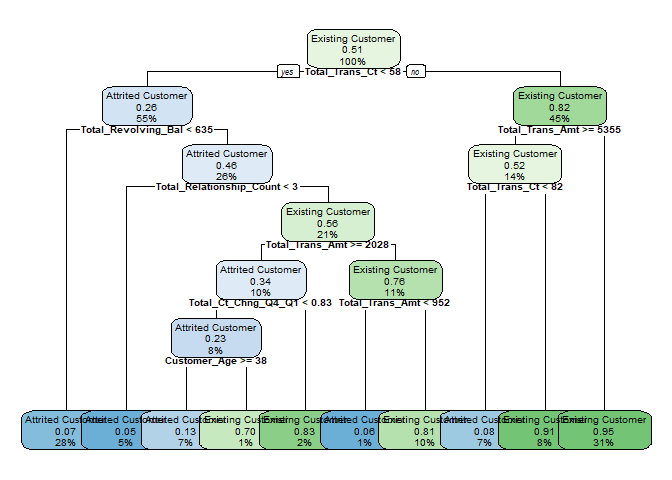

##### NOTE: STILL WORKING!!! 


# Background 

Customer churn is the loss/turnover of a client. For this analysis, the goal is to predict/classify customers who will churn. We will begin by importing the necessary packages and performing some exploratory data analysis. 


```r
# Import and load packages
required_packages <- c("RColorBrewer", "cowplot", 
                       "lubridate", 
                       "Hmisc", "psych", "DataExplorer",
                       "tidyverse", "data.table", "knitr",
                       "precrec", "rpart.plot", "smotefamily",
                       "mlr3", "mlr3learners", "mlr3viz", 
                       "mlr3filters", "mlr3pipelines", "mlr3tuning")

packageCheck <- lapply(required_packages, FUN = function(x) {
  if(!require(x, character.only = TRUE)) {
    install.packages(x, dependencies = TRUE)
    library(x, character.only = TRUE)
  }
})
```


```r
# Import the data 
bank_churn <- fread("C:/Users/diji_/Desktop/Data Science/Projects/Bank Churn/BankChurners.csv")
bank_churn <- bank_churn[, c(-22, -23)]
```


```r
# Select the character variables to be converted factors
character_variables <- c("Attrition_Flag", "Gender", "Education_Level", "Marital_Status", "Income_Category", "Card_Category")

# Convert the character variables to factors
bank_churn[, (character_variables) := lapply(.SD, factor), .SDcols = character_variables]

# Select the integersvariables to be converted to numeric
numeric_variables <- c("Customer_Age", "Total_Revolving_Bal", "Total_Trans_Amt")

# Convert some integers to numeric
bank_churn[, (numeric_variables) := lapply(.SD, as.numeric), .SDcols = numeric_variables]

# Verify that classes have been appropriately set 
lapply(bank_churn, class)
```

```
## $CLIENTNUM
## [1] "integer"
## 
## $Attrition_Flag
## [1] "factor"
## 
## $Customer_Age
## [1] "numeric"
## 
## $Gender
## [1] "factor"
## 
## $Dependent_count
## [1] "integer"
## 
## $Education_Level
## [1] "factor"
## 
## $Marital_Status
## [1] "factor"
## 
## $Income_Category
## [1] "factor"
## 
## $Card_Category
## [1] "factor"
## 
## $Months_on_book
## [1] "integer"
## 
## $Total_Relationship_Count
## [1] "integer"
## 
## $Months_Inactive_12_mon
## [1] "integer"
## 
## $Contacts_Count_12_mon
## [1] "integer"
## 
## $Credit_Limit
## [1] "numeric"
## 
## $Total_Revolving_Bal
## [1] "numeric"
## 
## $Avg_Open_To_Buy
## [1] "numeric"
## 
## $Total_Amt_Chng_Q4_Q1
## [1] "numeric"
## 
## $Total_Trans_Amt
## [1] "numeric"
## 
## $Total_Trans_Ct
## [1] "integer"
## 
## $Total_Ct_Chng_Q4_Q1
## [1] "numeric"
## 
## $Avg_Utilization_Ratio
## [1] "numeric"
```


```r
# Create the task 
task <- TaskClassif$new(id = "BankChurn", backend = bank_churn, target = "Attrition_Flag")
print(task)
```

```
## <TaskClassif:BankChurn> (10127 x 21)
## * Target: Attrition_Flag
## * Properties: twoclass
## * Features (20):
##   - dbl (8): Avg_Open_To_Buy, Avg_Utilization_Ratio, Credit_Limit,
##     Customer_Age, Total_Amt_Chng_Q4_Q1, Total_Ct_Chng_Q4_Q1,
##     Total_Revolving_Bal, Total_Trans_Amt
##   - int (7): CLIENTNUM, Contacts_Count_12_mon, Dependent_count,
##     Months_Inactive_12_mon, Months_on_book, Total_Relationship_Count,
##     Total_Trans_Ct
##   - fct (5): Card_Category, Education_Level, Gender, Income_Category,
##     Marital_Status
```


```r
# Set CLIENTNUM as an identifier 
task$set_col_roles("CLIENTNUM", roles = "name")
```


```r
# Explore the task 
as.data.table(task$col_info)
```

```
##                           id    type
##  1:                 ..row_id integer
##  2:           Attrition_Flag  factor
##  3:          Avg_Open_To_Buy numeric
##  4:    Avg_Utilization_Ratio numeric
##  5:                CLIENTNUM integer
##  6:            Card_Category  factor
##  7:    Contacts_Count_12_mon integer
##  8:             Credit_Limit numeric
##  9:             Customer_Age numeric
## 10:          Dependent_count integer
## 11:          Education_Level  factor
## 12:                   Gender  factor
## 13:          Income_Category  factor
## 14:           Marital_Status  factor
## 15:   Months_Inactive_12_mon integer
## 16:           Months_on_book integer
## 17:     Total_Amt_Chng_Q4_Q1 numeric
## 18:      Total_Ct_Chng_Q4_Q1 numeric
## 19: Total_Relationship_Count integer
## 20:      Total_Revolving_Bal numeric
## 21:          Total_Trans_Amt numeric
## 22:           Total_Trans_Ct integer
##                           id    type
##                                                                  levels
##  1:                                                                    
##  2:                                 Attrited Customer,Existing Customer
##  3:                                                                    
##  4:                                                                    
##  5:                                                                    
##  6:                                           Blue,Gold,Platinum,Silver
##  7:                                                                    
##  8:                                                                    
##  9:                                                                    
## 10:                                                                    
## 11: College,Doctorate,Graduate,High School,Post-Graduate,Uneducated,...
## 12:                                                                 F,M
## 13: $120K +,$40K - $60K,$60K - $80K,$80K - $120K,Less than $40K,Unknown
## 14:                                     Divorced,Married,Single,Unknown
## 15:                                                                    
## 16:                                                                    
## 17:                                                                    
## 18:                                                                    
## 19:                                                                    
## 20:                                                                    
## 21:                                                                    
## 22:                                                                    
##                                                                  levels
```

```r
task$col_roles
```

```
## $feature
##  [1] "Avg_Open_To_Buy"          "Avg_Utilization_Ratio"   
##  [3] "Card_Category"            "Contacts_Count_12_mon"   
##  [5] "Credit_Limit"             "Customer_Age"            
##  [7] "Dependent_count"          "Education_Level"         
##  [9] "Gender"                   "Income_Category"         
## [11] "Marital_Status"           "Months_Inactive_12_mon"  
## [13] "Months_on_book"           "Total_Amt_Chng_Q4_Q1"    
## [15] "Total_Ct_Chng_Q4_Q1"      "Total_Relationship_Count"
## [17] "Total_Revolving_Bal"      "Total_Trans_Amt"         
## [19] "Total_Trans_Ct"          
## 
## $target
## [1] "Attrition_Flag"
## 
## $name
## [1] "CLIENTNUM"
## 
## $order
## character(0)
## 
## $stratum
## character(0)
## 
## $group
## character(0)
## 
## $weight
## character(0)
## 
## $uri
## character(0)
```

```r
table(task$truth()) # Class imbalance with Attrited customers being 1/5 less than Existing customers 
```

```
## 
## Attrited Customer Existing Customer 
##              1627              8500
```

```r
task$positive
```

```
## [1] "Attrited Customer"
```

```r
Hmisc::describe(as.data.table(task))
```

```
## as.data.table(task) 
## 
##  20  Variables      10127  Observations
## --------------------------------------------------------------------------------
## Attrition_Flag 
##        n  missing distinct 
##    10127        0        2 
##                                               
## Value      Attrited Customer Existing Customer
## Frequency               1627              8500
## Proportion             0.161             0.839
## --------------------------------------------------------------------------------
## Avg_Open_To_Buy 
##        n  missing distinct     Info     Mean      Gmd      .05      .10 
##    10127        0     6813        1     7469     8848    480.3    683.0 
##      .25      .50      .75      .90      .95 
##   1324.5   3474.0   9859.0  21964.6  32183.4 
## 
## lowest :     3    10    14    15    24, highest: 34297 34300 34302 34362 34516
## --------------------------------------------------------------------------------
## Avg_Utilization_Ratio 
##        n  missing distinct     Info     Mean      Gmd      .05      .10 
##    10127        0      964    0.985   0.2749   0.3039    0.000    0.000 
##      .25      .50      .75      .90      .95 
##    0.023    0.176    0.503    0.707    0.793 
## 
## lowest : 0.000 0.004 0.005 0.006 0.007, highest: 0.990 0.992 0.994 0.995 0.999
## --------------------------------------------------------------------------------
## Card_Category 
##        n  missing distinct 
##    10127        0        4 
##                                               
## Value          Blue     Gold Platinum   Silver
## Frequency      9436      116       20      555
## Proportion    0.932    0.011    0.002    0.055
## --------------------------------------------------------------------------------
## Contacts_Count_12_mon 
##        n  missing distinct     Info     Mean      Gmd 
##    10127        0        7    0.925    2.455    1.204 
## 
## lowest : 0 1 2 3 4, highest: 2 3 4 5 6
##                                                     
## Value          0     1     2     3     4     5     6
## Frequency    399  1499  3227  3380  1392   176    54
## Proportion 0.039 0.148 0.319 0.334 0.137 0.017 0.005
## --------------------------------------------------------------------------------
## Credit_Limit 
##        n  missing distinct     Info     Mean      Gmd      .05      .10 
##    10127        0     6205        1     8632     8837     1439     1762 
##      .25      .50      .75      .90      .95 
##     2555     4549    11068    23400    34516 
## 
## lowest :  1438.3  1439.0  1440.0  1441.0  1442.0
## highest: 34198.0 34427.0 34458.0 34496.0 34516.0
## --------------------------------------------------------------------------------
## Customer_Age 
##        n  missing distinct     Info     Mean      Gmd      .05      .10 
##    10127        0       45    0.999    46.33     9.09       33       36 
##      .25      .50      .75      .90      .95 
##       41       46       52       57       60 
## 
## lowest : 26 27 28 29 30, highest: 66 67 68 70 73
## --------------------------------------------------------------------------------
## Dependent_count 
##        n  missing distinct     Info     Mean      Gmd 
##    10127        0        6    0.952    2.346    1.452 
## 
## lowest : 0 1 2 3 4, highest: 1 2 3 4 5
##                                               
## Value          0     1     2     3     4     5
## Frequency    904  1838  2655  2732  1574   424
## Proportion 0.089 0.181 0.262 0.270 0.155 0.042
## --------------------------------------------------------------------------------
## Education_Level 
##        n  missing distinct 
##    10127        0        7 
## 
## lowest : College       Doctorate     Graduate      High School   Post-Graduate
## highest: Graduate      High School   Post-Graduate Uneducated    Unknown      
##                                                                   
## Value            College     Doctorate      Graduate   High School
## Frequency           1013           451          3128          2013
## Proportion         0.100         0.045         0.309         0.199
##                                                     
## Value      Post-Graduate    Uneducated       Unknown
## Frequency            516          1487          1519
## Proportion         0.051         0.147         0.150
## --------------------------------------------------------------------------------
## Gender 
##        n  missing distinct 
##    10127        0        2 
##                       
## Value          F     M
## Frequency   5358  4769
## Proportion 0.529 0.471
## --------------------------------------------------------------------------------
## Income_Category 
##        n  missing distinct 
##    10127        0        6 
## 
## lowest : $120K +        $40K - $60K    $60K - $80K    $80K - $120K   Less than $40K
## highest: $40K - $60K    $60K - $80K    $80K - $120K   Less than $40K Unknown       
##                                                                       
## Value             $120K +    $40K - $60K    $60K - $80K   $80K - $120K
## Frequency             727           1790           1402           1535
## Proportion          0.072          0.177          0.138          0.152
##                                         
## Value      Less than $40K        Unknown
## Frequency            3561           1112
## Proportion          0.352          0.110
## --------------------------------------------------------------------------------
## Marital_Status 
##        n  missing distinct 
##    10127        0        4 
##                                               
## Value      Divorced  Married   Single  Unknown
## Frequency       748     4687     3943      749
## Proportion    0.074    0.463    0.389    0.074
## --------------------------------------------------------------------------------
## Months_Inactive_12_mon 
##        n  missing distinct     Info     Mean      Gmd 
##    10127        0        7      0.9    2.341    1.065 
## 
## lowest : 0 1 2 3 4, highest: 2 3 4 5 6
##                                                     
## Value          0     1     2     3     4     5     6
## Frequency     29  2233  3282  3846   435   178   124
## Proportion 0.003 0.220 0.324 0.380 0.043 0.018 0.012
## --------------------------------------------------------------------------------
## Months_on_book 
##        n  missing distinct     Info     Mean      Gmd      .05      .10 
##    10127        0       44    0.985    35.93    8.767       22       26 
##      .25      .50      .75      .90      .95 
##       31       36       40       46       50 
## 
## lowest : 13 14 15 16 17, highest: 52 53 54 55 56
## --------------------------------------------------------------------------------
## Total_Amt_Chng_Q4_Q1 
##        n  missing distinct     Info     Mean      Gmd      .05      .10 
##    10127        0     1158        1   0.7599   0.2251   0.4630   0.5310 
##      .25      .50      .75      .90      .95 
##   0.6310   0.7360   0.8590   0.9974   1.1030 
## 
## lowest : 0.000 0.010 0.018 0.046 0.061, highest: 2.368 2.594 2.675 3.355 3.397
## --------------------------------------------------------------------------------
## Total_Ct_Chng_Q4_Q1 
##        n  missing distinct     Info     Mean      Gmd      .05      .10 
##    10127        0      830        1   0.7122   0.2409    0.368    0.452 
##      .25      .50      .75      .90      .95 
##    0.582    0.702    0.818    0.950    1.069 
## 
## lowest : 0.000 0.028 0.029 0.038 0.053, highest: 3.000 3.250 3.500 3.571 3.714
## --------------------------------------------------------------------------------
## Total_Relationship_Count 
##        n  missing distinct     Info     Mean      Gmd 
##    10127        0        6    0.966    3.813    1.759 
## 
## lowest : 1 2 3 4 5, highest: 2 3 4 5 6
##                                               
## Value          1     2     3     4     5     6
## Frequency    910  1243  2305  1912  1891  1866
## Proportion 0.090 0.123 0.228 0.189 0.187 0.184
## --------------------------------------------------------------------------------
## Total_Revolving_Bal 
##        n  missing distinct     Info     Mean      Gmd      .05      .10 
##    10127        0     1974    0.985     1163      927        0        0 
##      .25      .50      .75      .90      .95 
##      359     1276     1784     2228     2517 
## 
## lowest :    0  132  134  145  154, highest: 2511 2512 2513 2514 2517
## --------------------------------------------------------------------------------
## Total_Trans_Amt 
##        n  missing distinct     Info     Mean      Gmd      .05      .10 
##    10127        0     5033        1     4404     3207     1283     1501 
##      .25      .50      .75      .90      .95 
##     2156     3899     4741     8212    14212 
## 
## lowest :   510   530   563   569   594, highest: 17628 17634 17744 17995 18484
## --------------------------------------------------------------------------------
## Total_Trans_Ct 
##        n  missing distinct     Info     Mean      Gmd      .05      .10 
##    10127        0      126        1    64.86     26.6       28       33 
##      .25      .50      .75      .90      .95 
##       45       67       81       92      105 
## 
## lowest :  10  11  12  13  14, highest: 131 132 134 138 139
## --------------------------------------------------------------------------------
```


```r
# Split the task into training and test sets 
train_set <- sample(task$nrow, 0.8*task$nrow)
test_set <- setdiff(seq_len(task$nrow), train_set)
```


```r
# Create learner 
learner_dt <- lrn("classif.rpart")
```


```r
# DECISION TREE MODEL; ORIGINAL DATA 
# Do nothing sampler
doing_nothing <- po("nop", id = "nop")

# Create ML graph for undersampler
doing_nothing_sampler <- doing_nothing %>>% 
  learner_dt
 
# Create a graph learner for undersampler
graph_learner_doing_nothing_sampler <- GraphLearner$new(doing_nothing_sampler)

# Train the undersampler decision tree model
graph_learner_doing_nothing_sampler$train(task, train_set)

# Show the state of the learner
graph_learner_doing_nothing_sampler$state
```

```
## $model
## $model$nop
## list()
## 
## $model$classif.rpart
## $model$classif.rpart$model
## n= 8101 
## 
## node), split, n, loss, yval, (yprob)
##       * denotes terminal node
## 
##  1) root 8101 1310 Existing Customer (0.16170843 0.83829157)  
##    2) Total_Trans_Ct< 54.5 2761 1045 Existing Customer (0.37848606 0.62151394)  
##      4) Total_Revolving_Bal< 656.5 930  248 Attrited Customer (0.73333333 0.26666667)  
##        8) Total_Trans_Amt>=1915 542   72 Attrited Customer (0.86715867 0.13284133) *
##        9) Total_Trans_Amt< 1915 388  176 Attrited Customer (0.54639175 0.45360825)  
##         18) Total_Relationship_Count< 3.5 200   45 Attrited Customer (0.77500000 0.22500000) *
##         19) Total_Relationship_Count>=3.5 188   57 Existing Customer (0.30319149 0.69680851)  
##           38) Total_Trans_Amt< 996 19    0 Attrited Customer (1.00000000 0.00000000) *
##           39) Total_Trans_Amt>=996 169   38 Existing Customer (0.22485207 0.77514793) *
##      5) Total_Revolving_Bal>=656.5 1831  363 Existing Customer (0.19825232 0.80174768)  
##       10) Total_Relationship_Count< 2.5 167   41 Attrited Customer (0.75449102 0.24550898) *
##       11) Total_Relationship_Count>=2.5 1664  237 Existing Customer (0.14242788 0.85757212)  
##         22) Total_Trans_Amt>=2105.5 403  151 Existing Customer (0.37468983 0.62531017)  
##           44) Total_Ct_Chng_Q4_Q1< 0.6315 178   64 Attrited Customer (0.64044944 0.35955056)  
##             88) Customer_Age>=37.5 130   28 Attrited Customer (0.78461538 0.21538462) *
##             89) Customer_Age< 37.5 48   12 Existing Customer (0.25000000 0.75000000) *
##           45) Total_Ct_Chng_Q4_Q1>=0.6315 225   37 Existing Customer (0.16444444 0.83555556) *
##         23) Total_Trans_Amt< 2105.5 1261   86 Existing Customer (0.06819984 0.93180016)  
##           46) Total_Trans_Amt< 924.5 21    3 Attrited Customer (0.85714286 0.14285714) *
##           47) Total_Trans_Amt>=924.5 1240   68 Existing Customer (0.05483871 0.94516129) *
##    3) Total_Trans_Ct>=54.5 5340  265 Existing Customer (0.04962547 0.95037453)  
##      6) Total_Trans_Amt>=5271.5 1247  196 Existing Customer (0.15717723 0.84282277)  
##       12) Total_Trans_Ct< 78.5 230   64 Attrited Customer (0.72173913 0.27826087)  
##         24) Total_Revolving_Bal< 825 122    6 Attrited Customer (0.95081967 0.04918033) *
##         25) Total_Revolving_Bal>=825 108   50 Existing Customer (0.46296296 0.53703704)  
##           50) Total_Trans_Amt>=8076.5 38    7 Attrited Customer (0.81578947 0.18421053) *
##           51) Total_Trans_Amt< 8076.5 70   19 Existing Customer (0.27142857 0.72857143) *
##       13) Total_Trans_Ct>=78.5 1017   30 Existing Customer (0.02949853 0.97050147) *
##      7) Total_Trans_Amt< 5271.5 4093   69 Existing Customer (0.01685805 0.98314195) *
## 
## $model$classif.rpart$log
## Empty data.table (0 rows and 3 cols): stage,class,msg
## 
## $model$classif.rpart$train_time
## [1] 0.07
## 
## $model$classif.rpart$train_task
## <TaskClassif:BankChurn> (8101 x 20)
## * Target: Attrition_Flag
## * Properties: twoclass
## * Features (19):
##   - dbl (8): Avg_Open_To_Buy, Avg_Utilization_Ratio, Credit_Limit,
##     Customer_Age, Total_Amt_Chng_Q4_Q1, Total_Ct_Chng_Q4_Q1,
##     Total_Revolving_Bal, Total_Trans_Amt
##   - int (6): Contacts_Count_12_mon, Dependent_count,
##     Months_Inactive_12_mon, Months_on_book, Total_Relationship_Count,
##     Total_Trans_Ct
##   - fct (5): Card_Category, Education_Level, Gender, Income_Category,
##     Marital_Status
## 
## 
## 
## $log
## Empty data.table (0 rows and 3 cols): stage,class,msg
## 
## $train_time
## [1] 0.11
## 
## $train_task
## <TaskClassif:BankChurn> (10127 x 20)
## * Target: Attrition_Flag
## * Properties: twoclass
## * Features (19):
##   - dbl (8): Avg_Open_To_Buy, Avg_Utilization_Ratio, Credit_Limit,
##     Customer_Age, Total_Amt_Chng_Q4_Q1, Total_Ct_Chng_Q4_Q1,
##     Total_Revolving_Bal, Total_Trans_Amt
##   - int (6): Contacts_Count_12_mon, Dependent_count,
##     Months_Inactive_12_mon, Months_on_book, Total_Relationship_Count,
##     Total_Trans_Ct
##   - fct (5): Card_Category, Education_Level, Gender, Income_Category,
##     Marital_Status
```


```r
# Visualize undersampler decision tree model
rpart.plot(graph_learner_doing_nothing_sampler$state$model$classif.rpart$model, cex = 0.6)
```

<!-- -->


```r
# Make predictions on the test set 
prediction_dt <- graph_learner_doing_nothing_sampler$predict(task, test_set)

# Show confusion matrix
prediction_dt$confusion
```

```
##                    truth
## response            Attrited Customer Existing Customer
##   Attrited Customer               249                58
##   Existing Customer                68              1651
```

```r
# Print sensitivity
prediction_dt$score(msr("classif.sensitivity"))
```

```
## classif.sensitivity 
##            0.785489
```

```r
prediction_dt$score(msr("classif.ce"))
```

```
## classif.ce 
## 0.06219151
```

```r
prediction_dt$score(msr("classif.fbeta"))
```

```
## classif.fbeta 
##     0.7980769
```

```r
# DECISION TREE MODEL; UNDERSAMPLER
# Create an undersampler 
undersampler <- po("classbalancing", ratio = 1/5, reference = "major", adjust = "major", shuffle = F, id = "undersampler")

# Create ML graph for undersampler
dt_undersampler <- undersampler %>>% 
  learner_dt

# Create a graph learner for undersampler
graph_learner_undersampler <- GraphLearner$new(dt_undersampler)

# Train the undersampler decision tree model
graph_learner_undersampler$train(task, train_set)

# Show the state of the learner
graph_learner_undersampler$state
```

```
## $model
## $model$undersampler
## $model$undersampler$affected_cols
##  [1] "Avg_Open_To_Buy"          "Avg_Utilization_Ratio"   
##  [3] "Card_Category"            "Contacts_Count_12_mon"   
##  [5] "Credit_Limit"             "Customer_Age"            
##  [7] "Dependent_count"          "Education_Level"         
##  [9] "Gender"                   "Income_Category"         
## [11] "Marital_Status"           "Months_Inactive_12_mon"  
## [13] "Months_on_book"           "Total_Amt_Chng_Q4_Q1"    
## [15] "Total_Ct_Chng_Q4_Q1"      "Total_Relationship_Count"
## [17] "Total_Revolving_Bal"      "Total_Trans_Amt"         
## [19] "Total_Trans_Ct"          
## 
## $model$undersampler$intasklayout
##                           id    type
##  1:          Avg_Open_To_Buy numeric
##  2:    Avg_Utilization_Ratio numeric
##  3:            Card_Category  factor
##  4:    Contacts_Count_12_mon integer
##  5:             Credit_Limit numeric
##  6:             Customer_Age numeric
##  7:          Dependent_count integer
##  8:          Education_Level  factor
##  9:                   Gender  factor
## 10:          Income_Category  factor
## 11:           Marital_Status  factor
## 12:   Months_Inactive_12_mon integer
## 13:           Months_on_book integer
## 14:     Total_Amt_Chng_Q4_Q1 numeric
## 15:      Total_Ct_Chng_Q4_Q1 numeric
## 16: Total_Relationship_Count integer
## 17:      Total_Revolving_Bal numeric
## 18:          Total_Trans_Amt numeric
## 19:           Total_Trans_Ct integer
## 
## $model$undersampler$outtasklayout
##                           id    type
##  1:          Avg_Open_To_Buy numeric
##  2:    Avg_Utilization_Ratio numeric
##  3:            Card_Category  factor
##  4:    Contacts_Count_12_mon integer
##  5:             Credit_Limit numeric
##  6:             Customer_Age numeric
##  7:          Dependent_count integer
##  8:          Education_Level  factor
##  9:                   Gender  factor
## 10:          Income_Category  factor
## 11:           Marital_Status  factor
## 12:   Months_Inactive_12_mon integer
## 13:           Months_on_book integer
## 14:     Total_Amt_Chng_Q4_Q1 numeric
## 15:      Total_Ct_Chng_Q4_Q1 numeric
## 16: Total_Relationship_Count integer
## 17:      Total_Revolving_Bal numeric
## 18:          Total_Trans_Amt numeric
## 19:           Total_Trans_Ct integer
## 
## $model$undersampler$outtaskshell
## Empty data.table (0 rows and 20 cols): Attrition_Flag,Avg_Open_To_Buy,Avg_Utilization_Ratio,Card_Category,Contacts_Count_12_mon,Credit_Limit...
## 
## 
## $model$classif.rpart
## $model$classif.rpart$model
## n= 2668 
## 
## node), split, n, loss, yval, (yprob)
##       * denotes terminal node
## 
##  1) root 2668 1310 Existing Customer (0.49100450 0.50899550)  
##    2) Total_Trans_Ct< 57.5 1464  380 Attrited Customer (0.74043716 0.25956284)  
##      4) Total_Revolving_Bal< 657 770   67 Attrited Customer (0.91298701 0.08701299) *
##      5) Total_Revolving_Bal>=657 694  313 Attrited Customer (0.54899135 0.45100865)  
##       10) Total_Relationship_Count< 2.5 139    7 Attrited Customer (0.94964029 0.05035971) *
##       11) Total_Relationship_Count>=2.5 555  249 Existing Customer (0.44864865 0.55135135)  
##         22) Total_Trans_Amt>=1993.5 258   83 Attrited Customer (0.67829457 0.32170543)  
##           44) Total_Ct_Chng_Q4_Q1< 0.6715 154   16 Attrited Customer (0.89610390 0.10389610) *
##           45) Total_Ct_Chng_Q4_Q1>=0.6715 104   37 Existing Customer (0.35576923 0.64423077) *
##         23) Total_Trans_Amt< 1993.5 297   74 Existing Customer (0.24915825 0.75084175)  
##           46) Total_Trans_Amt< 997.5 24    2 Attrited Customer (0.91666667 0.08333333) *
##           47) Total_Trans_Amt>=997.5 273   52 Existing Customer (0.19047619 0.80952381) *
##    3) Total_Trans_Ct>=57.5 1204  226 Existing Customer (0.18770764 0.81229236)  
##      6) Total_Trans_Amt>=5271 381  189 Attrited Customer (0.50393701 0.49606299)  
##       12) Total_Trans_Ct< 81.5 186   14 Attrited Customer (0.92473118 0.07526882) *
##       13) Total_Trans_Ct>=81.5 195   20 Existing Customer (0.10256410 0.89743590) *
##      7) Total_Trans_Amt< 5271 823   34 Existing Customer (0.04131227 0.95868773) *
## 
## $model$classif.rpart$log
## Empty data.table (0 rows and 3 cols): stage,class,msg
## 
## $model$classif.rpart$train_time
## [1] 0.02
## 
## $model$classif.rpart$train_task
## <TaskClassif:BankChurn> (2668 x 20)
## * Target: Attrition_Flag
## * Properties: twoclass
## * Features (19):
##   - dbl (8): Avg_Open_To_Buy, Avg_Utilization_Ratio, Credit_Limit,
##     Customer_Age, Total_Amt_Chng_Q4_Q1, Total_Ct_Chng_Q4_Q1,
##     Total_Revolving_Bal, Total_Trans_Amt
##   - int (6): Contacts_Count_12_mon, Dependent_count,
##     Months_Inactive_12_mon, Months_on_book, Total_Relationship_Count,
##     Total_Trans_Ct
##   - fct (5): Card_Category, Education_Level, Gender, Income_Category,
##     Marital_Status
## 
## 
## 
## $log
## Empty data.table (0 rows and 3 cols): stage,class,msg
## 
## $train_time
## [1] 0.07
## 
## $train_task
## <TaskClassif:BankChurn> (10127 x 20)
## * Target: Attrition_Flag
## * Properties: twoclass
## * Features (19):
##   - dbl (8): Avg_Open_To_Buy, Avg_Utilization_Ratio, Credit_Limit,
##     Customer_Age, Total_Amt_Chng_Q4_Q1, Total_Ct_Chng_Q4_Q1,
##     Total_Revolving_Bal, Total_Trans_Amt
##   - int (6): Contacts_Count_12_mon, Dependent_count,
##     Months_Inactive_12_mon, Months_on_book, Total_Relationship_Count,
##     Total_Trans_Ct
##   - fct (5): Card_Category, Education_Level, Gender, Income_Category,
##     Marital_Status
```

```r
# Visualize undersampler decision tree model
rpart.plot(graph_learner_undersampler$state$model$classif.rpart$model, cex = 0.6)
```

<!-- -->

```r
# Make predictions on the test set 
undersampler_prediction_dt <- graph_learner_undersampler$predict(task, test_set)

# Show confusion matrix
undersampler_prediction_dt$confusion
```

```
##                    truth
## response            Attrited Customer Existing Customer
##   Attrited Customer               281               156
##   Existing Customer                36              1553
```

```r
# Print sensitivity
undersampler_prediction_dt$score(msr("classif.sensitivity"))
```

```
## classif.sensitivity 
##           0.8864353
```

```r
undersampler_prediction_dt$score(msr("classif.ce"))
```

```
## classif.ce 
## 0.09476802
```

```r
undersampler_prediction_dt$score(msr("classif.fbeta"))
```

```
## classif.fbeta 
##     0.7453581
```

```r
# DECISION TREE MODEL; OVERSAMPLER 
# Create an oversampler 
oversampler = po("classbalancing", ratio = 5, reference = "minor", adjust = "minor", shuffle = F, id = "oversampler")

# Oversampler 
dt_oversampler <- oversampler %>>% 
  learner_dt

# Create a graph learner for oversampler
graph_learner_oversampler <- GraphLearner$new(dt_oversampler)

# Train the oversampler decision tree model
graph_learner_oversampler$train(task, train_set)

# Show the state of the learner
graph_learner_oversampler$state
```

```
## $model
## $model$oversampler
## $model$oversampler$affected_cols
##  [1] "Avg_Open_To_Buy"          "Avg_Utilization_Ratio"   
##  [3] "Card_Category"            "Contacts_Count_12_mon"   
##  [5] "Credit_Limit"             "Customer_Age"            
##  [7] "Dependent_count"          "Education_Level"         
##  [9] "Gender"                   "Income_Category"         
## [11] "Marital_Status"           "Months_Inactive_12_mon"  
## [13] "Months_on_book"           "Total_Amt_Chng_Q4_Q1"    
## [15] "Total_Ct_Chng_Q4_Q1"      "Total_Relationship_Count"
## [17] "Total_Revolving_Bal"      "Total_Trans_Amt"         
## [19] "Total_Trans_Ct"          
## 
## $model$oversampler$intasklayout
##                           id    type
##  1:          Avg_Open_To_Buy numeric
##  2:    Avg_Utilization_Ratio numeric
##  3:            Card_Category  factor
##  4:    Contacts_Count_12_mon integer
##  5:             Credit_Limit numeric
##  6:             Customer_Age numeric
##  7:          Dependent_count integer
##  8:          Education_Level  factor
##  9:                   Gender  factor
## 10:          Income_Category  factor
## 11:           Marital_Status  factor
## 12:   Months_Inactive_12_mon integer
## 13:           Months_on_book integer
## 14:     Total_Amt_Chng_Q4_Q1 numeric
## 15:      Total_Ct_Chng_Q4_Q1 numeric
## 16: Total_Relationship_Count integer
## 17:      Total_Revolving_Bal numeric
## 18:          Total_Trans_Amt numeric
## 19:           Total_Trans_Ct integer
## 
## $model$oversampler$outtasklayout
##                           id    type
##  1:          Avg_Open_To_Buy numeric
##  2:    Avg_Utilization_Ratio numeric
##  3:            Card_Category  factor
##  4:    Contacts_Count_12_mon integer
##  5:             Credit_Limit numeric
##  6:             Customer_Age numeric
##  7:          Dependent_count integer
##  8:          Education_Level  factor
##  9:                   Gender  factor
## 10:          Income_Category  factor
## 11:           Marital_Status  factor
## 12:   Months_Inactive_12_mon integer
## 13:           Months_on_book integer
## 14:     Total_Amt_Chng_Q4_Q1 numeric
## 15:      Total_Ct_Chng_Q4_Q1 numeric
## 16: Total_Relationship_Count integer
## 17:      Total_Revolving_Bal numeric
## 18:          Total_Trans_Amt numeric
## 19:           Total_Trans_Ct integer
## 
## $model$oversampler$outtaskshell
## Empty data.table (0 rows and 20 cols): Attrition_Flag,Avg_Open_To_Buy,Avg_Utilization_Ratio,Card_Category,Contacts_Count_12_mon,Credit_Limit...
## 
## 
## $model$classif.rpart
## $model$classif.rpart$model
## n= 13341 
## 
## node), split, n, loss, yval, (yprob)
##       * denotes terminal node
## 
##  1) root 13341 6550 Existing Customer (0.49096769 0.50903231)  
##    2) Total_Trans_Ct< 57.5 7317 1897 Attrited Customer (0.74074074 0.25925926)  
##      4) Total_Revolving_Bal< 656.5 3808  293 Attrited Customer (0.92305672 0.07694328) *
##      5) Total_Revolving_Bal>=656.5 3509 1604 Attrited Customer (0.54288971 0.45711029)  
##       10) Total_Relationship_Count< 2.5 702   42 Attrited Customer (0.94017094 0.05982906) *
##       11) Total_Relationship_Count>=2.5 2807 1245 Existing Customer (0.44353402 0.55646598)  
##         22) Total_Trans_Amt>=2015.5 1287  417 Attrited Customer (0.67599068 0.32400932)  
##           44) Total_Ct_Chng_Q4_Q1< 0.6965 868  148 Attrited Customer (0.82949309 0.17050691) *
##           45) Total_Ct_Chng_Q4_Q1>=0.6965 419  150 Existing Customer (0.35799523 0.64200477) *
##         23) Total_Trans_Amt< 2015.5 1520  375 Existing Customer (0.24671053 0.75328947)  
##           46) Total_Trans_Amt< 1027.5 139   19 Attrited Customer (0.86330935 0.13669065) *
##           47) Total_Trans_Amt>=1027.5 1381  255 Existing Customer (0.18464881 0.81535119) *
##    3) Total_Trans_Ct>=57.5 6024 1130 Existing Customer (0.18758300 0.81241700)  
##      6) Total_Trans_Amt>=5240 2030  965 Existing Customer (0.47536946 0.52463054)  
##       12) Total_Trans_Ct< 81.5 969  104 Attrited Customer (0.89267286 0.10732714) *
##       13) Total_Trans_Ct>=81.5 1061  100 Existing Customer (0.09425071 0.90574929) *
##      7) Total_Trans_Amt< 5240 3994  165 Existing Customer (0.04131197 0.95868803) *
## 
## $model$classif.rpart$log
## Empty data.table (0 rows and 3 cols): stage,class,msg
## 
## $model$classif.rpart$train_time
## [1] 0.08
## 
## $model$classif.rpart$train_task
## <TaskClassif:BankChurn> (13341 x 20)
## * Target: Attrition_Flag
## * Properties: twoclass
## * Features (19):
##   - dbl (8): Avg_Open_To_Buy, Avg_Utilization_Ratio, Credit_Limit,
##     Customer_Age, Total_Amt_Chng_Q4_Q1, Total_Ct_Chng_Q4_Q1,
##     Total_Revolving_Bal, Total_Trans_Amt
##   - int (6): Contacts_Count_12_mon, Dependent_count,
##     Months_Inactive_12_mon, Months_on_book, Total_Relationship_Count,
##     Total_Trans_Ct
##   - fct (5): Card_Category, Education_Level, Gender, Income_Category,
##     Marital_Status
## 
## 
## 
## $log
## Empty data.table (0 rows and 3 cols): stage,class,msg
## 
## $train_time
## [1] 0.13
## 
## $train_task
## <TaskClassif:BankChurn> (10127 x 20)
## * Target: Attrition_Flag
## * Properties: twoclass
## * Features (19):
##   - dbl (8): Avg_Open_To_Buy, Avg_Utilization_Ratio, Credit_Limit,
##     Customer_Age, Total_Amt_Chng_Q4_Q1, Total_Ct_Chng_Q4_Q1,
##     Total_Revolving_Bal, Total_Trans_Amt
##   - int (6): Contacts_Count_12_mon, Dependent_count,
##     Months_Inactive_12_mon, Months_on_book, Total_Relationship_Count,
##     Total_Trans_Ct
##   - fct (5): Card_Category, Education_Level, Gender, Income_Category,
##     Marital_Status
```


```r
# Visualize oversampler decision tree model
rpart.plot(graph_learner_oversampler$state$model$classif.rpart$model, cex = 0.6)
```

<!-- -->


```r
# Make predictions on the test set 
oversampler_prediction_dt <- graph_learner_oversampler$predict(task, test_set)

oversampler_prediction_dt$confusion
```

```
##                    truth
## response            Attrited Customer Existing Customer
##   Attrited Customer               282               159
##   Existing Customer                35              1550
```

```r
oversampler_prediction_dt$score(msr("classif.sensitivity"))
```

```
## classif.sensitivity 
##           0.8895899
```

```r
oversampler_prediction_dt$score(msr("classif.ce"))
```

```
## classif.ce 
## 0.09575518
```

```r
oversampler_prediction_dt$score(msr("classif.fbeta"))
```

```
## classif.fbeta 
##     0.7440633
```


```r
# Benchmarking 
dt_benchmark <- benchmark_grid(tasks = task,
                               learners = c(graph_learner_doing_nothing_sampler,
                                            graph_learner_undersampler, 
                                            graph_learner_oversampler), 
                               resamplings = rsmp("cv", folds = 2))

dt_bm_results <- benchmark(dt_benchmark)
```

```
## INFO  [17:35:18.801] [mlr3]  Running benchmark with 6 resampling iterations 
## INFO  [17:35:19.218] [mlr3]  Applying learner 'nop.classif.rpart' on task 'BankChurn' (iter 2/2) 
## INFO  [17:35:19.385] [mlr3]  Applying learner 'oversampler.classif.rpart' on task 'BankChurn' (iter 2/2) 
## INFO  [17:35:19.584] [mlr3]  Applying learner 'undersampler.classif.rpart' on task 'BankChurn' (iter 2/2) 
## INFO  [17:35:19.739] [mlr3]  Applying learner 'undersampler.classif.rpart' on task 'BankChurn' (iter 1/2) 
## INFO  [17:35:19.845] [mlr3]  Applying learner 'oversampler.classif.rpart' on task 'BankChurn' (iter 1/2) 
## INFO  [17:35:20.081] [mlr3]  Applying learner 'nop.classif.rpart' on task 'BankChurn' (iter 1/2) 
## INFO  [17:35:20.227] [mlr3]  Finished benchmark
```

```r
as.data.table(
  dt_bm_results$aggregate(
    c(msr("classif.ce"),
      msr("classif.sensitivity"),
      msr("classif.fbeta"))))[, c(
        "learner_id", "classif.ce", "classif.sensitivity", "classif.fbeta")]
```

```
##                    learner_id classif.ce classif.sensitivity classif.fbeta
## 1:          nop.classif.rpart 0.06783774           0.7405630     0.7780666
## 2: undersampler.classif.rpart 0.12728096           0.9182013     0.7015192
## 3:  oversampler.classif.rpart 0.10595431           0.8767420     0.7266237
```
